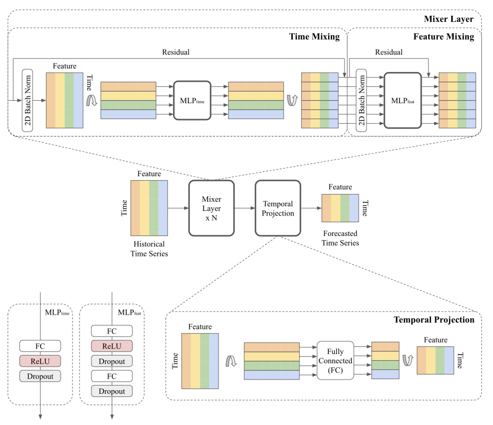

<figure>

<figcaption aria-hidden="true">Figure 1. TSMixer for multivariate time
series forecasting.</figcaption>
</figure>

## 1. Auxiliary Functions

## 1.1 Mixing layers

A mixing layer consists of a sequential time- and feature Multi Layer
Perceptron
([`MLP`](https://Nixtla.github.io/neuralforecast/models.mlp.html#mlp)).

## 1.2 Reversible InstanceNormalization

An Instance Normalization Layer that is reversible, based on [this
reference
implementation](https://github.com/google-research/google-research/blob/master/tsmixer/tsmixer_basic/models/rev_in.py).<br/>

### 2. Model

------------------------------------------------------------------------

<a
href="https://github.com/Nixtla/neuralforecast/blob/main/neuralforecast/models/tsmixer.py#L117"
target="_blank" style={{ float: "right", fontSize: "smaller" }}>source</a>

### TSMixer

> ``` text
>  TSMixer (h, input_size, n_series, futr_exog_list=None,
>           hist_exog_list=None, stat_exog_list=None, n_block=2, ff_dim=64,
>           dropout=0.9, revin=True, loss=MAE(), valid_loss=None,
>           max_steps:int=1000, learning_rate:float=0.001,
>           num_lr_decays:int=-1, early_stop_patience_steps:int=-1,
>           val_check_steps:int=100, batch_size:int=32, step_size:int=1,
>           scaler_type:str='identity', random_seed:int=1,
>           num_workers_loader:int=0, drop_last_loader:bool=False,
>           optimizer=None, optimizer_kwargs=None, **trainer_kwargs)
> ```

TSMixer

Time-Series Mixer
([`TSMixer`](https://Nixtla.github.io/neuralforecast/models.tsmixer.html#tsmixer))
is a MLP-based multivariate time-series forecasting model.
[`TSMixer`](https://Nixtla.github.io/neuralforecast/models.tsmixer.html#tsmixer)
jointly learns temporal and cross-sectional representations of the
time-series by repeatedly combining time- and feature information using
stacked mixing layers. A mixing layer consists of a sequential time- and
feature Multi Layer Perceptron
([`MLP`](https://Nixtla.github.io/neuralforecast/models.mlp.html#mlp)).

**Parameters:**<br/> `h`: int, forecast horizon.<br/> `input_size`: int,
considered autorregresive inputs (lags), y=\[1,2,3,4\] input_size=2 -\>
lags=\[1,2\].<br/> `n_series`: int, number of time-series.<br/>
`futr_exog_list`: str list, future exogenous columns.<br/>
`hist_exog_list`: str list, historic exogenous columns.<br/>
`stat_exog_list`: str list, static exogenous columns.<br/> `n_block`:
int=2, number of mixing layers in the model.<br/> `ff_dim`: int=64,
number of units for the second feed-forward layer in the feature
MLP.<br/> `dropout`: float=0.9, dropout rate between (0, 1) .<br/>
`revin`: bool=True, if True uses Reverse Instance Normalization to
process inputs and outputs.<br/> `loss`: PyTorch module, instantiated
train loss class from [losses
collection](https://nixtla.github.io/neuralforecast/losses.pytorch.html).<br/>
`valid_loss`: PyTorch module=`loss`, instantiated valid loss class from
[losses
collection](https://nixtla.github.io/neuralforecast/losses.pytorch.html).<br/>
`max_steps`: int=1000, maximum number of training steps.<br/>
`learning_rate`: float=1e-3, Learning rate between (0, 1).<br/>
`num_lr_decays`: int=-1, Number of learning rate decays, evenly
distributed across max_steps.<br/> `early_stop_patience_steps`: int=-1,
Number of validation iterations before early stopping.<br/>
`val_check_steps`: int=100, Number of training steps between every
validation loss check.<br/> `batch_size`: int=32, number of different
series in each batch.<br/> `step_size`: int=1, step size between each
window of temporal data.<br/> `scaler_type`: str=‘identity’, type of
scaler for temporal inputs normalization see [temporal
scalers](https://nixtla.github.io/neuralforecast/common.scalers.html).<br/>
`random_seed`: int=1, random_seed for pytorch initializer and numpy
generators.<br/> `num_workers_loader`: int=os.cpu_count(), workers to be
used by `TimeSeriesDataLoader`.<br/> `drop_last_loader`: bool=False, if
True `TimeSeriesDataLoader` drops last non-full batch.<br/> `alias`: str,
optional, Custom name of the model.<br/> `optimizer`: Subclass of
‘torch.optim.Optimizer’, optional, user specified optimizer instead of
the default choice (Adam).<br/> `optimizer_kwargs`: dict, optional, list
of parameters used by the user specified `optimizer`.<br/>
`**trainer_kwargs`: int, keyword trainer arguments inherited from
[PyTorch Lighning’s
trainer](https://pytorch-lightning.readthedocs.io/en/stable/api/pytorch_lightning.trainer.trainer.trainer.html?highlight=trainer).<br/>

**References:**<br/> - [Chen, Si-An, Chun-Liang Li, Nate Yoder, Sercan O.
Arik, and Tomas Pfister (2023). “TSMixer: An All-MLP Architecture for
Time Series Forecasting.”](http://arxiv.org/abs/2303.06053)

## 3. Usage Examples

Train model and forecast future values with `predict` method.

```python
import numpy as np
import pandas as pd
import pytorch_lightning as pl
import matplotlib.pyplot as plt

from neuralforecast import NeuralForecast
from neuralforecast.utils import AirPassengersPanel, AirPassengersStatic
from neuralforecast.losses.pytorch import MAE

Y_train_df = AirPassengersPanel[AirPassengersPanel.ds<AirPassengersPanel['ds'].values[-12]].reset_index(drop=True) # 132 train
Y_test_df = AirPassengersPanel[AirPassengersPanel.ds>=AirPassengersPanel['ds'].values[-12]].reset_index(drop=True) # 12 test

model = TSMixer(h=12,
                input_size=24,
                n_series=2, 
                n_block=4,
                ff_dim=4,
                dropout=0,
                revin=True,
                scaler_type='standard',
                max_steps=200,
                early_stop_patience_steps=-1,
                val_check_steps=5,
                learning_rate=1e-3,
                loss=MAE(),
                valid_loss=MAE(),
                batch_size=32
                )

fcst = NeuralForecast(models=[model], freq='M')
fcst.fit(df=Y_train_df, static_df=AirPassengersStatic, val_size=12)
forecasts = fcst.predict(futr_df=Y_test_df)
```

``` text
Sanity Checking: |          | 0/? [00:00<?, ?it/s]Sanity Checking:   0%|          | 0/1 [00:00<?, ?it/s]Sanity Checking DataLoader 0:   0%|          | 0/1 [00:00<?, ?it/s]Sanity Checking DataLoader 0: 100%|##########| 1/1 [00:00<00:00, 36.10it/s]                                                                           Training: |          | 0/? [00:00<?, ?it/s]Training:   0%|          | 0/1 [00:00<?, ?it/s]Epoch 0:   0%|          | 0/1 [00:00<?, ?it/s] Epoch 0: 100%|##########| 1/1 [00:00<00:00, 67.44it/s]Epoch 0: 100%|##########| 1/1 [00:00<00:00, 66.39it/s, v_num=0, train_loss_step=1.640]Epoch 0: 100%|##########| 1/1 [00:00<00:00, 64.40it/s, v_num=0, train_loss_step=1.640, train_loss_epoch=1.640]Epoch 0:   0%|          | 0/1 [00:00<?, ?it/s, v_num=0, train_loss_step=1.640, train_loss_epoch=1.640]        Epoch 1:   0%|          | 0/1 [00:00<?, ?it/s, v_num=0, train_loss_step=1.640, train_loss_epoch=1.640]Epoch 1: 100%|##########| 1/1 [00:00<00:00, 50.92it/s, v_num=0, train_loss_step=1.640, train_loss_epoch=1.640]Epoch 1: 100%|##########| 1/1 [00:00<00:00, 50.26it/s, v_num=0, train_loss_step=1.710, train_loss_epoch=1.640]Epoch 1: 100%|##########| 1/1 [00:00<00:00, 49.16it/s, v_num=0, train_loss_step=1.710, train_loss_epoch=1.710]Epoch 1:   0%|          | 0/1 [00:00<?, ?it/s, v_num=0, train_loss_step=1.710, train_loss_epoch=1.710]        Epoch 2:   0%|          | 0/1 [00:00<?, ?it/s, v_num=0, train_loss_step=1.710, train_loss_epoch=1.710]Epoch 2: 100%|##########| 1/1 [00:00<00:00, 20.58it/s, v_num=0, train_loss_step=1.710, train_loss_epoch=1.710]Epoch 2: 100%|##########| 1/1 [00:00<00:00, 20.47it/s, v_num=0, train_loss_step=1.620, train_loss_epoch=1.710]Epoch 2: 100%|##########| 1/1 [00:00<00:00, 20.31it/s, v_num=0, train_loss_step=1.620, train_loss_epoch=1.620]Epoch 2:   0%|          | 0/1 [00:00<?, ?it/s, v_num=0, train_loss_step=1.620, train_loss_epoch=1.620]        Epoch 3:   0%|          | 0/1 [00:00<?, ?it/s, v_num=0, train_loss_step=1.620, train_loss_epoch=1.620]Epoch 3: 100%|##########| 1/1 [00:00<00:00, 41.30it/s, v_num=0, train_loss_step=1.620, train_loss_epoch=1.620]Epoch 3: 100%|##########| 1/1 [00:00<00:00, 40.94it/s, v_num=0, train_loss_step=1.640, train_loss_epoch=1.620]Epoch 3: 100%|##########| 1/1 [00:00<00:00, 40.35it/s, v_num=0, train_loss_step=1.640, train_loss_epoch=1.640]Epoch 3:   0%|          | 0/1 [00:00<?, ?it/s, v_num=0, train_loss_step=1.640, train_loss_epoch=1.640]        Epoch 4:   0%|          | 0/1 [00:00<?, ?it/s, v_num=0, train_loss_step=1.640, train_loss_epoch=1.640]Epoch 4: 100%|##########| 1/1 [00:00<00:00, 43.40it/s, v_num=0, train_loss_step=1.640, train_loss_epoch=1.640]Epoch 4: 100%|##########| 1/1 [00:00<00:00, 42.84it/s, v_num=0, train_loss_step=1.620, train_loss_epoch=1.640]
Validation: |          | 0/? [00:00<?, ?it/s]
Validation:   0%|          | 0/1 [00:00<?, ?it/s]
Validation DataLoader 0:   0%|          | 0/1 [00:00<?, ?it/s]
Validation DataLoader 0: 100%|##########| 1/1 [00:00<00:00, 389.23it/s]
                                                                       Epoch 4: 100%|##########| 1/1 [00:00<00:00, 33.49it/s, v_num=0, train_loss_step=1.620, train_loss_epoch=1.640, valid_loss=1.310]Epoch 4: 100%|##########| 1/1 [00:00<00:00, 32.77it/s, v_num=0, train_loss_step=1.620, train_loss_epoch=1.620, valid_loss=1.310]Epoch 4:   0%|          | 0/1 [00:00<?, ?it/s, v_num=0, train_loss_step=1.620, train_loss_epoch=1.620, valid_loss=1.310]        Epoch 5:   0%|          | 0/1 [00:00<?, ?it/s, v_num=0, train_loss_step=1.620, train_loss_epoch=1.620, valid_loss=1.310]Epoch 5: 100%|##########| 1/1 [00:00<00:00, 115.21it/s, v_num=0, train_loss_step=1.620, train_loss_epoch=1.620, valid_loss=1.310]Epoch 5: 100%|##########| 1/1 [00:00<00:00, 112.46it/s, v_num=0, train_loss_step=1.550, train_loss_epoch=1.620, valid_loss=1.310]Epoch 5: 100%|##########| 1/1 [00:00<00:00, 108.04it/s, v_num=0, train_loss_step=1.550, train_loss_epoch=1.550, valid_loss=1.310]Epoch 5:   0%|          | 0/1 [00:00<?, ?it/s, v_num=0, train_loss_step=1.550, train_loss_epoch=1.550, valid_loss=1.310]         Epoch 6:   0%|          | 0/1 [00:00<?, ?it/s, v_num=0, train_loss_step=1.550, train_loss_epoch=1.550, valid_loss=1.310]Epoch 6: 100%|##########| 1/1 [00:00<00:00, 118.64it/s, v_num=0, train_loss_step=1.550, train_loss_epoch=1.550, valid_loss=1.310]Epoch 6: 100%|##########| 1/1 [00:00<00:00, 115.60it/s, v_num=0, train_loss_step=1.460, train_loss_epoch=1.550, valid_loss=1.310]Epoch 6: 100%|##########| 1/1 [00:00<00:00, 110.96it/s, v_num=0, train_loss_step=1.460, train_loss_epoch=1.460, valid_loss=1.310]Epoch 6:   0%|          | 0/1 [00:00<?, ?it/s, v_num=0, train_loss_step=1.460, train_loss_epoch=1.460, valid_loss=1.310]         Epoch 7:   0%|          | 0/1 [00:00<?, ?it/s, v_num=0, train_loss_step=1.460, train_loss_epoch=1.460, valid_loss=1.310]Epoch 7: 100%|##########| 1/1 [00:00<00:00, 115.22it/s, v_num=0, train_loss_step=1.460, train_loss_epoch=1.460, valid_loss=1.310]Epoch 7: 100%|##########| 1/1 [00:00<00:00, 111.87it/s, v_num=0, train_loss_step=1.490, train_loss_epoch=1.460, valid_loss=1.310]Epoch 7: 100%|##########| 1/1 [00:00<00:00, 107.07it/s, v_num=0, train_loss_step=1.490, train_loss_epoch=1.490, valid_loss=1.310]Epoch 7:   0%|          | 0/1 [00:00<?, ?it/s, v_num=0, train_loss_step=1.490, train_loss_epoch=1.490, valid_loss=1.310]         Epoch 8:   0%|          | 0/1 [00:00<?, ?it/s, v_num=0, train_loss_step=1.490, train_loss_epoch=1.490, valid_loss=1.310]Epoch 8: 100%|##########| 1/1 [00:00<00:00, 112.49it/s, v_num=0, train_loss_step=1.490, train_loss_epoch=1.490, valid_loss=1.310]Epoch 8: 100%|##########| 1/1 [00:00<00:00, 109.16it/s, v_num=0, train_loss_step=1.540, train_loss_epoch=1.490, valid_loss=1.310]Epoch 8: 100%|##########| 1/1 [00:00<00:00, 104.15it/s, v_num=0, train_loss_step=1.540, train_loss_epoch=1.540, valid_loss=1.310]Epoch 8:   0%|          | 0/1 [00:00<?, ?it/s, v_num=0, train_loss_step=1.540, train_loss_epoch=1.540, valid_loss=1.310]         Epoch 9:   0%|          | 0/1 [00:00<?, ?it/s, v_num=0, train_loss_step=1.540, train_loss_epoch=1.540, valid_loss=1.310]Epoch 9: 100%|##########| 1/1 [00:00<00:00, 10.21it/s, v_num=0, train_loss_step=1.540, train_loss_epoch=1.540, valid_loss=1.310]Epoch 9: 100%|##########| 1/1 [00:00<00:00, 10.18it/s, v_num=0, train_loss_step=1.490, train_loss_epoch=1.540, valid_loss=1.310]
Validation: |          | 0/? [00:00<?, ?it/s]
Validation:   0%|          | 0/1 [00:00<?, ?it/s]
Validation DataLoader 0:   0%|          | 0/1 [00:00<?, ?it/s]
Validation DataLoader 0: 100%|##########| 1/1 [00:00<00:00, 390.53it/s]
                                                                       Epoch 9: 100%|##########| 1/1 [00:00<00:00,  9.54it/s, v_num=0, train_loss_step=1.490, train_loss_epoch=1.540, valid_loss=1.170]Epoch 9: 100%|##########| 1/1 [00:00<00:00,  9.48it/s, v_num=0, train_loss_step=1.490, train_loss_epoch=1.490, valid_loss=1.170]Epoch 9:   0%|          | 0/1 [00:00<?, ?it/s, v_num=0, train_loss_step=1.490, train_loss_epoch=1.490, valid_loss=1.170]        Epoch 10:   0%|          | 0/1 [00:00<?, ?it/s, v_num=0, train_loss_step=1.490, train_loss_epoch=1.490, valid_loss=1.170]Epoch 10: 100%|##########| 1/1 [00:00<00:00, 111.66it/s, v_num=0, train_loss_step=1.490, train_loss_epoch=1.490, valid_loss=1.170]Epoch 10: 100%|##########| 1/1 [00:00<00:00, 109.20it/s, v_num=0, train_loss_step=1.450, train_loss_epoch=1.490, valid_loss=1.170]Epoch 10: 100%|##########| 1/1 [00:00<00:00, 104.97it/s, v_num=0, train_loss_step=1.450, train_loss_epoch=1.450, valid_loss=1.170]Epoch 10:   0%|          | 0/1 [00:00<?, ?it/s, v_num=0, train_loss_step=1.450, train_loss_epoch=1.450, valid_loss=1.170]         Epoch 11:   0%|          | 0/1 [00:00<?, ?it/s, v_num=0, train_loss_step=1.450, train_loss_epoch=1.450, valid_loss=1.170]Epoch 11: 100%|##########| 1/1 [00:00<00:00, 64.51it/s, v_num=0, train_loss_step=1.450, train_loss_epoch=1.450, valid_loss=1.170]Epoch 11: 100%|##########| 1/1 [00:00<00:00, 63.62it/s, v_num=0, train_loss_step=1.470, train_loss_epoch=1.450, valid_loss=1.170]Epoch 11: 100%|##########| 1/1 [00:00<00:00, 62.17it/s, v_num=0, train_loss_step=1.470, train_loss_epoch=1.470, valid_loss=1.170]Epoch 11:   0%|          | 0/1 [00:00<?, ?it/s, v_num=0, train_loss_step=1.470, train_loss_epoch=1.470, valid_loss=1.170]        Epoch 12:   0%|          | 0/1 [00:00<?, ?it/s, v_num=0, train_loss_step=1.470, train_loss_epoch=1.470, valid_loss=1.170]Epoch 12: 100%|##########| 1/1 [00:00<00:00,  7.14it/s, v_num=0, train_loss_step=1.470, train_loss_epoch=1.470, valid_loss=1.170]Epoch 12: 100%|##########| 1/1 [00:00<00:00,  7.13it/s, v_num=0, train_loss_step=1.420, train_loss_epoch=1.470, valid_loss=1.170]Epoch 12: 100%|##########| 1/1 [00:00<00:00,  7.10it/s, v_num=0, train_loss_step=1.420, train_loss_epoch=1.420, valid_loss=1.170]Epoch 12:   0%|          | 0/1 [00:00<?, ?it/s, v_num=0, train_loss_step=1.420, train_loss_epoch=1.420, valid_loss=1.170]        Epoch 13:   0%|          | 0/1 [00:00<?, ?it/s, v_num=0, train_loss_step=1.420, train_loss_epoch=1.420, valid_loss=1.170]Epoch 13: 100%|##########| 1/1 [00:00<00:00,  4.30it/s, v_num=0, train_loss_step=1.420, train_loss_epoch=1.420, valid_loss=1.170]Epoch 13: 100%|##########| 1/1 [00:00<00:00,  4.29it/s, v_num=0, train_loss_step=1.370, train_loss_epoch=1.420, valid_loss=1.170]Epoch 13: 100%|##########| 1/1 [00:00<00:00,  4.28it/s, v_num=0, train_loss_step=1.370, train_loss_epoch=1.370, valid_loss=1.170]Epoch 13:   0%|          | 0/1 [00:00<?, ?it/s, v_num=0, train_loss_step=1.370, train_loss_epoch=1.370, valid_loss=1.170]        Epoch 14:   0%|          | 0/1 [00:00<?, ?it/s, v_num=0, train_loss_step=1.370, train_loss_epoch=1.370, valid_loss=1.170]Epoch 14: 100%|##########| 1/1 [00:00<00:00, 14.84it/s, v_num=0, train_loss_step=1.370, train_loss_epoch=1.370, valid_loss=1.170]Epoch 14: 100%|##########| 1/1 [00:00<00:00, 14.78it/s, v_num=0, train_loss_step=1.300, train_loss_epoch=1.370, valid_loss=1.170]
Validation: |          | 0/? [00:00<?, ?it/s]
Validation:   0%|          | 0/1 [00:00<?, ?it/s]
Validation DataLoader 0:   0%|          | 0/1 [00:00<?, ?it/s]
Validation DataLoader 0: 100%|##########| 1/1 [00:00<00:00, 404.86it/s]
                                                                       Epoch 14: 100%|##########| 1/1 [00:00<00:00, 13.50it/s, v_num=0, train_loss_step=1.300, train_loss_epoch=1.370, valid_loss=1.080]Epoch 14: 100%|##########| 1/1 [00:00<00:00, 13.38it/s, v_num=0, train_loss_step=1.300, train_loss_epoch=1.300, valid_loss=1.080]Epoch 14:   0%|          | 0/1 [00:00<?, ?it/s, v_num=0, train_loss_step=1.300, train_loss_epoch=1.300, valid_loss=1.080]        Epoch 15:   0%|          | 0/1 [00:00<?, ?it/s, v_num=0, train_loss_step=1.300, train_loss_epoch=1.300, valid_loss=1.080]Epoch 15: 100%|##########| 1/1 [00:00<00:00, 74.10it/s, v_num=0, train_loss_step=1.300, train_loss_epoch=1.300, valid_loss=1.080]Epoch 15: 100%|##########| 1/1 [00:00<00:00, 72.82it/s, v_num=0, train_loss_step=1.280, train_loss_epoch=1.300, valid_loss=1.080]Epoch 15: 100%|##########| 1/1 [00:00<00:00, 70.83it/s, v_num=0, train_loss_step=1.280, train_loss_epoch=1.280, valid_loss=1.080]Epoch 15:   0%|          | 0/1 [00:00<?, ?it/s, v_num=0, train_loss_step=1.280, train_loss_epoch=1.280, valid_loss=1.080]        Epoch 16:   0%|          | 0/1 [00:00<?, ?it/s, v_num=0, train_loss_step=1.280, train_loss_epoch=1.280, valid_loss=1.080]Epoch 16: 100%|##########| 1/1 [00:00<00:00, 84.41it/s, v_num=0, train_loss_step=1.280, train_loss_epoch=1.280, valid_loss=1.080]Epoch 16: 100%|##########| 1/1 [00:00<00:00, 82.74it/s, v_num=0, train_loss_step=1.260, train_loss_epoch=1.280, valid_loss=1.080]Epoch 16: 100%|##########| 1/1 [00:00<00:00, 80.20it/s, v_num=0, train_loss_step=1.260, train_loss_epoch=1.260, valid_loss=1.080]Epoch 16:   0%|          | 0/1 [00:00<?, ?it/s, v_num=0, train_loss_step=1.260, train_loss_epoch=1.260, valid_loss=1.080]        Epoch 17:   0%|          | 0/1 [00:00<?, ?it/s, v_num=0, train_loss_step=1.260, train_loss_epoch=1.260, valid_loss=1.080]Epoch 17: 100%|##########| 1/1 [00:00<00:00, 55.99it/s, v_num=0, train_loss_step=1.260, train_loss_epoch=1.260, valid_loss=1.080]Epoch 17: 100%|##########| 1/1 [00:00<00:00, 55.28it/s, v_num=0, train_loss_step=1.230, train_loss_epoch=1.260, valid_loss=1.080]Epoch 17: 100%|##########| 1/1 [00:00<00:00, 54.16it/s, v_num=0, train_loss_step=1.230, train_loss_epoch=1.230, valid_loss=1.080]Epoch 17:   0%|          | 0/1 [00:00<?, ?it/s, v_num=0, train_loss_step=1.230, train_loss_epoch=1.230, valid_loss=1.080]        Epoch 18:   0%|          | 0/1 [00:00<?, ?it/s, v_num=0, train_loss_step=1.230, train_loss_epoch=1.230, valid_loss=1.080]Epoch 18: 100%|##########| 1/1 [00:00<00:00, 47.62it/s, v_num=0, train_loss_step=1.230, train_loss_epoch=1.230, valid_loss=1.080]Epoch 18: 100%|##########| 1/1 [00:00<00:00, 47.07it/s, v_num=0, train_loss_step=1.210, train_loss_epoch=1.230, valid_loss=1.080]Epoch 18: 100%|##########| 1/1 [00:00<00:00, 46.24it/s, v_num=0, train_loss_step=1.210, train_loss_epoch=1.210, valid_loss=1.080]Epoch 18:   0%|          | 0/1 [00:00<?, ?it/s, v_num=0, train_loss_step=1.210, train_loss_epoch=1.210, valid_loss=1.080]        Epoch 19:   0%|          | 0/1 [00:00<?, ?it/s, v_num=0, train_loss_step=1.210, train_loss_epoch=1.210, valid_loss=1.080]Epoch 19: 100%|##########| 1/1 [00:00<00:00, 20.31it/s, v_num=0, train_loss_step=1.210, train_loss_epoch=1.210, valid_loss=1.080]Epoch 19: 100%|##########| 1/1 [00:00<00:00, 20.20it/s, v_num=0, train_loss_step=1.240, train_loss_epoch=1.210, valid_loss=1.080]
Validation: |          | 0/? [00:00<?, ?it/s]
Validation:   0%|          | 0/1 [00:00<?, ?it/s]
Validation DataLoader 0:   0%|          | 0/1 [00:00<?, ?it/s]
Validation DataLoader 0: 100%|##########| 1/1 [00:00<00:00, 70.24it/s]
                                                                      Epoch 19: 100%|##########| 1/1 [00:00<00:00, 13.77it/s, v_num=0, train_loss_step=1.240, train_loss_epoch=1.210, valid_loss=1.010]Epoch 19: 100%|##########| 1/1 [00:00<00:00, 13.64it/s, v_num=0, train_loss_step=1.240, train_loss_epoch=1.240, valid_loss=1.010]Epoch 19:   0%|          | 0/1 [00:00<?, ?it/s, v_num=0, train_loss_step=1.240, train_loss_epoch=1.240, valid_loss=1.010]        Epoch 20:   0%|          | 0/1 [00:00<?, ?it/s, v_num=0, train_loss_step=1.240, train_loss_epoch=1.240, valid_loss=1.010]Epoch 20: 100%|##########| 1/1 [00:00<00:00, 87.94it/s, v_num=0, train_loss_step=1.240, train_loss_epoch=1.240, valid_loss=1.010]Epoch 20: 100%|##########| 1/1 [00:00<00:00, 86.26it/s, v_num=0, train_loss_step=1.130, train_loss_epoch=1.240, valid_loss=1.010]Epoch 20: 100%|##########| 1/1 [00:00<00:00, 83.63it/s, v_num=0, train_loss_step=1.130, train_loss_epoch=1.130, valid_loss=1.010]Epoch 20:   0%|          | 0/1 [00:00<?, ?it/s, v_num=0, train_loss_step=1.130, train_loss_epoch=1.130, valid_loss=1.010]        Epoch 21:   0%|          | 0/1 [00:00<?, ?it/s, v_num=0, train_loss_step=1.130, train_loss_epoch=1.130, valid_loss=1.010]Epoch 21: 100%|##########| 1/1 [00:00<00:00, 28.11it/s, v_num=0, train_loss_step=1.130, train_loss_epoch=1.130, valid_loss=1.010]Epoch 21: 100%|##########| 1/1 [00:00<00:00, 21.32it/s, v_num=0, train_loss_step=1.200, train_loss_epoch=1.130, valid_loss=1.010]Epoch 21: 100%|##########| 1/1 [00:00<00:00, 21.05it/s, v_num=0, train_loss_step=1.200, train_loss_epoch=1.200, valid_loss=1.010]Epoch 21:   0%|          | 0/1 [00:00<?, ?it/s, v_num=0, train_loss_step=1.200, train_loss_epoch=1.200, valid_loss=1.010]        Epoch 22:   0%|          | 0/1 [00:00<?, ?it/s, v_num=0, train_loss_step=1.200, train_loss_epoch=1.200, valid_loss=1.010]Epoch 22: 100%|##########| 1/1 [00:00<00:00, 49.91it/s, v_num=0, train_loss_step=1.200, train_loss_epoch=1.200, valid_loss=1.010]Epoch 22: 100%|##########| 1/1 [00:00<00:00, 49.22it/s, v_num=0, train_loss_step=1.160, train_loss_epoch=1.200, valid_loss=1.010]Epoch 22: 100%|##########| 1/1 [00:00<00:00, 48.03it/s, v_num=0, train_loss_step=1.160, train_loss_epoch=1.160, valid_loss=1.010]Epoch 22:   0%|          | 0/1 [00:00<?, ?it/s, v_num=0, train_loss_step=1.160, train_loss_epoch=1.160, valid_loss=1.010]        Epoch 23:   0%|          | 0/1 [00:00<?, ?it/s, v_num=0, train_loss_step=1.160, train_loss_epoch=1.160, valid_loss=1.010]Epoch 23: 100%|##########| 1/1 [00:00<00:00, 93.53it/s, v_num=0, train_loss_step=1.160, train_loss_epoch=1.160, valid_loss=1.010]Epoch 23: 100%|##########| 1/1 [00:00<00:00, 91.58it/s, v_num=0, train_loss_step=1.160, train_loss_epoch=1.160, valid_loss=1.010]Epoch 23: 100%|##########| 1/1 [00:00<00:00, 88.58it/s, v_num=0, train_loss_step=1.160, train_loss_epoch=1.160, valid_loss=1.010]Epoch 23:   0%|          | 0/1 [00:00<?, ?it/s, v_num=0, train_loss_step=1.160, train_loss_epoch=1.160, valid_loss=1.010]        Epoch 24:   0%|          | 0/1 [00:00<?, ?it/s, v_num=0, train_loss_step=1.160, train_loss_epoch=1.160, valid_loss=1.010]Epoch 24: 100%|##########| 1/1 [00:00<00:00, 46.67it/s, v_num=0, train_loss_step=1.160, train_loss_epoch=1.160, valid_loss=1.010]Epoch 24: 100%|##########| 1/1 [00:00<00:00, 46.18it/s, v_num=0, train_loss_step=1.230, train_loss_epoch=1.160, valid_loss=1.010]
Validation: |          | 0/? [00:00<?, ?it/s]
Validation:   0%|          | 0/1 [00:00<?, ?it/s]
Validation DataLoader 0:   0%|          | 0/1 [00:00<?, ?it/s]
Validation DataLoader 0: 100%|##########| 1/1 [00:00<00:00, 438.60it/s]
                                                                       Epoch 24: 100%|##########| 1/1 [00:00<00:00, 36.34it/s, v_num=0, train_loss_step=1.230, train_loss_epoch=1.160, valid_loss=0.967]Epoch 24: 100%|##########| 1/1 [00:00<00:00, 35.53it/s, v_num=0, train_loss_step=1.230, train_loss_epoch=1.230, valid_loss=0.967]Epoch 24:   0%|          | 0/1 [00:00<?, ?it/s, v_num=0, train_loss_step=1.230, train_loss_epoch=1.230, valid_loss=0.967]        Epoch 25:   0%|          | 0/1 [00:00<?, ?it/s, v_num=0, train_loss_step=1.230, train_loss_epoch=1.230, valid_loss=0.967]Epoch 25: 100%|##########| 1/1 [00:00<00:00, 121.30it/s, v_num=0, train_loss_step=1.230, train_loss_epoch=1.230, valid_loss=0.967]Epoch 25: 100%|##########| 1/1 [00:00<00:00, 118.47it/s, v_num=0, train_loss_step=1.120, train_loss_epoch=1.230, valid_loss=0.967]Epoch 25: 100%|##########| 1/1 [00:00<00:00, 113.75it/s, v_num=0, train_loss_step=1.120, train_loss_epoch=1.120, valid_loss=0.967]Epoch 25:   0%|          | 0/1 [00:00<?, ?it/s, v_num=0, train_loss_step=1.120, train_loss_epoch=1.120, valid_loss=0.967]         Epoch 26:   0%|          | 0/1 [00:00<?, ?it/s, v_num=0, train_loss_step=1.120, train_loss_epoch=1.120, valid_loss=0.967]Epoch 26: 100%|##########| 1/1 [00:00<00:00, 122.55it/s, v_num=0, train_loss_step=1.120, train_loss_epoch=1.120, valid_loss=0.967]Epoch 26: 100%|##########| 1/1 [00:00<00:00, 119.41it/s, v_num=0, train_loss_step=1.060, train_loss_epoch=1.120, valid_loss=0.967]Epoch 26: 100%|##########| 1/1 [00:00<00:00, 114.54it/s, v_num=0, train_loss_step=1.060, train_loss_epoch=1.060, valid_loss=0.967]Epoch 26:   0%|          | 0/1 [00:00<?, ?it/s, v_num=0, train_loss_step=1.060, train_loss_epoch=1.060, valid_loss=0.967]         Epoch 27:   0%|          | 0/1 [00:00<?, ?it/s, v_num=0, train_loss_step=1.060, train_loss_epoch=1.060, valid_loss=0.967]Epoch 27: 100%|##########| 1/1 [00:00<00:00, 122.38it/s, v_num=0, train_loss_step=1.060, train_loss_epoch=1.060, valid_loss=0.967]Epoch 27: 100%|##########| 1/1 [00:00<00:00, 119.32it/s, v_num=0, train_loss_step=1.090, train_loss_epoch=1.060, valid_loss=0.967]Epoch 27: 100%|##########| 1/1 [00:00<00:00, 114.49it/s, v_num=0, train_loss_step=1.090, train_loss_epoch=1.090, valid_loss=0.967]Epoch 27:   0%|          | 0/1 [00:00<?, ?it/s, v_num=0, train_loss_step=1.090, train_loss_epoch=1.090, valid_loss=0.967]         Epoch 28:   0%|          | 0/1 [00:00<?, ?it/s, v_num=0, train_loss_step=1.090, train_loss_epoch=1.090, valid_loss=0.967]Epoch 28: 100%|##########| 1/1 [00:00<00:00, 123.77it/s, v_num=0, train_loss_step=1.090, train_loss_epoch=1.090, valid_loss=0.967]Epoch 28: 100%|##########| 1/1 [00:00<00:00, 120.29it/s, v_num=0, train_loss_step=1.150, train_loss_epoch=1.090, valid_loss=0.967]Epoch 28: 100%|##########| 1/1 [00:00<00:00, 115.33it/s, v_num=0, train_loss_step=1.150, train_loss_epoch=1.150, valid_loss=0.967]Epoch 28:   0%|          | 0/1 [00:00<?, ?it/s, v_num=0, train_loss_step=1.150, train_loss_epoch=1.150, valid_loss=0.967]         Epoch 29:   0%|          | 0/1 [00:00<?, ?it/s, v_num=0, train_loss_step=1.150, train_loss_epoch=1.150, valid_loss=0.967]Epoch 29: 100%|##########| 1/1 [00:00<00:00, 120.65it/s, v_num=0, train_loss_step=1.150, train_loss_epoch=1.150, valid_loss=0.967]Epoch 29: 100%|##########| 1/1 [00:00<00:00, 117.72it/s, v_num=0, train_loss_step=1.030, train_loss_epoch=1.150, valid_loss=0.967]
Validation: |          | 0/? [00:00<?, ?it/s]
Validation:   0%|          | 0/1 [00:00<?, ?it/s]
Validation DataLoader 0:   0%|          | 0/1 [00:00<?, ?it/s]
Validation DataLoader 0: 100%|##########| 1/1 [00:00<00:00, 450.37it/s]
                                                                       Epoch 29: 100%|##########| 1/1 [00:00<00:00, 71.13it/s, v_num=0, train_loss_step=1.030, train_loss_epoch=1.150, valid_loss=0.924] Epoch 29: 100%|##########| 1/1 [00:00<00:00, 68.13it/s, v_num=0, train_loss_step=1.030, train_loss_epoch=1.030, valid_loss=0.924]Epoch 29:   0%|          | 0/1 [00:00<?, ?it/s, v_num=0, train_loss_step=1.030, train_loss_epoch=1.030, valid_loss=0.924]        Epoch 30:   0%|          | 0/1 [00:00<?, ?it/s, v_num=0, train_loss_step=1.030, train_loss_epoch=1.030, valid_loss=0.924]Epoch 30: 100%|##########| 1/1 [00:00<00:00, 121.43it/s, v_num=0, train_loss_step=1.030, train_loss_epoch=1.030, valid_loss=0.924]Epoch 30: 100%|##########| 1/1 [00:00<00:00, 111.45it/s, v_num=0, train_loss_step=1.100, train_loss_epoch=1.030, valid_loss=0.924]Epoch 30: 100%|##########| 1/1 [00:00<00:00, 106.54it/s, v_num=0, train_loss_step=1.100, train_loss_epoch=1.100, valid_loss=0.924]Epoch 30:   0%|          | 0/1 [00:00<?, ?it/s, v_num=0, train_loss_step=1.100, train_loss_epoch=1.100, valid_loss=0.924]         Epoch 31:   0%|          | 0/1 [00:00<?, ?it/s, v_num=0, train_loss_step=1.100, train_loss_epoch=1.100, valid_loss=0.924]Epoch 31: 100%|##########| 1/1 [00:00<00:00, 109.47it/s, v_num=0, train_loss_step=1.100, train_loss_epoch=1.100, valid_loss=0.924]Epoch 31: 100%|##########| 1/1 [00:00<00:00, 106.68it/s, v_num=0, train_loss_step=0.932, train_loss_epoch=1.100, valid_loss=0.924]Epoch 31: 100%|##########| 1/1 [00:00<00:00, 102.43it/s, v_num=0, train_loss_step=0.932, train_loss_epoch=0.932, valid_loss=0.924]Epoch 31:   0%|          | 0/1 [00:00<?, ?it/s, v_num=0, train_loss_step=0.932, train_loss_epoch=0.932, valid_loss=0.924]         Epoch 32:   0%|          | 0/1 [00:00<?, ?it/s, v_num=0, train_loss_step=0.932, train_loss_epoch=0.932, valid_loss=0.924]Epoch 32: 100%|##########| 1/1 [00:00<00:00, 116.43it/s, v_num=0, train_loss_step=0.932, train_loss_epoch=0.932, valid_loss=0.924]Epoch 32: 100%|##########| 1/1 [00:00<00:00, 113.56it/s, v_num=0, train_loss_step=0.973, train_loss_epoch=0.932, valid_loss=0.924]Epoch 32: 100%|##########| 1/1 [00:00<00:00, 108.94it/s, v_num=0, train_loss_step=0.973, train_loss_epoch=0.973, valid_loss=0.924]Epoch 32:   0%|          | 0/1 [00:00<?, ?it/s, v_num=0, train_loss_step=0.973, train_loss_epoch=0.973, valid_loss=0.924]         Epoch 33:   0%|          | 0/1 [00:00<?, ?it/s, v_num=0, train_loss_step=0.973, train_loss_epoch=0.973, valid_loss=0.924]Epoch 33: 100%|##########| 1/1 [00:00<00:00, 114.01it/s, v_num=0, train_loss_step=0.973, train_loss_epoch=0.973, valid_loss=0.924]Epoch 33: 100%|##########| 1/1 [00:00<00:00, 111.10it/s, v_num=0, train_loss_step=1.010, train_loss_epoch=0.973, valid_loss=0.924]Epoch 33: 100%|##########| 1/1 [00:00<00:00, 106.63it/s, v_num=0, train_loss_step=1.010, train_loss_epoch=1.010, valid_loss=0.924]Epoch 33:   0%|          | 0/1 [00:00<?, ?it/s, v_num=0, train_loss_step=1.010, train_loss_epoch=1.010, valid_loss=0.924]         Epoch 34:   0%|          | 0/1 [00:00<?, ?it/s, v_num=0, train_loss_step=1.010, train_loss_epoch=1.010, valid_loss=0.924]Epoch 34: 100%|##########| 1/1 [00:00<00:00, 116.08it/s, v_num=0, train_loss_step=1.010, train_loss_epoch=1.010, valid_loss=0.924]Epoch 34: 100%|##########| 1/1 [00:00<00:00, 113.11it/s, v_num=0, train_loss_step=0.962, train_loss_epoch=1.010, valid_loss=0.924]
Validation: |          | 0/? [00:00<?, ?it/s]
Validation:   0%|          | 0/1 [00:00<?, ?it/s]
Validation DataLoader 0:   0%|          | 0/1 [00:00<?, ?it/s]
Validation DataLoader 0: 100%|##########| 1/1 [00:00<00:00, 433.97it/s]
                                                                       Epoch 34: 100%|##########| 1/1 [00:00<00:00, 67.59it/s, v_num=0, train_loss_step=0.962, train_loss_epoch=1.010, valid_loss=0.870] Epoch 34: 100%|##########| 1/1 [00:00<00:00, 64.75it/s, v_num=0, train_loss_step=0.962, train_loss_epoch=0.962, valid_loss=0.870]Epoch 34:   0%|          | 0/1 [00:00<?, ?it/s, v_num=0, train_loss_step=0.962, train_loss_epoch=0.962, valid_loss=0.870]        Epoch 35:   0%|          | 0/1 [00:00<?, ?it/s, v_num=0, train_loss_step=0.962, train_loss_epoch=0.962, valid_loss=0.870]Epoch 35: 100%|##########| 1/1 [00:00<00:00, 119.23it/s, v_num=0, train_loss_step=0.962, train_loss_epoch=0.962, valid_loss=0.870]Epoch 35: 100%|##########| 1/1 [00:00<00:00, 116.30it/s, v_num=0, train_loss_step=1.020, train_loss_epoch=0.962, valid_loss=0.870]Epoch 35: 100%|##########| 1/1 [00:00<00:00, 111.62it/s, v_num=0, train_loss_step=1.020, train_loss_epoch=1.020, valid_loss=0.870]Epoch 35:   0%|          | 0/1 [00:00<?, ?it/s, v_num=0, train_loss_step=1.020, train_loss_epoch=1.020, valid_loss=0.870]         Epoch 36:   0%|          | 0/1 [00:00<?, ?it/s, v_num=0, train_loss_step=1.020, train_loss_epoch=1.020, valid_loss=0.870]Epoch 36: 100%|##########| 1/1 [00:00<00:00, 121.28it/s, v_num=0, train_loss_step=1.020, train_loss_epoch=1.020, valid_loss=0.870]Epoch 36: 100%|##########| 1/1 [00:00<00:00, 118.24it/s, v_num=0, train_loss_step=0.901, train_loss_epoch=1.020, valid_loss=0.870]Epoch 36: 100%|##########| 1/1 [00:00<00:00, 113.45it/s, v_num=0, train_loss_step=0.901, train_loss_epoch=0.901, valid_loss=0.870]Epoch 36:   0%|          | 0/1 [00:00<?, ?it/s, v_num=0, train_loss_step=0.901, train_loss_epoch=0.901, valid_loss=0.870]         Epoch 37:   0%|          | 0/1 [00:00<?, ?it/s, v_num=0, train_loss_step=0.901, train_loss_epoch=0.901, valid_loss=0.870]Epoch 37: 100%|##########| 1/1 [00:00<00:00, 120.27it/s, v_num=0, train_loss_step=0.901, train_loss_epoch=0.901, valid_loss=0.870]Epoch 37: 100%|##########| 1/1 [00:00<00:00, 117.33it/s, v_num=0, train_loss_step=0.932, train_loss_epoch=0.901, valid_loss=0.870]Epoch 37: 100%|##########| 1/1 [00:00<00:00, 112.61it/s, v_num=0, train_loss_step=0.932, train_loss_epoch=0.932, valid_loss=0.870]Epoch 37:   0%|          | 0/1 [00:00<?, ?it/s, v_num=0, train_loss_step=0.932, train_loss_epoch=0.932, valid_loss=0.870]         Epoch 38:   0%|          | 0/1 [00:00<?, ?it/s, v_num=0, train_loss_step=0.932, train_loss_epoch=0.932, valid_loss=0.870]Epoch 38: 100%|##########| 1/1 [00:00<00:00, 122.78it/s, v_num=0, train_loss_step=0.932, train_loss_epoch=0.932, valid_loss=0.870]Epoch 38: 100%|##########| 1/1 [00:00<00:00, 119.72it/s, v_num=0, train_loss_step=0.915, train_loss_epoch=0.932, valid_loss=0.870]Epoch 38: 100%|##########| 1/1 [00:00<00:00, 114.84it/s, v_num=0, train_loss_step=0.915, train_loss_epoch=0.915, valid_loss=0.870]Epoch 38:   0%|          | 0/1 [00:00<?, ?it/s, v_num=0, train_loss_step=0.915, train_loss_epoch=0.915, valid_loss=0.870]         Epoch 39:   0%|          | 0/1 [00:00<?, ?it/s, v_num=0, train_loss_step=0.915, train_loss_epoch=0.915, valid_loss=0.870]Epoch 39: 100%|##########| 1/1 [00:00<00:00, 123.86it/s, v_num=0, train_loss_step=0.915, train_loss_epoch=0.915, valid_loss=0.870]Epoch 39: 100%|##########| 1/1 [00:00<00:00, 120.79it/s, v_num=0, train_loss_step=0.851, train_loss_epoch=0.915, valid_loss=0.870]
Validation: |          | 0/? [00:00<?, ?it/s]
Validation:   0%|          | 0/1 [00:00<?, ?it/s]
Validation DataLoader 0:   0%|          | 0/1 [00:00<?, ?it/s]
Validation DataLoader 0: 100%|##########| 1/1 [00:00<00:00, 443.23it/s]
                                                                       Epoch 39: 100%|##########| 1/1 [00:00<00:00, 72.11it/s, v_num=0, train_loss_step=0.851, train_loss_epoch=0.915, valid_loss=0.783] Epoch 39: 100%|##########| 1/1 [00:00<00:00, 68.94it/s, v_num=0, train_loss_step=0.851, train_loss_epoch=0.851, valid_loss=0.783]Epoch 39:   0%|          | 0/1 [00:00<?, ?it/s, v_num=0, train_loss_step=0.851, train_loss_epoch=0.851, valid_loss=0.783]        Epoch 40:   0%|          | 0/1 [00:00<?, ?it/s, v_num=0, train_loss_step=0.851, train_loss_epoch=0.851, valid_loss=0.783]Epoch 40: 100%|##########| 1/1 [00:00<00:00, 124.82it/s, v_num=0, train_loss_step=0.851, train_loss_epoch=0.851, valid_loss=0.783]Epoch 40: 100%|##########| 1/1 [00:00<00:00, 121.80it/s, v_num=0, train_loss_step=0.817, train_loss_epoch=0.851, valid_loss=0.783]Epoch 40: 100%|##########| 1/1 [00:00<00:00, 116.43it/s, v_num=0, train_loss_step=0.817, train_loss_epoch=0.817, valid_loss=0.783]Epoch 40:   0%|          | 0/1 [00:00<?, ?it/s, v_num=0, train_loss_step=0.817, train_loss_epoch=0.817, valid_loss=0.783]         Epoch 41:   0%|          | 0/1 [00:00<?, ?it/s, v_num=0, train_loss_step=0.817, train_loss_epoch=0.817, valid_loss=0.783]Epoch 41: 100%|##########| 1/1 [00:00<00:00, 61.36it/s, v_num=0, train_loss_step=0.817, train_loss_epoch=0.817, valid_loss=0.783]Epoch 41: 100%|##########| 1/1 [00:00<00:00, 60.55it/s, v_num=0, train_loss_step=0.814, train_loss_epoch=0.817, valid_loss=0.783]Epoch 41: 100%|##########| 1/1 [00:00<00:00, 59.24it/s, v_num=0, train_loss_step=0.814, train_loss_epoch=0.814, valid_loss=0.783]Epoch 41:   0%|          | 0/1 [00:00<?, ?it/s, v_num=0, train_loss_step=0.814, train_loss_epoch=0.814, valid_loss=0.783]        Epoch 42:   0%|          | 0/1 [00:00<?, ?it/s, v_num=0, train_loss_step=0.814, train_loss_epoch=0.814, valid_loss=0.783]Epoch 42: 100%|##########| 1/1 [00:00<00:00, 111.99it/s, v_num=0, train_loss_step=0.814, train_loss_epoch=0.814, valid_loss=0.783]Epoch 42: 100%|##########| 1/1 [00:00<00:00, 109.53it/s, v_num=0, train_loss_step=0.929, train_loss_epoch=0.814, valid_loss=0.783]Epoch 42: 100%|##########| 1/1 [00:00<00:00, 105.40it/s, v_num=0, train_loss_step=0.929, train_loss_epoch=0.929, valid_loss=0.783]Epoch 42:   0%|          | 0/1 [00:00<?, ?it/s, v_num=0, train_loss_step=0.929, train_loss_epoch=0.929, valid_loss=0.783]         Epoch 43:   0%|          | 0/1 [00:00<?, ?it/s, v_num=0, train_loss_step=0.929, train_loss_epoch=0.929, valid_loss=0.783]Epoch 43: 100%|##########| 1/1 [00:00<00:00, 23.29it/s, v_num=0, train_loss_step=0.929, train_loss_epoch=0.929, valid_loss=0.783]Epoch 43: 100%|##########| 1/1 [00:00<00:00, 23.15it/s, v_num=0, train_loss_step=0.843, train_loss_epoch=0.929, valid_loss=0.783]Epoch 43: 100%|##########| 1/1 [00:00<00:00, 22.94it/s, v_num=0, train_loss_step=0.843, train_loss_epoch=0.843, valid_loss=0.783]Epoch 43:   0%|          | 0/1 [00:00<?, ?it/s, v_num=0, train_loss_step=0.843, train_loss_epoch=0.843, valid_loss=0.783]        Epoch 44:   0%|          | 0/1 [00:00<?, ?it/s, v_num=0, train_loss_step=0.843, train_loss_epoch=0.843, valid_loss=0.783]Epoch 44: 100%|##########| 1/1 [00:00<00:00, 60.75it/s, v_num=0, train_loss_step=0.843, train_loss_epoch=0.843, valid_loss=0.783]Epoch 44: 100%|##########| 1/1 [00:00<00:00, 59.93it/s, v_num=0, train_loss_step=0.799, train_loss_epoch=0.843, valid_loss=0.783]
Validation: |          | 0/? [00:00<?, ?it/s]
Validation:   0%|          | 0/1 [00:00<?, ?it/s]
Validation DataLoader 0:   0%|          | 0/1 [00:00<?, ?it/s]
Validation DataLoader 0: 100%|##########| 1/1 [00:00<00:00, 68.43it/s]
                                                                      Epoch 44: 100%|##########| 1/1 [00:00<00:00, 24.81it/s, v_num=0, train_loss_step=0.799, train_loss_epoch=0.843, valid_loss=0.696]Epoch 44: 100%|##########| 1/1 [00:00<00:00, 24.38it/s, v_num=0, train_loss_step=0.799, train_loss_epoch=0.799, valid_loss=0.696]Epoch 44:   0%|          | 0/1 [00:00<?, ?it/s, v_num=0, train_loss_step=0.799, train_loss_epoch=0.799, valid_loss=0.696]        Epoch 45:   0%|          | 0/1 [00:00<?, ?it/s, v_num=0, train_loss_step=0.799, train_loss_epoch=0.799, valid_loss=0.696]Epoch 45: 100%|##########| 1/1 [00:00<00:00, 34.70it/s, v_num=0, train_loss_step=0.799, train_loss_epoch=0.799, valid_loss=0.696]Epoch 45: 100%|##########| 1/1 [00:00<00:00, 34.33it/s, v_num=0, train_loss_step=0.825, train_loss_epoch=0.799, valid_loss=0.696]Epoch 45: 100%|##########| 1/1 [00:00<00:00, 33.81it/s, v_num=0, train_loss_step=0.825, train_loss_epoch=0.825, valid_loss=0.696]Epoch 45:   0%|          | 0/1 [00:00<?, ?it/s, v_num=0, train_loss_step=0.825, train_loss_epoch=0.825, valid_loss=0.696]        Epoch 46:   0%|          | 0/1 [00:00<?, ?it/s, v_num=0, train_loss_step=0.825, train_loss_epoch=0.825, valid_loss=0.696]Epoch 46: 100%|##########| 1/1 [00:00<00:00, 107.98it/s, v_num=0, train_loss_step=0.825, train_loss_epoch=0.825, valid_loss=0.696]Epoch 46: 100%|##########| 1/1 [00:00<00:00, 105.44it/s, v_num=0, train_loss_step=0.852, train_loss_epoch=0.825, valid_loss=0.696]Epoch 46: 100%|##########| 1/1 [00:00<00:00, 101.33it/s, v_num=0, train_loss_step=0.852, train_loss_epoch=0.852, valid_loss=0.696]Epoch 46:   0%|          | 0/1 [00:00<?, ?it/s, v_num=0, train_loss_step=0.852, train_loss_epoch=0.852, valid_loss=0.696]         Epoch 47:   0%|          | 0/1 [00:00<?, ?it/s, v_num=0, train_loss_step=0.852, train_loss_epoch=0.852, valid_loss=0.696]Epoch 47: 100%|##########| 1/1 [00:00<00:00, 90.98it/s, v_num=0, train_loss_step=0.852, train_loss_epoch=0.852, valid_loss=0.696]Epoch 47: 100%|##########| 1/1 [00:00<00:00, 58.44it/s, v_num=0, train_loss_step=0.730, train_loss_epoch=0.852, valid_loss=0.696]Epoch 47: 100%|##########| 1/1 [00:00<00:00, 56.81it/s, v_num=0, train_loss_step=0.730, train_loss_epoch=0.730, valid_loss=0.696]Epoch 47:   0%|          | 0/1 [00:00<?, ?it/s, v_num=0, train_loss_step=0.730, train_loss_epoch=0.730, valid_loss=0.696]        Epoch 48:   0%|          | 0/1 [00:00<?, ?it/s, v_num=0, train_loss_step=0.730, train_loss_epoch=0.730, valid_loss=0.696]Epoch 48: 100%|##########| 1/1 [00:00<00:00, 29.95it/s, v_num=0, train_loss_step=0.730, train_loss_epoch=0.730, valid_loss=0.696]Epoch 48: 100%|##########| 1/1 [00:00<00:00, 29.70it/s, v_num=0, train_loss_step=0.671, train_loss_epoch=0.730, valid_loss=0.696]Epoch 48: 100%|##########| 1/1 [00:00<00:00, 29.34it/s, v_num=0, train_loss_step=0.671, train_loss_epoch=0.671, valid_loss=0.696]Epoch 48:   0%|          | 0/1 [00:00<?, ?it/s, v_num=0, train_loss_step=0.671, train_loss_epoch=0.671, valid_loss=0.696]        Epoch 49:   0%|          | 0/1 [00:00<?, ?it/s, v_num=0, train_loss_step=0.671, train_loss_epoch=0.671, valid_loss=0.696]Epoch 49: 100%|##########| 1/1 [00:00<00:00, 108.11it/s, v_num=0, train_loss_step=0.671, train_loss_epoch=0.671, valid_loss=0.696]Epoch 49: 100%|##########| 1/1 [00:00<00:00, 105.40it/s, v_num=0, train_loss_step=0.784, train_loss_epoch=0.671, valid_loss=0.696]
Validation: |          | 0/? [00:00<?, ?it/s]
Validation:   0%|          | 0/1 [00:00<?, ?it/s]
Validation DataLoader 0:   0%|          | 0/1 [00:00<?, ?it/s]
Validation DataLoader 0: 100%|##########| 1/1 [00:00<00:00, 426.94it/s]
                                                                       Epoch 49: 100%|##########| 1/1 [00:00<00:00, 63.19it/s, v_num=0, train_loss_step=0.784, train_loss_epoch=0.671, valid_loss=0.621] Epoch 49: 100%|##########| 1/1 [00:00<00:00, 60.78it/s, v_num=0, train_loss_step=0.784, train_loss_epoch=0.784, valid_loss=0.621]Epoch 49:   0%|          | 0/1 [00:00<?, ?it/s, v_num=0, train_loss_step=0.784, train_loss_epoch=0.784, valid_loss=0.621]        Epoch 50:   0%|          | 0/1 [00:00<?, ?it/s, v_num=0, train_loss_step=0.784, train_loss_epoch=0.784, valid_loss=0.621]Epoch 50: 100%|##########| 1/1 [00:00<00:00, 121.89it/s, v_num=0, train_loss_step=0.784, train_loss_epoch=0.784, valid_loss=0.621]Epoch 50: 100%|##########| 1/1 [00:00<00:00, 118.84it/s, v_num=0, train_loss_step=0.725, train_loss_epoch=0.784, valid_loss=0.621]Epoch 50: 100%|##########| 1/1 [00:00<00:00, 113.99it/s, v_num=0, train_loss_step=0.725, train_loss_epoch=0.725, valid_loss=0.621]Epoch 50:   0%|          | 0/1 [00:00<?, ?it/s, v_num=0, train_loss_step=0.725, train_loss_epoch=0.725, valid_loss=0.621]         Epoch 51:   0%|          | 0/1 [00:00<?, ?it/s, v_num=0, train_loss_step=0.725, train_loss_epoch=0.725, valid_loss=0.621]Epoch 51: 100%|##########| 1/1 [00:00<00:00, 122.11it/s, v_num=0, train_loss_step=0.725, train_loss_epoch=0.725, valid_loss=0.621]Epoch 51: 100%|##########| 1/1 [00:00<00:00, 119.10it/s, v_num=0, train_loss_step=0.715, train_loss_epoch=0.725, valid_loss=0.621]Epoch 51: 100%|##########| 1/1 [00:00<00:00, 114.30it/s, v_num=0, train_loss_step=0.715, train_loss_epoch=0.715, valid_loss=0.621]Epoch 51:   0%|          | 0/1 [00:00<?, ?it/s, v_num=0, train_loss_step=0.715, train_loss_epoch=0.715, valid_loss=0.621]         Epoch 52:   0%|          | 0/1 [00:00<?, ?it/s, v_num=0, train_loss_step=0.715, train_loss_epoch=0.715, valid_loss=0.621]Epoch 52: 100%|##########| 1/1 [00:00<00:00, 110.12it/s, v_num=0, train_loss_step=0.715, train_loss_epoch=0.715, valid_loss=0.621]Epoch 52: 100%|##########| 1/1 [00:00<00:00, 106.44it/s, v_num=0, train_loss_step=0.690, train_loss_epoch=0.715, valid_loss=0.621]Epoch 52: 100%|##########| 1/1 [00:00<00:00, 101.85it/s, v_num=0, train_loss_step=0.690, train_loss_epoch=0.690, valid_loss=0.621]Epoch 52:   0%|          | 0/1 [00:00<?, ?it/s, v_num=0, train_loss_step=0.690, train_loss_epoch=0.690, valid_loss=0.621]         Epoch 53:   0%|          | 0/1 [00:00<?, ?it/s, v_num=0, train_loss_step=0.690, train_loss_epoch=0.690, valid_loss=0.621]Epoch 53: 100%|##########| 1/1 [00:00<00:00, 112.68it/s, v_num=0, train_loss_step=0.690, train_loss_epoch=0.690, valid_loss=0.621]Epoch 53: 100%|##########| 1/1 [00:00<00:00, 109.79it/s, v_num=0, train_loss_step=0.703, train_loss_epoch=0.690, valid_loss=0.621]Epoch 53: 100%|##########| 1/1 [00:00<00:00, 105.44it/s, v_num=0, train_loss_step=0.703, train_loss_epoch=0.703, valid_loss=0.621]Epoch 53:   0%|          | 0/1 [00:00<?, ?it/s, v_num=0, train_loss_step=0.703, train_loss_epoch=0.703, valid_loss=0.621]         Epoch 54:   0%|          | 0/1 [00:00<?, ?it/s, v_num=0, train_loss_step=0.703, train_loss_epoch=0.703, valid_loss=0.621]Epoch 54: 100%|##########| 1/1 [00:00<00:00, 108.42it/s, v_num=0, train_loss_step=0.703, train_loss_epoch=0.703, valid_loss=0.621]Epoch 54: 100%|##########| 1/1 [00:00<00:00, 105.42it/s, v_num=0, train_loss_step=0.652, train_loss_epoch=0.703, valid_loss=0.621]
Validation: |          | 0/? [00:00<?, ?it/s]
Validation:   0%|          | 0/1 [00:00<?, ?it/s]
Validation DataLoader 0:   0%|          | 0/1 [00:00<?, ?it/s]
Validation DataLoader 0: 100%|##########| 1/1 [00:00<00:00, 261.82it/s]
                                                                       Epoch 54: 100%|##########| 1/1 [00:00<00:00, 58.68it/s, v_num=0, train_loss_step=0.652, train_loss_epoch=0.703, valid_loss=0.558] Epoch 54: 100%|##########| 1/1 [00:00<00:00, 56.56it/s, v_num=0, train_loss_step=0.652, train_loss_epoch=0.652, valid_loss=0.558]Epoch 54:   0%|          | 0/1 [00:00<?, ?it/s, v_num=0, train_loss_step=0.652, train_loss_epoch=0.652, valid_loss=0.558]        Epoch 55:   0%|          | 0/1 [00:00<?, ?it/s, v_num=0, train_loss_step=0.652, train_loss_epoch=0.652, valid_loss=0.558]Epoch 55: 100%|##########| 1/1 [00:00<00:00, 115.96it/s, v_num=0, train_loss_step=0.652, train_loss_epoch=0.652, valid_loss=0.558]Epoch 55: 100%|##########| 1/1 [00:00<00:00, 113.20it/s, v_num=0, train_loss_step=0.645, train_loss_epoch=0.652, valid_loss=0.558]Epoch 55: 100%|##########| 1/1 [00:00<00:00, 108.74it/s, v_num=0, train_loss_step=0.645, train_loss_epoch=0.645, valid_loss=0.558]Epoch 55:   0%|          | 0/1 [00:00<?, ?it/s, v_num=0, train_loss_step=0.645, train_loss_epoch=0.645, valid_loss=0.558]         Epoch 56:   0%|          | 0/1 [00:00<?, ?it/s, v_num=0, train_loss_step=0.645, train_loss_epoch=0.645, valid_loss=0.558]Epoch 56: 100%|##########| 1/1 [00:00<00:00, 120.53it/s, v_num=0, train_loss_step=0.645, train_loss_epoch=0.645, valid_loss=0.558]Epoch 56: 100%|##########| 1/1 [00:00<00:00, 117.54it/s, v_num=0, train_loss_step=0.631, train_loss_epoch=0.645, valid_loss=0.558]Epoch 56: 100%|##########| 1/1 [00:00<00:00, 112.79it/s, v_num=0, train_loss_step=0.631, train_loss_epoch=0.631, valid_loss=0.558]Epoch 56:   0%|          | 0/1 [00:00<?, ?it/s, v_num=0, train_loss_step=0.631, train_loss_epoch=0.631, valid_loss=0.558]         Epoch 57:   0%|          | 0/1 [00:00<?, ?it/s, v_num=0, train_loss_step=0.631, train_loss_epoch=0.631, valid_loss=0.558]Epoch 57: 100%|##########| 1/1 [00:00<00:00, 121.61it/s, v_num=0, train_loss_step=0.631, train_loss_epoch=0.631, valid_loss=0.558]Epoch 57: 100%|##########| 1/1 [00:00<00:00, 118.56it/s, v_num=0, train_loss_step=0.633, train_loss_epoch=0.631, valid_loss=0.558]Epoch 57: 100%|##########| 1/1 [00:00<00:00, 113.74it/s, v_num=0, train_loss_step=0.633, train_loss_epoch=0.633, valid_loss=0.558]Epoch 57:   0%|          | 0/1 [00:00<?, ?it/s, v_num=0, train_loss_step=0.633, train_loss_epoch=0.633, valid_loss=0.558]         Epoch 58:   0%|          | 0/1 [00:00<?, ?it/s, v_num=0, train_loss_step=0.633, train_loss_epoch=0.633, valid_loss=0.558]Epoch 58: 100%|##########| 1/1 [00:00<00:00, 121.16it/s, v_num=0, train_loss_step=0.633, train_loss_epoch=0.633, valid_loss=0.558]Epoch 58: 100%|##########| 1/1 [00:00<00:00, 117.98it/s, v_num=0, train_loss_step=0.659, train_loss_epoch=0.633, valid_loss=0.558]Epoch 58: 100%|##########| 1/1 [00:00<00:00, 113.09it/s, v_num=0, train_loss_step=0.659, train_loss_epoch=0.659, valid_loss=0.558]Epoch 58:   0%|          | 0/1 [00:00<?, ?it/s, v_num=0, train_loss_step=0.659, train_loss_epoch=0.659, valid_loss=0.558]         Epoch 59:   0%|          | 0/1 [00:00<?, ?it/s, v_num=0, train_loss_step=0.659, train_loss_epoch=0.659, valid_loss=0.558]Epoch 59: 100%|##########| 1/1 [00:00<00:00, 114.27it/s, v_num=0, train_loss_step=0.659, train_loss_epoch=0.659, valid_loss=0.558]Epoch 59: 100%|##########| 1/1 [00:00<00:00, 111.64it/s, v_num=0, train_loss_step=0.599, train_loss_epoch=0.659, valid_loss=0.558]
Validation: |          | 0/? [00:00<?, ?it/s]
Validation:   0%|          | 0/1 [00:00<?, ?it/s]
Validation DataLoader 0:   0%|          | 0/1 [00:00<?, ?it/s]
Validation DataLoader 0: 100%|##########| 1/1 [00:00<00:00, 445.63it/s]
                                                                       Epoch 59: 100%|##########| 1/1 [00:00<00:00, 67.86it/s, v_num=0, train_loss_step=0.599, train_loss_epoch=0.659, valid_loss=0.520] Epoch 59: 100%|##########| 1/1 [00:00<00:00, 65.10it/s, v_num=0, train_loss_step=0.599, train_loss_epoch=0.599, valid_loss=0.520]Epoch 59:   0%|          | 0/1 [00:00<?, ?it/s, v_num=0, train_loss_step=0.599, train_loss_epoch=0.599, valid_loss=0.520]        Epoch 60:   0%|          | 0/1 [00:00<?, ?it/s, v_num=0, train_loss_step=0.599, train_loss_epoch=0.599, valid_loss=0.520]Epoch 60: 100%|##########| 1/1 [00:00<00:00, 121.77it/s, v_num=0, train_loss_step=0.599, train_loss_epoch=0.599, valid_loss=0.520]Epoch 60: 100%|##########| 1/1 [00:00<00:00, 118.76it/s, v_num=0, train_loss_step=0.616, train_loss_epoch=0.599, valid_loss=0.520]Epoch 60: 100%|##########| 1/1 [00:00<00:00, 113.98it/s, v_num=0, train_loss_step=0.616, train_loss_epoch=0.616, valid_loss=0.520]Epoch 60:   0%|          | 0/1 [00:00<?, ?it/s, v_num=0, train_loss_step=0.616, train_loss_epoch=0.616, valid_loss=0.520]         Epoch 61:   0%|          | 0/1 [00:00<?, ?it/s, v_num=0, train_loss_step=0.616, train_loss_epoch=0.616, valid_loss=0.520]Epoch 61: 100%|##########| 1/1 [00:00<00:00, 95.97it/s, v_num=0, train_loss_step=0.616, train_loss_epoch=0.616, valid_loss=0.520]Epoch 61: 100%|##########| 1/1 [00:00<00:00, 94.07it/s, v_num=0, train_loss_step=0.628, train_loss_epoch=0.616, valid_loss=0.520]Epoch 61: 100%|##########| 1/1 [00:00<00:00, 91.02it/s, v_num=0, train_loss_step=0.628, train_loss_epoch=0.628, valid_loss=0.520]Epoch 61:   0%|          | 0/1 [00:00<?, ?it/s, v_num=0, train_loss_step=0.628, train_loss_epoch=0.628, valid_loss=0.520]        Epoch 62:   0%|          | 0/1 [00:00<?, ?it/s, v_num=0, train_loss_step=0.628, train_loss_epoch=0.628, valid_loss=0.520]Epoch 62: 100%|##########| 1/1 [00:00<00:00, 122.90it/s, v_num=0, train_loss_step=0.628, train_loss_epoch=0.628, valid_loss=0.520]Epoch 62: 100%|##########| 1/1 [00:00<00:00, 119.33it/s, v_num=0, train_loss_step=0.599, train_loss_epoch=0.628, valid_loss=0.520]Epoch 62: 100%|##########| 1/1 [00:00<00:00, 114.33it/s, v_num=0, train_loss_step=0.599, train_loss_epoch=0.599, valid_loss=0.520]Epoch 62:   0%|          | 0/1 [00:00<?, ?it/s, v_num=0, train_loss_step=0.599, train_loss_epoch=0.599, valid_loss=0.520]         Epoch 63:   0%|          | 0/1 [00:00<?, ?it/s, v_num=0, train_loss_step=0.599, train_loss_epoch=0.599, valid_loss=0.520]Epoch 63: 100%|##########| 1/1 [00:00<00:00, 119.60it/s, v_num=0, train_loss_step=0.599, train_loss_epoch=0.599, valid_loss=0.520]Epoch 63: 100%|##########| 1/1 [00:00<00:00, 116.63it/s, v_num=0, train_loss_step=0.591, train_loss_epoch=0.599, valid_loss=0.520]Epoch 63: 100%|##########| 1/1 [00:00<00:00, 111.95it/s, v_num=0, train_loss_step=0.591, train_loss_epoch=0.591, valid_loss=0.520]Epoch 63:   0%|          | 0/1 [00:00<?, ?it/s, v_num=0, train_loss_step=0.591, train_loss_epoch=0.591, valid_loss=0.520]         Epoch 64:   0%|          | 0/1 [00:00<?, ?it/s, v_num=0, train_loss_step=0.591, train_loss_epoch=0.591, valid_loss=0.520]Epoch 64: 100%|##########| 1/1 [00:00<00:00, 121.72it/s, v_num=0, train_loss_step=0.591, train_loss_epoch=0.591, valid_loss=0.520]Epoch 64: 100%|##########| 1/1 [00:00<00:00, 118.68it/s, v_num=0, train_loss_step=0.590, train_loss_epoch=0.591, valid_loss=0.520]
Validation: |          | 0/? [00:00<?, ?it/s]
Validation:   0%|          | 0/1 [00:00<?, ?it/s]
Validation DataLoader 0:   0%|          | 0/1 [00:00<?, ?it/s]
Validation DataLoader 0: 100%|##########| 1/1 [00:00<00:00, 447.54it/s]
                                                                       Epoch 64: 100%|##########| 1/1 [00:00<00:00, 70.99it/s, v_num=0, train_loss_step=0.590, train_loss_epoch=0.591, valid_loss=0.520] Epoch 64: 100%|##########| 1/1 [00:00<00:00, 67.99it/s, v_num=0, train_loss_step=0.590, train_loss_epoch=0.590, valid_loss=0.520]Epoch 64:   0%|          | 0/1 [00:00<?, ?it/s, v_num=0, train_loss_step=0.590, train_loss_epoch=0.590, valid_loss=0.520]        Epoch 65:   0%|          | 0/1 [00:00<?, ?it/s, v_num=0, train_loss_step=0.590, train_loss_epoch=0.590, valid_loss=0.520]Epoch 65: 100%|##########| 1/1 [00:00<00:00, 124.66it/s, v_num=0, train_loss_step=0.590, train_loss_epoch=0.590, valid_loss=0.520]Epoch 65: 100%|##########| 1/1 [00:00<00:00, 121.55it/s, v_num=0, train_loss_step=0.555, train_loss_epoch=0.590, valid_loss=0.520]Epoch 65: 100%|##########| 1/1 [00:00<00:00, 116.50it/s, v_num=0, train_loss_step=0.555, train_loss_epoch=0.555, valid_loss=0.520]Epoch 65:   0%|          | 0/1 [00:00<?, ?it/s, v_num=0, train_loss_step=0.555, train_loss_epoch=0.555, valid_loss=0.520]         Epoch 66:   0%|          | 0/1 [00:00<?, ?it/s, v_num=0, train_loss_step=0.555, train_loss_epoch=0.555, valid_loss=0.520]Epoch 66: 100%|##########| 1/1 [00:00<00:00, 124.88it/s, v_num=0, train_loss_step=0.555, train_loss_epoch=0.555, valid_loss=0.520]Epoch 66: 100%|##########| 1/1 [00:00<00:00, 121.75it/s, v_num=0, train_loss_step=0.550, train_loss_epoch=0.555, valid_loss=0.520]Epoch 66: 100%|##########| 1/1 [00:00<00:00, 116.46it/s, v_num=0, train_loss_step=0.550, train_loss_epoch=0.550, valid_loss=0.520]Epoch 66:   0%|          | 0/1 [00:00<?, ?it/s, v_num=0, train_loss_step=0.550, train_loss_epoch=0.550, valid_loss=0.520]         Epoch 67:   0%|          | 0/1 [00:00<?, ?it/s, v_num=0, train_loss_step=0.550, train_loss_epoch=0.550, valid_loss=0.520]Epoch 67: 100%|##########| 1/1 [00:00<00:00, 124.71it/s, v_num=0, train_loss_step=0.550, train_loss_epoch=0.550, valid_loss=0.520]Epoch 67: 100%|##########| 1/1 [00:00<00:00, 121.66it/s, v_num=0, train_loss_step=0.580, train_loss_epoch=0.550, valid_loss=0.520]Epoch 67: 100%|##########| 1/1 [00:00<00:00, 116.67it/s, v_num=0, train_loss_step=0.580, train_loss_epoch=0.580, valid_loss=0.520]Epoch 67:   0%|          | 0/1 [00:00<?, ?it/s, v_num=0, train_loss_step=0.580, train_loss_epoch=0.580, valid_loss=0.520]         Epoch 68:   0%|          | 0/1 [00:00<?, ?it/s, v_num=0, train_loss_step=0.580, train_loss_epoch=0.580, valid_loss=0.520]Epoch 68: 100%|##########| 1/1 [00:00<00:00, 119.70it/s, v_num=0, train_loss_step=0.580, train_loss_epoch=0.580, valid_loss=0.520]Epoch 68: 100%|##########| 1/1 [00:00<00:00, 116.86it/s, v_num=0, train_loss_step=0.569, train_loss_epoch=0.580, valid_loss=0.520]Epoch 68: 100%|##########| 1/1 [00:00<00:00, 112.15it/s, v_num=0, train_loss_step=0.569, train_loss_epoch=0.569, valid_loss=0.520]Epoch 68:   0%|          | 0/1 [00:00<?, ?it/s, v_num=0, train_loss_step=0.569, train_loss_epoch=0.569, valid_loss=0.520]         Epoch 69:   0%|          | 0/1 [00:00<?, ?it/s, v_num=0, train_loss_step=0.569, train_loss_epoch=0.569, valid_loss=0.520]Epoch 69: 100%|##########| 1/1 [00:00<00:00, 122.93it/s, v_num=0, train_loss_step=0.569, train_loss_epoch=0.569, valid_loss=0.520]Epoch 69: 100%|##########| 1/1 [00:00<00:00, 119.22it/s, v_num=0, train_loss_step=0.516, train_loss_epoch=0.569, valid_loss=0.520]
Validation: |          | 0/? [00:00<?, ?it/s]
Validation:   0%|          | 0/1 [00:00<?, ?it/s]
Validation DataLoader 0:   0%|          | 0/1 [00:00<?, ?it/s]
Validation DataLoader 0: 100%|##########| 1/1 [00:00<00:00, 443.56it/s]
                                                                       Epoch 69: 100%|##########| 1/1 [00:00<00:00, 70.61it/s, v_num=0, train_loss_step=0.516, train_loss_epoch=0.569, valid_loss=0.563] Epoch 69: 100%|##########| 1/1 [00:00<00:00, 67.64it/s, v_num=0, train_loss_step=0.516, train_loss_epoch=0.516, valid_loss=0.563]Epoch 69:   0%|          | 0/1 [00:00<?, ?it/s, v_num=0, train_loss_step=0.516, train_loss_epoch=0.516, valid_loss=0.563]        Epoch 70:   0%|          | 0/1 [00:00<?, ?it/s, v_num=0, train_loss_step=0.516, train_loss_epoch=0.516, valid_loss=0.563]Epoch 70: 100%|##########| 1/1 [00:00<00:00, 121.09it/s, v_num=0, train_loss_step=0.516, train_loss_epoch=0.516, valid_loss=0.563]Epoch 70: 100%|##########| 1/1 [00:00<00:00, 117.88it/s, v_num=0, train_loss_step=0.562, train_loss_epoch=0.516, valid_loss=0.563]Epoch 70: 100%|##########| 1/1 [00:00<00:00, 113.00it/s, v_num=0, train_loss_step=0.562, train_loss_epoch=0.562, valid_loss=0.563]Epoch 70:   0%|          | 0/1 [00:00<?, ?it/s, v_num=0, train_loss_step=0.562, train_loss_epoch=0.562, valid_loss=0.563]         Epoch 71:   0%|          | 0/1 [00:00<?, ?it/s, v_num=0, train_loss_step=0.562, train_loss_epoch=0.562, valid_loss=0.563]Epoch 71: 100%|##########| 1/1 [00:00<00:00, 122.09it/s, v_num=0, train_loss_step=0.562, train_loss_epoch=0.562, valid_loss=0.563]Epoch 71: 100%|##########| 1/1 [00:00<00:00, 119.10it/s, v_num=0, train_loss_step=0.543, train_loss_epoch=0.562, valid_loss=0.563]Epoch 71: 100%|##########| 1/1 [00:00<00:00, 114.17it/s, v_num=0, train_loss_step=0.543, train_loss_epoch=0.543, valid_loss=0.563]Epoch 71:   0%|          | 0/1 [00:00<?, ?it/s, v_num=0, train_loss_step=0.543, train_loss_epoch=0.543, valid_loss=0.563]         Epoch 72:   0%|          | 0/1 [00:00<?, ?it/s, v_num=0, train_loss_step=0.543, train_loss_epoch=0.543, valid_loss=0.563]Epoch 72: 100%|##########| 1/1 [00:00<00:00, 122.46it/s, v_num=0, train_loss_step=0.543, train_loss_epoch=0.543, valid_loss=0.563]Epoch 72: 100%|##########| 1/1 [00:00<00:00, 119.30it/s, v_num=0, train_loss_step=0.526, train_loss_epoch=0.543, valid_loss=0.563]Epoch 72: 100%|##########| 1/1 [00:00<00:00, 114.39it/s, v_num=0, train_loss_step=0.526, train_loss_epoch=0.526, valid_loss=0.563]Epoch 72:   0%|          | 0/1 [00:00<?, ?it/s, v_num=0, train_loss_step=0.526, train_loss_epoch=0.526, valid_loss=0.563]         Epoch 73:   0%|          | 0/1 [00:00<?, ?it/s, v_num=0, train_loss_step=0.526, train_loss_epoch=0.526, valid_loss=0.563]Epoch 73: 100%|##########| 1/1 [00:00<00:00, 123.13it/s, v_num=0, train_loss_step=0.526, train_loss_epoch=0.526, valid_loss=0.563]Epoch 73: 100%|##########| 1/1 [00:00<00:00, 120.06it/s, v_num=0, train_loss_step=0.520, train_loss_epoch=0.526, valid_loss=0.563]Epoch 73: 100%|##########| 1/1 [00:00<00:00, 115.04it/s, v_num=0, train_loss_step=0.520, train_loss_epoch=0.520, valid_loss=0.563]Epoch 73:   0%|          | 0/1 [00:00<?, ?it/s, v_num=0, train_loss_step=0.520, train_loss_epoch=0.520, valid_loss=0.563]         Epoch 74:   0%|          | 0/1 [00:00<?, ?it/s, v_num=0, train_loss_step=0.520, train_loss_epoch=0.520, valid_loss=0.563]Epoch 74: 100%|##########| 1/1 [00:00<00:00, 37.34it/s, v_num=0, train_loss_step=0.520, train_loss_epoch=0.520, valid_loss=0.563]Epoch 74: 100%|##########| 1/1 [00:00<00:00, 36.94it/s, v_num=0, train_loss_step=0.564, train_loss_epoch=0.520, valid_loss=0.563]
Validation: |          | 0/? [00:00<?, ?it/s]
Validation:   0%|          | 0/1 [00:00<?, ?it/s]
Validation DataLoader 0:   0%|          | 0/1 [00:00<?, ?it/s]
Validation DataLoader 0: 100%|##########| 1/1 [00:00<00:00, 325.29it/s]
                                                                       Epoch 74: 100%|##########| 1/1 [00:00<00:00, 21.22it/s, v_num=0, train_loss_step=0.564, train_loss_epoch=0.520, valid_loss=0.602]Epoch 74: 100%|##########| 1/1 [00:00<00:00, 20.86it/s, v_num=0, train_loss_step=0.564, train_loss_epoch=0.564, valid_loss=0.602]Epoch 74:   0%|          | 0/1 [00:00<?, ?it/s, v_num=0, train_loss_step=0.564, train_loss_epoch=0.564, valid_loss=0.602]        Epoch 75:   0%|          | 0/1 [00:00<?, ?it/s, v_num=0, train_loss_step=0.564, train_loss_epoch=0.564, valid_loss=0.602]Epoch 75: 100%|##########| 1/1 [00:00<00:00, 41.97it/s, v_num=0, train_loss_step=0.564, train_loss_epoch=0.564, valid_loss=0.602]Epoch 75: 100%|##########| 1/1 [00:00<00:00, 41.45it/s, v_num=0, train_loss_step=0.511, train_loss_epoch=0.564, valid_loss=0.602]Epoch 75: 100%|##########| 1/1 [00:00<00:00, 40.66it/s, v_num=0, train_loss_step=0.511, train_loss_epoch=0.511, valid_loss=0.602]Epoch 75:   0%|          | 0/1 [00:00<?, ?it/s, v_num=0, train_loss_step=0.511, train_loss_epoch=0.511, valid_loss=0.602]        Epoch 76:   0%|          | 0/1 [00:00<?, ?it/s, v_num=0, train_loss_step=0.511, train_loss_epoch=0.511, valid_loss=0.602]Epoch 76: 100%|##########| 1/1 [00:00<00:00, 41.21it/s, v_num=0, train_loss_step=0.511, train_loss_epoch=0.511, valid_loss=0.602]Epoch 76: 100%|##########| 1/1 [00:00<00:00, 40.70it/s, v_num=0, train_loss_step=0.481, train_loss_epoch=0.511, valid_loss=0.602]Epoch 76: 100%|##########| 1/1 [00:00<00:00, 39.88it/s, v_num=0, train_loss_step=0.481, train_loss_epoch=0.481, valid_loss=0.602]Epoch 76:   0%|          | 0/1 [00:00<?, ?it/s, v_num=0, train_loss_step=0.481, train_loss_epoch=0.481, valid_loss=0.602]        Epoch 77:   0%|          | 0/1 [00:00<?, ?it/s, v_num=0, train_loss_step=0.481, train_loss_epoch=0.481, valid_loss=0.602]Epoch 77: 100%|##########| 1/1 [00:00<00:00, 51.69it/s, v_num=0, train_loss_step=0.481, train_loss_epoch=0.481, valid_loss=0.602]Epoch 77: 100%|##########| 1/1 [00:00<00:00, 50.92it/s, v_num=0, train_loss_step=0.579, train_loss_epoch=0.481, valid_loss=0.602]Epoch 77: 100%|##########| 1/1 [00:00<00:00, 49.71it/s, v_num=0, train_loss_step=0.579, train_loss_epoch=0.579, valid_loss=0.602]Epoch 77:   0%|          | 0/1 [00:00<?, ?it/s, v_num=0, train_loss_step=0.579, train_loss_epoch=0.579, valid_loss=0.602]        Epoch 78:   0%|          | 0/1 [00:00<?, ?it/s, v_num=0, train_loss_step=0.579, train_loss_epoch=0.579, valid_loss=0.602]Epoch 78: 100%|##########| 1/1 [00:00<00:00, 41.62it/s, v_num=0, train_loss_step=0.579, train_loss_epoch=0.579, valid_loss=0.602]Epoch 78: 100%|##########| 1/1 [00:00<00:00, 41.09it/s, v_num=0, train_loss_step=0.489, train_loss_epoch=0.579, valid_loss=0.602]Epoch 78: 100%|##########| 1/1 [00:00<00:00, 40.32it/s, v_num=0, train_loss_step=0.489, train_loss_epoch=0.489, valid_loss=0.602]Epoch 78:   0%|          | 0/1 [00:00<?, ?it/s, v_num=0, train_loss_step=0.489, train_loss_epoch=0.489, valid_loss=0.602]        Epoch 79:   0%|          | 0/1 [00:00<?, ?it/s, v_num=0, train_loss_step=0.489, train_loss_epoch=0.489, valid_loss=0.602]Epoch 79: 100%|##########| 1/1 [00:00<00:00, 42.29it/s, v_num=0, train_loss_step=0.489, train_loss_epoch=0.489, valid_loss=0.602]Epoch 79: 100%|##########| 1/1 [00:00<00:00, 41.67it/s, v_num=0, train_loss_step=0.474, train_loss_epoch=0.489, valid_loss=0.602]
Validation: |          | 0/? [00:00<?, ?it/s]
Validation:   0%|          | 0/1 [00:00<?, ?it/s]
Validation DataLoader 0:   0%|          | 0/1 [00:00<?, ?it/s]
Validation DataLoader 0: 100%|##########| 1/1 [00:00<00:00, 273.14it/s]
                                                                       Epoch 79: 100%|##########| 1/1 [00:00<00:00, 24.87it/s, v_num=0, train_loss_step=0.474, train_loss_epoch=0.489, valid_loss=0.618]Epoch 79: 100%|##########| 1/1 [00:00<00:00, 24.40it/s, v_num=0, train_loss_step=0.474, train_loss_epoch=0.474, valid_loss=0.618]Epoch 79:   0%|          | 0/1 [00:00<?, ?it/s, v_num=0, train_loss_step=0.474, train_loss_epoch=0.474, valid_loss=0.618]        Epoch 80:   0%|          | 0/1 [00:00<?, ?it/s, v_num=0, train_loss_step=0.474, train_loss_epoch=0.474, valid_loss=0.618]Epoch 80: 100%|##########| 1/1 [00:00<00:00,  9.55it/s, v_num=0, train_loss_step=0.474, train_loss_epoch=0.474, valid_loss=0.618]Epoch 80: 100%|##########| 1/1 [00:00<00:00,  9.53it/s, v_num=0, train_loss_step=0.508, train_loss_epoch=0.474, valid_loss=0.618]Epoch 80: 100%|##########| 1/1 [00:00<00:00,  9.49it/s, v_num=0, train_loss_step=0.508, train_loss_epoch=0.508, valid_loss=0.618]Epoch 80:   0%|          | 0/1 [00:00<?, ?it/s, v_num=0, train_loss_step=0.508, train_loss_epoch=0.508, valid_loss=0.618]        Epoch 81:   0%|          | 0/1 [00:00<?, ?it/s, v_num=0, train_loss_step=0.508, train_loss_epoch=0.508, valid_loss=0.618]Epoch 81: 100%|##########| 1/1 [00:00<00:00, 19.58it/s, v_num=0, train_loss_step=0.508, train_loss_epoch=0.508, valid_loss=0.618]Epoch 81: 100%|##########| 1/1 [00:00<00:00, 19.46it/s, v_num=0, train_loss_step=0.549, train_loss_epoch=0.508, valid_loss=0.618]Epoch 81: 100%|##########| 1/1 [00:00<00:00, 19.26it/s, v_num=0, train_loss_step=0.549, train_loss_epoch=0.549, valid_loss=0.618]Epoch 81:   0%|          | 0/1 [00:00<?, ?it/s, v_num=0, train_loss_step=0.549, train_loss_epoch=0.549, valid_loss=0.618]        Epoch 82:   0%|          | 0/1 [00:00<?, ?it/s, v_num=0, train_loss_step=0.549, train_loss_epoch=0.549, valid_loss=0.618]Epoch 82: 100%|##########| 1/1 [00:00<00:00, 19.29it/s, v_num=0, train_loss_step=0.549, train_loss_epoch=0.549, valid_loss=0.618]Epoch 82: 100%|##########| 1/1 [00:00<00:00, 19.13it/s, v_num=0, train_loss_step=0.492, train_loss_epoch=0.549, valid_loss=0.618]Epoch 82: 100%|##########| 1/1 [00:00<00:00, 18.94it/s, v_num=0, train_loss_step=0.492, train_loss_epoch=0.492, valid_loss=0.618]Epoch 82:   0%|          | 0/1 [00:00<?, ?it/s, v_num=0, train_loss_step=0.492, train_loss_epoch=0.492, valid_loss=0.618]        Epoch 83:   0%|          | 0/1 [00:00<?, ?it/s, v_num=0, train_loss_step=0.492, train_loss_epoch=0.492, valid_loss=0.618]Epoch 83: 100%|##########| 1/1 [00:00<00:00, 32.70it/s, v_num=0, train_loss_step=0.492, train_loss_epoch=0.492, valid_loss=0.618]Epoch 83: 100%|##########| 1/1 [00:00<00:00, 32.37it/s, v_num=0, train_loss_step=0.493, train_loss_epoch=0.492, valid_loss=0.618]Epoch 83: 100%|##########| 1/1 [00:00<00:00, 31.95it/s, v_num=0, train_loss_step=0.493, train_loss_epoch=0.493, valid_loss=0.618]Epoch 83:   0%|          | 0/1 [00:00<?, ?it/s, v_num=0, train_loss_step=0.493, train_loss_epoch=0.493, valid_loss=0.618]        Epoch 84:   0%|          | 0/1 [00:00<?, ?it/s, v_num=0, train_loss_step=0.493, train_loss_epoch=0.493, valid_loss=0.618]Epoch 84: 100%|##########| 1/1 [00:00<00:00, 31.82it/s, v_num=0, train_loss_step=0.493, train_loss_epoch=0.493, valid_loss=0.618]Epoch 84: 100%|##########| 1/1 [00:00<00:00, 31.43it/s, v_num=0, train_loss_step=0.482, train_loss_epoch=0.493, valid_loss=0.618]
Validation: |          | 0/? [00:00<?, ?it/s]
Validation:   0%|          | 0/1 [00:00<?, ?it/s]
Validation DataLoader 0:   0%|          | 0/1 [00:00<?, ?it/s]
Validation DataLoader 0: 100%|##########| 1/1 [00:00<00:00, 112.35it/s]
                                                                       Epoch 84: 100%|##########| 1/1 [00:00<00:00, 22.12it/s, v_num=0, train_loss_step=0.482, train_loss_epoch=0.493, valid_loss=0.594]Epoch 84: 100%|##########| 1/1 [00:00<00:00, 21.80it/s, v_num=0, train_loss_step=0.482, train_loss_epoch=0.482, valid_loss=0.594]Epoch 84:   0%|          | 0/1 [00:00<?, ?it/s, v_num=0, train_loss_step=0.482, train_loss_epoch=0.482, valid_loss=0.594]        Epoch 85:   0%|          | 0/1 [00:00<?, ?it/s, v_num=0, train_loss_step=0.482, train_loss_epoch=0.482, valid_loss=0.594]Epoch 85: 100%|##########| 1/1 [00:00<00:00, 104.25it/s, v_num=0, train_loss_step=0.482, train_loss_epoch=0.482, valid_loss=0.594]Epoch 85: 100%|##########| 1/1 [00:00<00:00, 100.86it/s, v_num=0, train_loss_step=0.491, train_loss_epoch=0.482, valid_loss=0.594]Epoch 85: 100%|##########| 1/1 [00:00<00:00, 96.04it/s, v_num=0, train_loss_step=0.491, train_loss_epoch=0.491, valid_loss=0.594] Epoch 85:   0%|          | 0/1 [00:00<?, ?it/s, v_num=0, train_loss_step=0.491, train_loss_epoch=0.491, valid_loss=0.594]        Epoch 86:   0%|          | 0/1 [00:00<?, ?it/s, v_num=0, train_loss_step=0.491, train_loss_epoch=0.491, valid_loss=0.594]Epoch 86: 100%|##########| 1/1 [00:00<00:00, 63.04it/s, v_num=0, train_loss_step=0.491, train_loss_epoch=0.491, valid_loss=0.594]Epoch 86: 100%|##########| 1/1 [00:00<00:00, 61.96it/s, v_num=0, train_loss_step=0.451, train_loss_epoch=0.491, valid_loss=0.594]Epoch 86: 100%|##########| 1/1 [00:00<00:00, 60.47it/s, v_num=0, train_loss_step=0.451, train_loss_epoch=0.451, valid_loss=0.594]Epoch 86:   0%|          | 0/1 [00:00<?, ?it/s, v_num=0, train_loss_step=0.451, train_loss_epoch=0.451, valid_loss=0.594]        Epoch 87:   0%|          | 0/1 [00:00<?, ?it/s, v_num=0, train_loss_step=0.451, train_loss_epoch=0.451, valid_loss=0.594]Epoch 87: 100%|##########| 1/1 [00:00<00:00,  9.09it/s, v_num=0, train_loss_step=0.451, train_loss_epoch=0.451, valid_loss=0.594]Epoch 87: 100%|##########| 1/1 [00:00<00:00,  9.06it/s, v_num=0, train_loss_step=0.470, train_loss_epoch=0.451, valid_loss=0.594]Epoch 87: 100%|##########| 1/1 [00:00<00:00,  9.02it/s, v_num=0, train_loss_step=0.470, train_loss_epoch=0.470, valid_loss=0.594]Epoch 87:   0%|          | 0/1 [00:00<?, ?it/s, v_num=0, train_loss_step=0.470, train_loss_epoch=0.470, valid_loss=0.594]        Epoch 88:   0%|          | 0/1 [00:00<?, ?it/s, v_num=0, train_loss_step=0.470, train_loss_epoch=0.470, valid_loss=0.594]Epoch 88: 100%|##########| 1/1 [00:00<00:00, 111.28it/s, v_num=0, train_loss_step=0.470, train_loss_epoch=0.470, valid_loss=0.594]Epoch 88: 100%|##########| 1/1 [00:00<00:00, 108.72it/s, v_num=0, train_loss_step=0.521, train_loss_epoch=0.470, valid_loss=0.594]Epoch 88: 100%|##########| 1/1 [00:00<00:00, 104.54it/s, v_num=0, train_loss_step=0.521, train_loss_epoch=0.521, valid_loss=0.594]Epoch 88:   0%|          | 0/1 [00:00<?, ?it/s, v_num=0, train_loss_step=0.521, train_loss_epoch=0.521, valid_loss=0.594]         Epoch 89:   0%|          | 0/1 [00:00<?, ?it/s, v_num=0, train_loss_step=0.521, train_loss_epoch=0.521, valid_loss=0.594]Epoch 89: 100%|##########| 1/1 [00:00<00:00, 111.24it/s, v_num=0, train_loss_step=0.521, train_loss_epoch=0.521, valid_loss=0.594]Epoch 89: 100%|##########| 1/1 [00:00<00:00, 108.51it/s, v_num=0, train_loss_step=0.417, train_loss_epoch=0.521, valid_loss=0.594]
Validation: |          | 0/? [00:00<?, ?it/s]
Validation:   0%|          | 0/1 [00:00<?, ?it/s]
Validation DataLoader 0:   0%|          | 0/1 [00:00<?, ?it/s]
Validation DataLoader 0: 100%|##########| 1/1 [00:00<00:00, 118.12it/s]
                                                                       Epoch 89: 100%|##########| 1/1 [00:00<00:00, 46.51it/s, v_num=0, train_loss_step=0.417, train_loss_epoch=0.521, valid_loss=0.538] Epoch 89: 100%|##########| 1/1 [00:00<00:00, 45.16it/s, v_num=0, train_loss_step=0.417, train_loss_epoch=0.417, valid_loss=0.538]Epoch 89:   0%|          | 0/1 [00:00<?, ?it/s, v_num=0, train_loss_step=0.417, train_loss_epoch=0.417, valid_loss=0.538]        Epoch 90:   0%|          | 0/1 [00:00<?, ?it/s, v_num=0, train_loss_step=0.417, train_loss_epoch=0.417, valid_loss=0.538]Epoch 90: 100%|##########| 1/1 [00:00<00:00, 117.91it/s, v_num=0, train_loss_step=0.417, train_loss_epoch=0.417, valid_loss=0.538]Epoch 90: 100%|##########| 1/1 [00:00<00:00, 114.89it/s, v_num=0, train_loss_step=0.449, train_loss_epoch=0.417, valid_loss=0.538]Epoch 90: 100%|##########| 1/1 [00:00<00:00, 110.17it/s, v_num=0, train_loss_step=0.449, train_loss_epoch=0.449, valid_loss=0.538]Epoch 90:   0%|          | 0/1 [00:00<?, ?it/s, v_num=0, train_loss_step=0.449, train_loss_epoch=0.449, valid_loss=0.538]         Epoch 91:   0%|          | 0/1 [00:00<?, ?it/s, v_num=0, train_loss_step=0.449, train_loss_epoch=0.449, valid_loss=0.538]Epoch 91: 100%|##########| 1/1 [00:00<00:00, 116.79it/s, v_num=0, train_loss_step=0.449, train_loss_epoch=0.449, valid_loss=0.538]Epoch 91: 100%|##########| 1/1 [00:00<00:00, 113.95it/s, v_num=0, train_loss_step=0.490, train_loss_epoch=0.449, valid_loss=0.538]Epoch 91: 100%|##########| 1/1 [00:00<00:00, 109.43it/s, v_num=0, train_loss_step=0.490, train_loss_epoch=0.490, valid_loss=0.538]Epoch 91:   0%|          | 0/1 [00:00<?, ?it/s, v_num=0, train_loss_step=0.490, train_loss_epoch=0.490, valid_loss=0.538]         Epoch 92:   0%|          | 0/1 [00:00<?, ?it/s, v_num=0, train_loss_step=0.490, train_loss_epoch=0.490, valid_loss=0.538]Epoch 92: 100%|##########| 1/1 [00:00<00:00, 118.43it/s, v_num=0, train_loss_step=0.490, train_loss_epoch=0.490, valid_loss=0.538]Epoch 92: 100%|##########| 1/1 [00:00<00:00, 115.25it/s, v_num=0, train_loss_step=0.462, train_loss_epoch=0.490, valid_loss=0.538]Epoch 92: 100%|##########| 1/1 [00:00<00:00, 110.48it/s, v_num=0, train_loss_step=0.462, train_loss_epoch=0.462, valid_loss=0.538]Epoch 92:   0%|          | 0/1 [00:00<?, ?it/s, v_num=0, train_loss_step=0.462, train_loss_epoch=0.462, valid_loss=0.538]         Epoch 93:   0%|          | 0/1 [00:00<?, ?it/s, v_num=0, train_loss_step=0.462, train_loss_epoch=0.462, valid_loss=0.538]Epoch 93: 100%|##########| 1/1 [00:00<00:00, 121.10it/s, v_num=0, train_loss_step=0.462, train_loss_epoch=0.462, valid_loss=0.538]Epoch 93: 100%|##########| 1/1 [00:00<00:00, 118.13it/s, v_num=0, train_loss_step=0.446, train_loss_epoch=0.462, valid_loss=0.538]Epoch 93: 100%|##########| 1/1 [00:00<00:00, 113.31it/s, v_num=0, train_loss_step=0.446, train_loss_epoch=0.446, valid_loss=0.538]Epoch 93:   0%|          | 0/1 [00:00<?, ?it/s, v_num=0, train_loss_step=0.446, train_loss_epoch=0.446, valid_loss=0.538]         Epoch 94:   0%|          | 0/1 [00:00<?, ?it/s, v_num=0, train_loss_step=0.446, train_loss_epoch=0.446, valid_loss=0.538]Epoch 94: 100%|##########| 1/1 [00:00<00:00, 122.43it/s, v_num=0, train_loss_step=0.446, train_loss_epoch=0.446, valid_loss=0.538]Epoch 94: 100%|##########| 1/1 [00:00<00:00, 119.06it/s, v_num=0, train_loss_step=0.438, train_loss_epoch=0.446, valid_loss=0.538]
Validation: |          | 0/? [00:00<?, ?it/s]
Validation:   0%|          | 0/1 [00:00<?, ?it/s]
Validation DataLoader 0:   0%|          | 0/1 [00:00<?, ?it/s]
Validation DataLoader 0: 100%|##########| 1/1 [00:00<00:00, 442.11it/s]
                                                                       Epoch 94: 100%|##########| 1/1 [00:00<00:00, 71.09it/s, v_num=0, train_loss_step=0.438, train_loss_epoch=0.446, valid_loss=0.500] Epoch 94: 100%|##########| 1/1 [00:00<00:00, 68.06it/s, v_num=0, train_loss_step=0.438, train_loss_epoch=0.438, valid_loss=0.500]Epoch 94:   0%|          | 0/1 [00:00<?, ?it/s, v_num=0, train_loss_step=0.438, train_loss_epoch=0.438, valid_loss=0.500]        Epoch 95:   0%|          | 0/1 [00:00<?, ?it/s, v_num=0, train_loss_step=0.438, train_loss_epoch=0.438, valid_loss=0.500]Epoch 95: 100%|##########| 1/1 [00:00<00:00, 123.48it/s, v_num=0, train_loss_step=0.438, train_loss_epoch=0.438, valid_loss=0.500]Epoch 95: 100%|##########| 1/1 [00:00<00:00, 120.40it/s, v_num=0, train_loss_step=0.411, train_loss_epoch=0.438, valid_loss=0.500]Epoch 95: 100%|##########| 1/1 [00:00<00:00, 115.52it/s, v_num=0, train_loss_step=0.411, train_loss_epoch=0.411, valid_loss=0.500]Epoch 95:   0%|          | 0/1 [00:00<?, ?it/s, v_num=0, train_loss_step=0.411, train_loss_epoch=0.411, valid_loss=0.500]         Epoch 96:   0%|          | 0/1 [00:00<?, ?it/s, v_num=0, train_loss_step=0.411, train_loss_epoch=0.411, valid_loss=0.500]Epoch 96: 100%|##########| 1/1 [00:00<00:00, 122.36it/s, v_num=0, train_loss_step=0.411, train_loss_epoch=0.411, valid_loss=0.500]Epoch 96: 100%|##########| 1/1 [00:00<00:00, 119.26it/s, v_num=0, train_loss_step=0.434, train_loss_epoch=0.411, valid_loss=0.500]Epoch 96: 100%|##########| 1/1 [00:00<00:00, 114.40it/s, v_num=0, train_loss_step=0.434, train_loss_epoch=0.434, valid_loss=0.500]Epoch 96:   0%|          | 0/1 [00:00<?, ?it/s, v_num=0, train_loss_step=0.434, train_loss_epoch=0.434, valid_loss=0.500]         Epoch 97:   0%|          | 0/1 [00:00<?, ?it/s, v_num=0, train_loss_step=0.434, train_loss_epoch=0.434, valid_loss=0.500]Epoch 97: 100%|##########| 1/1 [00:00<00:00, 116.30it/s, v_num=0, train_loss_step=0.434, train_loss_epoch=0.434, valid_loss=0.500]Epoch 97: 100%|##########| 1/1 [00:00<00:00, 113.55it/s, v_num=0, train_loss_step=0.495, train_loss_epoch=0.434, valid_loss=0.500]Epoch 97: 100%|##########| 1/1 [00:00<00:00, 109.15it/s, v_num=0, train_loss_step=0.495, train_loss_epoch=0.495, valid_loss=0.500]Epoch 97:   0%|          | 0/1 [00:00<?, ?it/s, v_num=0, train_loss_step=0.495, train_loss_epoch=0.495, valid_loss=0.500]         Epoch 98:   0%|          | 0/1 [00:00<?, ?it/s, v_num=0, train_loss_step=0.495, train_loss_epoch=0.495, valid_loss=0.500]Epoch 98: 100%|##########| 1/1 [00:00<00:00, 123.09it/s, v_num=0, train_loss_step=0.495, train_loss_epoch=0.495, valid_loss=0.500]Epoch 98: 100%|##########| 1/1 [00:00<00:00, 119.96it/s, v_num=0, train_loss_step=0.413, train_loss_epoch=0.495, valid_loss=0.500]Epoch 98: 100%|##########| 1/1 [00:00<00:00, 115.06it/s, v_num=0, train_loss_step=0.413, train_loss_epoch=0.413, valid_loss=0.500]Epoch 98:   0%|          | 0/1 [00:00<?, ?it/s, v_num=0, train_loss_step=0.413, train_loss_epoch=0.413, valid_loss=0.500]         Epoch 99:   0%|          | 0/1 [00:00<?, ?it/s, v_num=0, train_loss_step=0.413, train_loss_epoch=0.413, valid_loss=0.500]Epoch 99: 100%|##########| 1/1 [00:00<00:00, 123.85it/s, v_num=0, train_loss_step=0.413, train_loss_epoch=0.413, valid_loss=0.500]Epoch 99: 100%|##########| 1/1 [00:00<00:00, 120.77it/s, v_num=0, train_loss_step=0.436, train_loss_epoch=0.413, valid_loss=0.500]
Validation: |          | 0/? [00:00<?, ?it/s]
Validation:   0%|          | 0/1 [00:00<?, ?it/s]
Validation DataLoader 0:   0%|          | 0/1 [00:00<?, ?it/s]
Validation DataLoader 0: 100%|##########| 1/1 [00:00<00:00, 453.24it/s]
                                                                       Epoch 99: 100%|##########| 1/1 [00:00<00:00, 69.85it/s, v_num=0, train_loss_step=0.436, train_loss_epoch=0.413, valid_loss=0.502] Epoch 99: 100%|##########| 1/1 [00:00<00:00, 66.82it/s, v_num=0, train_loss_step=0.436, train_loss_epoch=0.436, valid_loss=0.502]Epoch 99:   0%|          | 0/1 [00:00<?, ?it/s, v_num=0, train_loss_step=0.436, train_loss_epoch=0.436, valid_loss=0.502]        Epoch 100:   0%|          | 0/1 [00:00<?, ?it/s, v_num=0, train_loss_step=0.436, train_loss_epoch=0.436, valid_loss=0.502]Epoch 100: 100%|##########| 1/1 [00:00<00:00, 124.48it/s, v_num=0, train_loss_step=0.436, train_loss_epoch=0.436, valid_loss=0.502]Epoch 100: 100%|##########| 1/1 [00:00<00:00, 121.48it/s, v_num=0, train_loss_step=0.405, train_loss_epoch=0.436, valid_loss=0.502]Epoch 100: 100%|##########| 1/1 [00:00<00:00, 116.47it/s, v_num=0, train_loss_step=0.405, train_loss_epoch=0.405, valid_loss=0.502]Epoch 100:   0%|          | 0/1 [00:00<?, ?it/s, v_num=0, train_loss_step=0.405, train_loss_epoch=0.405, valid_loss=0.502]         Epoch 101:   0%|          | 0/1 [00:00<?, ?it/s, v_num=0, train_loss_step=0.405, train_loss_epoch=0.405, valid_loss=0.502]Epoch 101: 100%|##########| 1/1 [00:00<00:00, 121.33it/s, v_num=0, train_loss_step=0.405, train_loss_epoch=0.405, valid_loss=0.502]Epoch 101: 100%|##########| 1/1 [00:00<00:00, 118.28it/s, v_num=0, train_loss_step=0.517, train_loss_epoch=0.405, valid_loss=0.502]Epoch 101: 100%|##########| 1/1 [00:00<00:00, 113.53it/s, v_num=0, train_loss_step=0.517, train_loss_epoch=0.517, valid_loss=0.502]Epoch 101:   0%|          | 0/1 [00:00<?, ?it/s, v_num=0, train_loss_step=0.517, train_loss_epoch=0.517, valid_loss=0.502]         Epoch 102:   0%|          | 0/1 [00:00<?, ?it/s, v_num=0, train_loss_step=0.517, train_loss_epoch=0.517, valid_loss=0.502]Epoch 102: 100%|##########| 1/1 [00:00<00:00, 121.85it/s, v_num=0, train_loss_step=0.517, train_loss_epoch=0.517, valid_loss=0.502]Epoch 102: 100%|##########| 1/1 [00:00<00:00, 117.76it/s, v_num=0, train_loss_step=0.442, train_loss_epoch=0.517, valid_loss=0.502]Epoch 102: 100%|##########| 1/1 [00:00<00:00, 111.17it/s, v_num=0, train_loss_step=0.442, train_loss_epoch=0.442, valid_loss=0.502]Epoch 102:   0%|          | 0/1 [00:00<?, ?it/s, v_num=0, train_loss_step=0.442, train_loss_epoch=0.442, valid_loss=0.502]         Epoch 103:   0%|          | 0/1 [00:00<?, ?it/s, v_num=0, train_loss_step=0.442, train_loss_epoch=0.442, valid_loss=0.502]Epoch 103: 100%|##########| 1/1 [00:00<00:00, 116.76it/s, v_num=0, train_loss_step=0.442, train_loss_epoch=0.442, valid_loss=0.502]Epoch 103: 100%|##########| 1/1 [00:00<00:00, 113.71it/s, v_num=0, train_loss_step=0.405, train_loss_epoch=0.442, valid_loss=0.502]Epoch 103: 100%|##########| 1/1 [00:00<00:00, 109.10it/s, v_num=0, train_loss_step=0.405, train_loss_epoch=0.405, valid_loss=0.502]Epoch 103:   0%|          | 0/1 [00:00<?, ?it/s, v_num=0, train_loss_step=0.405, train_loss_epoch=0.405, valid_loss=0.502]         Epoch 104:   0%|          | 0/1 [00:00<?, ?it/s, v_num=0, train_loss_step=0.405, train_loss_epoch=0.405, valid_loss=0.502]Epoch 104: 100%|##########| 1/1 [00:00<00:00, 116.69it/s, v_num=0, train_loss_step=0.405, train_loss_epoch=0.405, valid_loss=0.502]Epoch 104: 100%|##########| 1/1 [00:00<00:00, 113.56it/s, v_num=0, train_loss_step=0.432, train_loss_epoch=0.405, valid_loss=0.502]
Validation: |          | 0/? [00:00<?, ?it/s]
Validation:   0%|          | 0/1 [00:00<?, ?it/s]
Validation DataLoader 0:   0%|          | 0/1 [00:00<?, ?it/s]
Validation DataLoader 0: 100%|##########| 1/1 [00:00<00:00, 418.26it/s]
                                                                       Epoch 104: 100%|##########| 1/1 [00:00<00:00, 67.49it/s, v_num=0, train_loss_step=0.432, train_loss_epoch=0.405, valid_loss=0.474] Epoch 104: 100%|##########| 1/1 [00:00<00:00, 64.71it/s, v_num=0, train_loss_step=0.432, train_loss_epoch=0.432, valid_loss=0.474]Epoch 104:   0%|          | 0/1 [00:00<?, ?it/s, v_num=0, train_loss_step=0.432, train_loss_epoch=0.432, valid_loss=0.474]        Epoch 105:   0%|          | 0/1 [00:00<?, ?it/s, v_num=0, train_loss_step=0.432, train_loss_epoch=0.432, valid_loss=0.474]Epoch 105: 100%|##########| 1/1 [00:00<00:00, 117.86it/s, v_num=0, train_loss_step=0.432, train_loss_epoch=0.432, valid_loss=0.474]Epoch 105: 100%|##########| 1/1 [00:00<00:00, 114.63it/s, v_num=0, train_loss_step=0.447, train_loss_epoch=0.432, valid_loss=0.474]Epoch 105: 100%|##########| 1/1 [00:00<00:00, 109.16it/s, v_num=0, train_loss_step=0.447, train_loss_epoch=0.447, valid_loss=0.474]Epoch 105:   0%|          | 0/1 [00:00<?, ?it/s, v_num=0, train_loss_step=0.447, train_loss_epoch=0.447, valid_loss=0.474]         Epoch 106:   0%|          | 0/1 [00:00<?, ?it/s, v_num=0, train_loss_step=0.447, train_loss_epoch=0.447, valid_loss=0.474]Epoch 106: 100%|##########| 1/1 [00:00<00:00, 56.41it/s, v_num=0, train_loss_step=0.447, train_loss_epoch=0.447, valid_loss=0.474]Epoch 106: 100%|##########| 1/1 [00:00<00:00, 55.55it/s, v_num=0, train_loss_step=0.421, train_loss_epoch=0.447, valid_loss=0.474]Epoch 106: 100%|##########| 1/1 [00:00<00:00, 54.38it/s, v_num=0, train_loss_step=0.421, train_loss_epoch=0.421, valid_loss=0.474]Epoch 106:   0%|          | 0/1 [00:00<?, ?it/s, v_num=0, train_loss_step=0.421, train_loss_epoch=0.421, valid_loss=0.474]        Epoch 107:   0%|          | 0/1 [00:00<?, ?it/s, v_num=0, train_loss_step=0.421, train_loss_epoch=0.421, valid_loss=0.474]Epoch 107: 100%|##########| 1/1 [00:00<00:00, 37.70it/s, v_num=0, train_loss_step=0.421, train_loss_epoch=0.421, valid_loss=0.474]Epoch 107: 100%|##########| 1/1 [00:00<00:00, 37.27it/s, v_num=0, train_loss_step=0.438, train_loss_epoch=0.421, valid_loss=0.474]Epoch 107: 100%|##########| 1/1 [00:00<00:00, 36.75it/s, v_num=0, train_loss_step=0.438, train_loss_epoch=0.438, valid_loss=0.474]Epoch 107:   0%|          | 0/1 [00:00<?, ?it/s, v_num=0, train_loss_step=0.438, train_loss_epoch=0.438, valid_loss=0.474]        Epoch 108:   0%|          | 0/1 [00:00<?, ?it/s, v_num=0, train_loss_step=0.438, train_loss_epoch=0.438, valid_loss=0.474]Epoch 108: 100%|##########| 1/1 [00:00<00:00,  5.66it/s, v_num=0, train_loss_step=0.438, train_loss_epoch=0.438, valid_loss=0.474]Epoch 108: 100%|##########| 1/1 [00:00<00:00,  5.65it/s, v_num=0, train_loss_step=0.399, train_loss_epoch=0.438, valid_loss=0.474]Epoch 108: 100%|##########| 1/1 [00:00<00:00,  5.63it/s, v_num=0, train_loss_step=0.399, train_loss_epoch=0.399, valid_loss=0.474]Epoch 108:   0%|          | 0/1 [00:00<?, ?it/s, v_num=0, train_loss_step=0.399, train_loss_epoch=0.399, valid_loss=0.474]        Epoch 109:   0%|          | 0/1 [00:00<?, ?it/s, v_num=0, train_loss_step=0.399, train_loss_epoch=0.399, valid_loss=0.474]Epoch 109: 100%|##########| 1/1 [00:00<00:00, 28.38it/s, v_num=0, train_loss_step=0.399, train_loss_epoch=0.399, valid_loss=0.474]Epoch 109: 100%|##########| 1/1 [00:00<00:00, 28.15it/s, v_num=0, train_loss_step=0.452, train_loss_epoch=0.399, valid_loss=0.474]
Validation: |          | 0/? [00:00<?, ?it/s]
Validation:   0%|          | 0/1 [00:00<?, ?it/s]
Validation DataLoader 0:   0%|          | 0/1 [00:00<?, ?it/s]
Validation DataLoader 0: 100%|##########| 1/1 [00:00<00:00, 42.62it/s]
                                                                      Epoch 109: 100%|##########| 1/1 [00:00<00:00, 16.01it/s, v_num=0, train_loss_step=0.452, train_loss_epoch=0.399, valid_loss=0.487]Epoch 109: 100%|##########| 1/1 [00:00<00:00, 15.83it/s, v_num=0, train_loss_step=0.452, train_loss_epoch=0.452, valid_loss=0.487]Epoch 109:   0%|          | 0/1 [00:00<?, ?it/s, v_num=0, train_loss_step=0.452, train_loss_epoch=0.452, valid_loss=0.487]        Epoch 110:   0%|          | 0/1 [00:00<?, ?it/s, v_num=0, train_loss_step=0.452, train_loss_epoch=0.452, valid_loss=0.487]Epoch 110: 100%|##########| 1/1 [00:00<00:00, 105.78it/s, v_num=0, train_loss_step=0.452, train_loss_epoch=0.452, valid_loss=0.487]Epoch 110: 100%|##########| 1/1 [00:00<00:00, 103.53it/s, v_num=0, train_loss_step=0.388, train_loss_epoch=0.452, valid_loss=0.487]Epoch 110: 100%|##########| 1/1 [00:00<00:00, 99.88it/s, v_num=0, train_loss_step=0.388, train_loss_epoch=0.388, valid_loss=0.487] Epoch 110:   0%|          | 0/1 [00:00<?, ?it/s, v_num=0, train_loss_step=0.388, train_loss_epoch=0.388, valid_loss=0.487]        Epoch 111:   0%|          | 0/1 [00:00<?, ?it/s, v_num=0, train_loss_step=0.388, train_loss_epoch=0.388, valid_loss=0.487]Epoch 111: 100%|##########| 1/1 [00:00<00:00, 93.36it/s, v_num=0, train_loss_step=0.388, train_loss_epoch=0.388, valid_loss=0.487]Epoch 111: 100%|##########| 1/1 [00:00<00:00, 91.01it/s, v_num=0, train_loss_step=0.479, train_loss_epoch=0.388, valid_loss=0.487]Epoch 111: 100%|##########| 1/1 [00:00<00:00, 86.97it/s, v_num=0, train_loss_step=0.479, train_loss_epoch=0.479, valid_loss=0.487]Epoch 111:   0%|          | 0/1 [00:00<?, ?it/s, v_num=0, train_loss_step=0.479, train_loss_epoch=0.479, valid_loss=0.487]        Epoch 112:   0%|          | 0/1 [00:00<?, ?it/s, v_num=0, train_loss_step=0.479, train_loss_epoch=0.479, valid_loss=0.487]Epoch 112: 100%|##########| 1/1 [00:00<00:00, 14.65it/s, v_num=0, train_loss_step=0.479, train_loss_epoch=0.479, valid_loss=0.487]Epoch 112: 100%|##########| 1/1 [00:00<00:00, 13.49it/s, v_num=0, train_loss_step=0.404, train_loss_epoch=0.479, valid_loss=0.487]Epoch 112: 100%|##########| 1/1 [00:00<00:00, 13.41it/s, v_num=0, train_loss_step=0.404, train_loss_epoch=0.404, valid_loss=0.487]Epoch 112:   0%|          | 0/1 [00:00<?, ?it/s, v_num=0, train_loss_step=0.404, train_loss_epoch=0.404, valid_loss=0.487]        Epoch 113:   0%|          | 0/1 [00:00<?, ?it/s, v_num=0, train_loss_step=0.404, train_loss_epoch=0.404, valid_loss=0.487]Epoch 113: 100%|##########| 1/1 [00:00<00:00, 49.57it/s, v_num=0, train_loss_step=0.404, train_loss_epoch=0.404, valid_loss=0.487]Epoch 113: 100%|##########| 1/1 [00:00<00:00, 49.03it/s, v_num=0, train_loss_step=0.377, train_loss_epoch=0.404, valid_loss=0.487]Epoch 113: 100%|##########| 1/1 [00:00<00:00, 48.17it/s, v_num=0, train_loss_step=0.377, train_loss_epoch=0.377, valid_loss=0.487]Epoch 113:   0%|          | 0/1 [00:00<?, ?it/s, v_num=0, train_loss_step=0.377, train_loss_epoch=0.377, valid_loss=0.487]        Epoch 114:   0%|          | 0/1 [00:00<?, ?it/s, v_num=0, train_loss_step=0.377, train_loss_epoch=0.377, valid_loss=0.487]Epoch 114: 100%|##########| 1/1 [00:00<00:00, 44.11it/s, v_num=0, train_loss_step=0.377, train_loss_epoch=0.377, valid_loss=0.487]Epoch 114: 100%|##########| 1/1 [00:00<00:00, 43.63it/s, v_num=0, train_loss_step=0.396, train_loss_epoch=0.377, valid_loss=0.487]
Validation: |          | 0/? [00:00<?, ?it/s]
Validation:   0%|          | 0/1 [00:00<?, ?it/s]
Validation DataLoader 0:   0%|          | 0/1 [00:00<?, ?it/s]
Validation DataLoader 0: 100%|##########| 1/1 [00:00<00:00, 34.46it/s]
                                                                      Epoch 114: 100%|##########| 1/1 [00:00<00:00, 17.84it/s, v_num=0, train_loss_step=0.396, train_loss_epoch=0.377, valid_loss=0.472]Epoch 114: 100%|##########| 1/1 [00:00<00:00, 17.61it/s, v_num=0, train_loss_step=0.396, train_loss_epoch=0.396, valid_loss=0.472]Epoch 114:   0%|          | 0/1 [00:00<?, ?it/s, v_num=0, train_loss_step=0.396, train_loss_epoch=0.396, valid_loss=0.472]        Epoch 115:   0%|          | 0/1 [00:00<?, ?it/s, v_num=0, train_loss_step=0.396, train_loss_epoch=0.396, valid_loss=0.472]Epoch 115: 100%|##########| 1/1 [00:00<00:00, 111.23it/s, v_num=0, train_loss_step=0.396, train_loss_epoch=0.396, valid_loss=0.472]Epoch 115: 100%|##########| 1/1 [00:00<00:00, 108.65it/s, v_num=0, train_loss_step=0.439, train_loss_epoch=0.396, valid_loss=0.472]Epoch 115: 100%|##########| 1/1 [00:00<00:00, 104.54it/s, v_num=0, train_loss_step=0.439, train_loss_epoch=0.439, valid_loss=0.472]Epoch 115:   0%|          | 0/1 [00:00<?, ?it/s, v_num=0, train_loss_step=0.439, train_loss_epoch=0.439, valid_loss=0.472]         Epoch 116:   0%|          | 0/1 [00:00<?, ?it/s, v_num=0, train_loss_step=0.439, train_loss_epoch=0.439, valid_loss=0.472]Epoch 116: 100%|##########| 1/1 [00:00<00:00, 117.24it/s, v_num=0, train_loss_step=0.439, train_loss_epoch=0.439, valid_loss=0.472]Epoch 116: 100%|##########| 1/1 [00:00<00:00, 114.45it/s, v_num=0, train_loss_step=0.410, train_loss_epoch=0.439, valid_loss=0.472]Epoch 116: 100%|##########| 1/1 [00:00<00:00, 109.44it/s, v_num=0, train_loss_step=0.410, train_loss_epoch=0.410, valid_loss=0.472]Epoch 116:   0%|          | 0/1 [00:00<?, ?it/s, v_num=0, train_loss_step=0.410, train_loss_epoch=0.410, valid_loss=0.472]         Epoch 117:   0%|          | 0/1 [00:00<?, ?it/s, v_num=0, train_loss_step=0.410, train_loss_epoch=0.410, valid_loss=0.472]Epoch 117: 100%|##########| 1/1 [00:00<00:00, 120.50it/s, v_num=0, train_loss_step=0.410, train_loss_epoch=0.410, valid_loss=0.472]Epoch 117: 100%|##########| 1/1 [00:00<00:00, 117.52it/s, v_num=0, train_loss_step=0.412, train_loss_epoch=0.410, valid_loss=0.472]Epoch 117: 100%|##########| 1/1 [00:00<00:00, 112.83it/s, v_num=0, train_loss_step=0.412, train_loss_epoch=0.412, valid_loss=0.472]Epoch 117:   0%|          | 0/1 [00:00<?, ?it/s, v_num=0, train_loss_step=0.412, train_loss_epoch=0.412, valid_loss=0.472]         Epoch 118:   0%|          | 0/1 [00:00<?, ?it/s, v_num=0, train_loss_step=0.412, train_loss_epoch=0.412, valid_loss=0.472]Epoch 118: 100%|##########| 1/1 [00:00<00:00, 121.12it/s, v_num=0, train_loss_step=0.412, train_loss_epoch=0.412, valid_loss=0.472]Epoch 118: 100%|##########| 1/1 [00:00<00:00, 118.06it/s, v_num=0, train_loss_step=0.458, train_loss_epoch=0.412, valid_loss=0.472]Epoch 118: 100%|##########| 1/1 [00:00<00:00, 113.30it/s, v_num=0, train_loss_step=0.458, train_loss_epoch=0.458, valid_loss=0.472]Epoch 118:   0%|          | 0/1 [00:00<?, ?it/s, v_num=0, train_loss_step=0.458, train_loss_epoch=0.458, valid_loss=0.472]         Epoch 119:   0%|          | 0/1 [00:00<?, ?it/s, v_num=0, train_loss_step=0.458, train_loss_epoch=0.458, valid_loss=0.472]Epoch 119: 100%|##########| 1/1 [00:00<00:00, 122.63it/s, v_num=0, train_loss_step=0.458, train_loss_epoch=0.458, valid_loss=0.472]Epoch 119: 100%|##########| 1/1 [00:00<00:00, 119.56it/s, v_num=0, train_loss_step=0.444, train_loss_epoch=0.458, valid_loss=0.472]
Validation: |          | 0/? [00:00<?, ?it/s]
Validation:   0%|          | 0/1 [00:00<?, ?it/s]
Validation DataLoader 0:   0%|          | 0/1 [00:00<?, ?it/s]
Validation DataLoader 0: 100%|##########| 1/1 [00:00<00:00, 445.87it/s]
                                                                       Epoch 119: 100%|##########| 1/1 [00:00<00:00, 71.70it/s, v_num=0, train_loss_step=0.444, train_loss_epoch=0.458, valid_loss=0.449] Epoch 119: 100%|##########| 1/1 [00:00<00:00, 68.64it/s, v_num=0, train_loss_step=0.444, train_loss_epoch=0.444, valid_loss=0.449]Epoch 119:   0%|          | 0/1 [00:00<?, ?it/s, v_num=0, train_loss_step=0.444, train_loss_epoch=0.444, valid_loss=0.449]        Epoch 120:   0%|          | 0/1 [00:00<?, ?it/s, v_num=0, train_loss_step=0.444, train_loss_epoch=0.444, valid_loss=0.449]Epoch 120: 100%|##########| 1/1 [00:00<00:00, 121.97it/s, v_num=0, train_loss_step=0.444, train_loss_epoch=0.444, valid_loss=0.449]Epoch 120: 100%|##########| 1/1 [00:00<00:00, 117.71it/s, v_num=0, train_loss_step=0.380, train_loss_epoch=0.444, valid_loss=0.449]Epoch 120: 100%|##########| 1/1 [00:00<00:00, 112.67it/s, v_num=0, train_loss_step=0.380, train_loss_epoch=0.380, valid_loss=0.449]Epoch 120:   0%|          | 0/1 [00:00<?, ?it/s, v_num=0, train_loss_step=0.380, train_loss_epoch=0.380, valid_loss=0.449]         Epoch 121:   0%|          | 0/1 [00:00<?, ?it/s, v_num=0, train_loss_step=0.380, train_loss_epoch=0.380, valid_loss=0.449]Epoch 121: 100%|##########| 1/1 [00:00<00:00, 119.12it/s, v_num=0, train_loss_step=0.380, train_loss_epoch=0.380, valid_loss=0.449]Epoch 121: 100%|##########| 1/1 [00:00<00:00, 116.24it/s, v_num=0, train_loss_step=0.344, train_loss_epoch=0.380, valid_loss=0.449]Epoch 121: 100%|##########| 1/1 [00:00<00:00, 111.64it/s, v_num=0, train_loss_step=0.344, train_loss_epoch=0.344, valid_loss=0.449]Epoch 121:   0%|          | 0/1 [00:00<?, ?it/s, v_num=0, train_loss_step=0.344, train_loss_epoch=0.344, valid_loss=0.449]         Epoch 122:   0%|          | 0/1 [00:00<?, ?it/s, v_num=0, train_loss_step=0.344, train_loss_epoch=0.344, valid_loss=0.449]Epoch 122: 100%|##########| 1/1 [00:00<00:00, 120.22it/s, v_num=0, train_loss_step=0.344, train_loss_epoch=0.344, valid_loss=0.449]Epoch 122: 100%|##########| 1/1 [00:00<00:00, 117.35it/s, v_num=0, train_loss_step=0.430, train_loss_epoch=0.344, valid_loss=0.449]Epoch 122: 100%|##########| 1/1 [00:00<00:00, 112.69it/s, v_num=0, train_loss_step=0.430, train_loss_epoch=0.430, valid_loss=0.449]Epoch 122:   0%|          | 0/1 [00:00<?, ?it/s, v_num=0, train_loss_step=0.430, train_loss_epoch=0.430, valid_loss=0.449]         Epoch 123:   0%|          | 0/1 [00:00<?, ?it/s, v_num=0, train_loss_step=0.430, train_loss_epoch=0.430, valid_loss=0.449]Epoch 123: 100%|##########| 1/1 [00:00<00:00, 123.11it/s, v_num=0, train_loss_step=0.430, train_loss_epoch=0.430, valid_loss=0.449]Epoch 123: 100%|##########| 1/1 [00:00<00:00, 120.06it/s, v_num=0, train_loss_step=0.381, train_loss_epoch=0.430, valid_loss=0.449]Epoch 123: 100%|##########| 1/1 [00:00<00:00, 115.29it/s, v_num=0, train_loss_step=0.381, train_loss_epoch=0.381, valid_loss=0.449]Epoch 123:   0%|          | 0/1 [00:00<?, ?it/s, v_num=0, train_loss_step=0.381, train_loss_epoch=0.381, valid_loss=0.449]         Epoch 124:   0%|          | 0/1 [00:00<?, ?it/s, v_num=0, train_loss_step=0.381, train_loss_epoch=0.381, valid_loss=0.449]Epoch 124: 100%|##########| 1/1 [00:00<00:00, 124.37it/s, v_num=0, train_loss_step=0.381, train_loss_epoch=0.381, valid_loss=0.449]Epoch 124: 100%|##########| 1/1 [00:00<00:00, 121.29it/s, v_num=0, train_loss_step=0.394, train_loss_epoch=0.381, valid_loss=0.449]
Validation: |          | 0/? [00:00<?, ?it/s]
Validation:   0%|          | 0/1 [00:00<?, ?it/s]
Validation DataLoader 0:   0%|          | 0/1 [00:00<?, ?it/s]
Validation DataLoader 0: 100%|##########| 1/1 [00:00<00:00, 459.55it/s]
                                                                       Epoch 124: 100%|##########| 1/1 [00:00<00:00, 69.89it/s, v_num=0, train_loss_step=0.394, train_loss_epoch=0.381, valid_loss=0.421] Epoch 124: 100%|##########| 1/1 [00:00<00:00, 66.97it/s, v_num=0, train_loss_step=0.394, train_loss_epoch=0.394, valid_loss=0.421]Epoch 124:   0%|          | 0/1 [00:00<?, ?it/s, v_num=0, train_loss_step=0.394, train_loss_epoch=0.394, valid_loss=0.421]        Epoch 125:   0%|          | 0/1 [00:00<?, ?it/s, v_num=0, train_loss_step=0.394, train_loss_epoch=0.394, valid_loss=0.421]Epoch 125: 100%|##########| 1/1 [00:00<00:00, 28.28it/s, v_num=0, train_loss_step=0.394, train_loss_epoch=0.394, valid_loss=0.421]Epoch 125: 100%|##########| 1/1 [00:00<00:00, 28.10it/s, v_num=0, train_loss_step=0.378, train_loss_epoch=0.394, valid_loss=0.421]Epoch 125: 100%|##########| 1/1 [00:00<00:00, 27.81it/s, v_num=0, train_loss_step=0.378, train_loss_epoch=0.378, valid_loss=0.421]Epoch 125:   0%|          | 0/1 [00:00<?, ?it/s, v_num=0, train_loss_step=0.378, train_loss_epoch=0.378, valid_loss=0.421]        Epoch 126:   0%|          | 0/1 [00:00<?, ?it/s, v_num=0, train_loss_step=0.378, train_loss_epoch=0.378, valid_loss=0.421]Epoch 126: 100%|##########| 1/1 [00:00<00:00, 122.64it/s, v_num=0, train_loss_step=0.378, train_loss_epoch=0.378, valid_loss=0.421]Epoch 126: 100%|##########| 1/1 [00:00<00:00, 119.66it/s, v_num=0, train_loss_step=0.418, train_loss_epoch=0.378, valid_loss=0.421]Epoch 126: 100%|##########| 1/1 [00:00<00:00, 114.81it/s, v_num=0, train_loss_step=0.418, train_loss_epoch=0.418, valid_loss=0.421]Epoch 126:   0%|          | 0/1 [00:00<?, ?it/s, v_num=0, train_loss_step=0.418, train_loss_epoch=0.418, valid_loss=0.421]         Epoch 127:   0%|          | 0/1 [00:00<?, ?it/s, v_num=0, train_loss_step=0.418, train_loss_epoch=0.418, valid_loss=0.421]Epoch 127: 100%|##########| 1/1 [00:00<00:00, 108.80it/s, v_num=0, train_loss_step=0.418, train_loss_epoch=0.418, valid_loss=0.421]Epoch 127: 100%|##########| 1/1 [00:00<00:00, 106.43it/s, v_num=0, train_loss_step=0.417, train_loss_epoch=0.418, valid_loss=0.421]Epoch 127: 100%|##########| 1/1 [00:00<00:00, 102.62it/s, v_num=0, train_loss_step=0.417, train_loss_epoch=0.417, valid_loss=0.421]Epoch 127:   0%|          | 0/1 [00:00<?, ?it/s, v_num=0, train_loss_step=0.417, train_loss_epoch=0.417, valid_loss=0.421]         Epoch 128:   0%|          | 0/1 [00:00<?, ?it/s, v_num=0, train_loss_step=0.417, train_loss_epoch=0.417, valid_loss=0.421]Epoch 128: 100%|##########| 1/1 [00:00<00:00, 125.11it/s, v_num=0, train_loss_step=0.417, train_loss_epoch=0.417, valid_loss=0.421]Epoch 128: 100%|##########| 1/1 [00:00<00:00, 121.99it/s, v_num=0, train_loss_step=0.399, train_loss_epoch=0.417, valid_loss=0.421]Epoch 128: 100%|##########| 1/1 [00:00<00:00, 117.05it/s, v_num=0, train_loss_step=0.399, train_loss_epoch=0.399, valid_loss=0.421]Epoch 128:   0%|          | 0/1 [00:00<?, ?it/s, v_num=0, train_loss_step=0.399, train_loss_epoch=0.399, valid_loss=0.421]         Epoch 129:   0%|          | 0/1 [00:00<?, ?it/s, v_num=0, train_loss_step=0.399, train_loss_epoch=0.399, valid_loss=0.421]Epoch 129: 100%|##########| 1/1 [00:00<00:00, 125.65it/s, v_num=0, train_loss_step=0.399, train_loss_epoch=0.399, valid_loss=0.421]Epoch 129: 100%|##########| 1/1 [00:00<00:00, 122.52it/s, v_num=0, train_loss_step=0.362, train_loss_epoch=0.399, valid_loss=0.421]
Validation: |          | 0/? [00:00<?, ?it/s]
Validation:   0%|          | 0/1 [00:00<?, ?it/s]
Validation DataLoader 0:   0%|          | 0/1 [00:00<?, ?it/s]
Validation DataLoader 0: 100%|##########| 1/1 [00:00<00:00, 375.40it/s]
                                                                       Epoch 129: 100%|##########| 1/1 [00:00<00:00, 71.00it/s, v_num=0, train_loss_step=0.362, train_loss_epoch=0.399, valid_loss=0.431] Epoch 129: 100%|##########| 1/1 [00:00<00:00, 68.02it/s, v_num=0, train_loss_step=0.362, train_loss_epoch=0.362, valid_loss=0.431]Epoch 129:   0%|          | 0/1 [00:00<?, ?it/s, v_num=0, train_loss_step=0.362, train_loss_epoch=0.362, valid_loss=0.431]        Epoch 130:   0%|          | 0/1 [00:00<?, ?it/s, v_num=0, train_loss_step=0.362, train_loss_epoch=0.362, valid_loss=0.431]Epoch 130: 100%|##########| 1/1 [00:00<00:00, 58.31it/s, v_num=0, train_loss_step=0.362, train_loss_epoch=0.362, valid_loss=0.431]Epoch 130: 100%|##########| 1/1 [00:00<00:00, 57.44it/s, v_num=0, train_loss_step=0.385, train_loss_epoch=0.362, valid_loss=0.431]Epoch 130: 100%|##########| 1/1 [00:00<00:00, 56.02it/s, v_num=0, train_loss_step=0.385, train_loss_epoch=0.385, valid_loss=0.431]Epoch 130:   0%|          | 0/1 [00:00<?, ?it/s, v_num=0, train_loss_step=0.385, train_loss_epoch=0.385, valid_loss=0.431]        Epoch 131:   0%|          | 0/1 [00:00<?, ?it/s, v_num=0, train_loss_step=0.385, train_loss_epoch=0.385, valid_loss=0.431]Epoch 131: 100%|##########| 1/1 [00:00<00:00, 118.47it/s, v_num=0, train_loss_step=0.385, train_loss_epoch=0.385, valid_loss=0.431]Epoch 131: 100%|##########| 1/1 [00:00<00:00, 115.77it/s, v_num=0, train_loss_step=0.332, train_loss_epoch=0.385, valid_loss=0.431]Epoch 131: 100%|##########| 1/1 [00:00<00:00, 111.21it/s, v_num=0, train_loss_step=0.332, train_loss_epoch=0.332, valid_loss=0.431]Epoch 131:   0%|          | 0/1 [00:00<?, ?it/s, v_num=0, train_loss_step=0.332, train_loss_epoch=0.332, valid_loss=0.431]         Epoch 132:   0%|          | 0/1 [00:00<?, ?it/s, v_num=0, train_loss_step=0.332, train_loss_epoch=0.332, valid_loss=0.431]Epoch 132: 100%|##########| 1/1 [00:00<00:00, 17.99it/s, v_num=0, train_loss_step=0.332, train_loss_epoch=0.332, valid_loss=0.431]Epoch 132: 100%|##########| 1/1 [00:00<00:00, 17.90it/s, v_num=0, train_loss_step=0.363, train_loss_epoch=0.332, valid_loss=0.431]Epoch 132: 100%|##########| 1/1 [00:00<00:00, 17.78it/s, v_num=0, train_loss_step=0.363, train_loss_epoch=0.363, valid_loss=0.431]Epoch 132:   0%|          | 0/1 [00:00<?, ?it/s, v_num=0, train_loss_step=0.363, train_loss_epoch=0.363, valid_loss=0.431]        Epoch 133:   0%|          | 0/1 [00:00<?, ?it/s, v_num=0, train_loss_step=0.363, train_loss_epoch=0.363, valid_loss=0.431]Epoch 133: 100%|##########| 1/1 [00:00<00:00, 115.64it/s, v_num=0, train_loss_step=0.363, train_loss_epoch=0.363, valid_loss=0.431]Epoch 133: 100%|##########| 1/1 [00:00<00:00, 112.90it/s, v_num=0, train_loss_step=0.414, train_loss_epoch=0.363, valid_loss=0.431]Epoch 133: 100%|##########| 1/1 [00:00<00:00, 108.43it/s, v_num=0, train_loss_step=0.414, train_loss_epoch=0.414, valid_loss=0.431]Epoch 133:   0%|          | 0/1 [00:00<?, ?it/s, v_num=0, train_loss_step=0.414, train_loss_epoch=0.414, valid_loss=0.431]         Epoch 134:   0%|          | 0/1 [00:00<?, ?it/s, v_num=0, train_loss_step=0.414, train_loss_epoch=0.414, valid_loss=0.431]Epoch 134: 100%|##########| 1/1 [00:00<00:00, 116.51it/s, v_num=0, train_loss_step=0.414, train_loss_epoch=0.414, valid_loss=0.431]Epoch 134: 100%|##########| 1/1 [00:00<00:00, 113.76it/s, v_num=0, train_loss_step=0.344, train_loss_epoch=0.414, valid_loss=0.431]
Validation: |          | 0/? [00:00<?, ?it/s]
Validation:   0%|          | 0/1 [00:00<?, ?it/s]
Validation DataLoader 0:   0%|          | 0/1 [00:00<?, ?it/s]
Validation DataLoader 0: 100%|##########| 1/1 [00:00<00:00, 440.21it/s]
                                                                       Epoch 134: 100%|##########| 1/1 [00:00<00:00, 44.89it/s, v_num=0, train_loss_step=0.344, train_loss_epoch=0.414, valid_loss=0.432] Epoch 134: 100%|##########| 1/1 [00:00<00:00, 43.56it/s, v_num=0, train_loss_step=0.344, train_loss_epoch=0.344, valid_loss=0.432]Epoch 134:   0%|          | 0/1 [00:00<?, ?it/s, v_num=0, train_loss_step=0.344, train_loss_epoch=0.344, valid_loss=0.432]        Epoch 135:   0%|          | 0/1 [00:00<?, ?it/s, v_num=0, train_loss_step=0.344, train_loss_epoch=0.344, valid_loss=0.432]Epoch 135: 100%|##########| 1/1 [00:00<00:00, 68.64it/s, v_num=0, train_loss_step=0.344, train_loss_epoch=0.344, valid_loss=0.432]Epoch 135: 100%|##########| 1/1 [00:00<00:00, 67.61it/s, v_num=0, train_loss_step=0.424, train_loss_epoch=0.344, valid_loss=0.432]Epoch 135: 100%|##########| 1/1 [00:00<00:00, 65.96it/s, v_num=0, train_loss_step=0.424, train_loss_epoch=0.424, valid_loss=0.432]Epoch 135:   0%|          | 0/1 [00:00<?, ?it/s, v_num=0, train_loss_step=0.424, train_loss_epoch=0.424, valid_loss=0.432]        Epoch 136:   0%|          | 0/1 [00:00<?, ?it/s, v_num=0, train_loss_step=0.424, train_loss_epoch=0.424, valid_loss=0.432]Epoch 136: 100%|##########| 1/1 [00:00<00:00, 67.19it/s, v_num=0, train_loss_step=0.424, train_loss_epoch=0.424, valid_loss=0.432]Epoch 136: 100%|##########| 1/1 [00:00<00:00, 66.24it/s, v_num=0, train_loss_step=0.347, train_loss_epoch=0.424, valid_loss=0.432]Epoch 136: 100%|##########| 1/1 [00:00<00:00, 64.72it/s, v_num=0, train_loss_step=0.347, train_loss_epoch=0.347, valid_loss=0.432]Epoch 136:   0%|          | 0/1 [00:00<?, ?it/s, v_num=0, train_loss_step=0.347, train_loss_epoch=0.347, valid_loss=0.432]        Epoch 137:   0%|          | 0/1 [00:00<?, ?it/s, v_num=0, train_loss_step=0.347, train_loss_epoch=0.347, valid_loss=0.432]Epoch 137: 100%|##########| 1/1 [00:00<00:00, 65.23it/s, v_num=0, train_loss_step=0.347, train_loss_epoch=0.347, valid_loss=0.432]Epoch 137: 100%|##########| 1/1 [00:00<00:00, 64.36it/s, v_num=0, train_loss_step=0.397, train_loss_epoch=0.347, valid_loss=0.432]Epoch 137: 100%|##########| 1/1 [00:00<00:00, 62.88it/s, v_num=0, train_loss_step=0.397, train_loss_epoch=0.397, valid_loss=0.432]Epoch 137:   0%|          | 0/1 [00:00<?, ?it/s, v_num=0, train_loss_step=0.397, train_loss_epoch=0.397, valid_loss=0.432]        Epoch 138:   0%|          | 0/1 [00:00<?, ?it/s, v_num=0, train_loss_step=0.397, train_loss_epoch=0.397, valid_loss=0.432]Epoch 138: 100%|##########| 1/1 [00:00<00:00, 119.84it/s, v_num=0, train_loss_step=0.397, train_loss_epoch=0.397, valid_loss=0.432]Epoch 138: 100%|##########| 1/1 [00:00<00:00, 116.95it/s, v_num=0, train_loss_step=0.438, train_loss_epoch=0.397, valid_loss=0.432]Epoch 138: 100%|##########| 1/1 [00:00<00:00, 112.33it/s, v_num=0, train_loss_step=0.438, train_loss_epoch=0.438, valid_loss=0.432]Epoch 138:   0%|          | 0/1 [00:00<?, ?it/s, v_num=0, train_loss_step=0.438, train_loss_epoch=0.438, valid_loss=0.432]         Epoch 139:   0%|          | 0/1 [00:00<?, ?it/s, v_num=0, train_loss_step=0.438, train_loss_epoch=0.438, valid_loss=0.432]Epoch 139: 100%|##########| 1/1 [00:00<00:00, 30.11it/s, v_num=0, train_loss_step=0.438, train_loss_epoch=0.438, valid_loss=0.432]Epoch 139: 100%|##########| 1/1 [00:00<00:00, 29.88it/s, v_num=0, train_loss_step=0.405, train_loss_epoch=0.438, valid_loss=0.432]
Validation: |          | 0/? [00:00<?, ?it/s]
Validation:   0%|          | 0/1 [00:00<?, ?it/s]
Validation DataLoader 0:   0%|          | 0/1 [00:00<?, ?it/s]
Validation DataLoader 0: 100%|##########| 1/1 [00:00<00:00, 436.41it/s]
                                                                       Epoch 139: 100%|##########| 1/1 [00:00<00:00, 25.38it/s, v_num=0, train_loss_step=0.405, train_loss_epoch=0.438, valid_loss=0.411]Epoch 139: 100%|##########| 1/1 [00:00<00:00, 24.98it/s, v_num=0, train_loss_step=0.405, train_loss_epoch=0.405, valid_loss=0.411]Epoch 139:   0%|          | 0/1 [00:00<?, ?it/s, v_num=0, train_loss_step=0.405, train_loss_epoch=0.405, valid_loss=0.411]        Epoch 140:   0%|          | 0/1 [00:00<?, ?it/s, v_num=0, train_loss_step=0.405, train_loss_epoch=0.405, valid_loss=0.411]Epoch 140: 100%|##########| 1/1 [00:00<00:00, 122.03it/s, v_num=0, train_loss_step=0.405, train_loss_epoch=0.405, valid_loss=0.411]Epoch 140: 100%|##########| 1/1 [00:00<00:00, 119.02it/s, v_num=0, train_loss_step=0.380, train_loss_epoch=0.405, valid_loss=0.411]Epoch 140: 100%|##########| 1/1 [00:00<00:00, 113.59it/s, v_num=0, train_loss_step=0.380, train_loss_epoch=0.380, valid_loss=0.411]Epoch 140:   0%|          | 0/1 [00:00<?, ?it/s, v_num=0, train_loss_step=0.380, train_loss_epoch=0.380, valid_loss=0.411]         Epoch 141:   0%|          | 0/1 [00:00<?, ?it/s, v_num=0, train_loss_step=0.380, train_loss_epoch=0.380, valid_loss=0.411]Epoch 141: 100%|##########| 1/1 [00:00<00:00, 123.35it/s, v_num=0, train_loss_step=0.380, train_loss_epoch=0.380, valid_loss=0.411]Epoch 141: 100%|##########| 1/1 [00:00<00:00, 120.31it/s, v_num=0, train_loss_step=0.367, train_loss_epoch=0.380, valid_loss=0.411]Epoch 141: 100%|##########| 1/1 [00:00<00:00, 115.48it/s, v_num=0, train_loss_step=0.367, train_loss_epoch=0.367, valid_loss=0.411]Epoch 141:   0%|          | 0/1 [00:00<?, ?it/s, v_num=0, train_loss_step=0.367, train_loss_epoch=0.367, valid_loss=0.411]         Epoch 142:   0%|          | 0/1 [00:00<?, ?it/s, v_num=0, train_loss_step=0.367, train_loss_epoch=0.367, valid_loss=0.411]Epoch 142: 100%|##########| 1/1 [00:00<00:00,  5.17it/s, v_num=0, train_loss_step=0.367, train_loss_epoch=0.367, valid_loss=0.411]Epoch 142: 100%|##########| 1/1 [00:00<00:00,  5.16it/s, v_num=0, train_loss_step=0.360, train_loss_epoch=0.367, valid_loss=0.411]Epoch 142: 100%|##########| 1/1 [00:00<00:00,  5.15it/s, v_num=0, train_loss_step=0.360, train_loss_epoch=0.360, valid_loss=0.411]Epoch 142:   0%|          | 0/1 [00:00<?, ?it/s, v_num=0, train_loss_step=0.360, train_loss_epoch=0.360, valid_loss=0.411]        Epoch 143:   0%|          | 0/1 [00:00<?, ?it/s, v_num=0, train_loss_step=0.360, train_loss_epoch=0.360, valid_loss=0.411]Epoch 143: 100%|##########| 1/1 [00:00<00:00, 87.66it/s, v_num=0, train_loss_step=0.360, train_loss_epoch=0.360, valid_loss=0.411]Epoch 143: 100%|##########| 1/1 [00:00<00:00, 86.03it/s, v_num=0, train_loss_step=0.375, train_loss_epoch=0.360, valid_loss=0.411]Epoch 143: 100%|##########| 1/1 [00:00<00:00, 83.38it/s, v_num=0, train_loss_step=0.375, train_loss_epoch=0.375, valid_loss=0.411]Epoch 143:   0%|          | 0/1 [00:00<?, ?it/s, v_num=0, train_loss_step=0.375, train_loss_epoch=0.375, valid_loss=0.411]        Epoch 144:   0%|          | 0/1 [00:00<?, ?it/s, v_num=0, train_loss_step=0.375, train_loss_epoch=0.375, valid_loss=0.411]Epoch 144: 100%|##########| 1/1 [00:00<00:00, 31.00it/s, v_num=0, train_loss_step=0.375, train_loss_epoch=0.375, valid_loss=0.411]Epoch 144: 100%|##########| 1/1 [00:00<00:00, 30.77it/s, v_num=0, train_loss_step=0.361, train_loss_epoch=0.375, valid_loss=0.411]
Validation: |          | 0/? [00:00<?, ?it/s]
Validation:   0%|          | 0/1 [00:00<?, ?it/s]
Validation DataLoader 0:   0%|          | 0/1 [00:00<?, ?it/s]
Validation DataLoader 0: 100%|##########| 1/1 [00:00<00:00, 99.47it/s]
                                                                      Epoch 144: 100%|##########| 1/1 [00:00<00:00, 20.16it/s, v_num=0, train_loss_step=0.361, train_loss_epoch=0.375, valid_loss=0.357]Epoch 144: 100%|##########| 1/1 [00:00<00:00, 19.83it/s, v_num=0, train_loss_step=0.361, train_loss_epoch=0.361, valid_loss=0.357]Epoch 144:   0%|          | 0/1 [00:00<?, ?it/s, v_num=0, train_loss_step=0.361, train_loss_epoch=0.361, valid_loss=0.357]        Epoch 145:   0%|          | 0/1 [00:00<?, ?it/s, v_num=0, train_loss_step=0.361, train_loss_epoch=0.361, valid_loss=0.357]Epoch 145: 100%|##########| 1/1 [00:00<00:00, 78.52it/s, v_num=0, train_loss_step=0.361, train_loss_epoch=0.361, valid_loss=0.357]Epoch 145: 100%|##########| 1/1 [00:00<00:00, 76.91it/s, v_num=0, train_loss_step=0.324, train_loss_epoch=0.361, valid_loss=0.357]Epoch 145: 100%|##########| 1/1 [00:00<00:00, 74.25it/s, v_num=0, train_loss_step=0.324, train_loss_epoch=0.324, valid_loss=0.357]Epoch 145:   0%|          | 0/1 [00:00<?, ?it/s, v_num=0, train_loss_step=0.324, train_loss_epoch=0.324, valid_loss=0.357]        Epoch 146:   0%|          | 0/1 [00:00<?, ?it/s, v_num=0, train_loss_step=0.324, train_loss_epoch=0.324, valid_loss=0.357]Epoch 146: 100%|##########| 1/1 [00:00<00:00,  9.88it/s, v_num=0, train_loss_step=0.324, train_loss_epoch=0.324, valid_loss=0.357]Epoch 146: 100%|##########| 1/1 [00:00<00:00,  9.85it/s, v_num=0, train_loss_step=0.364, train_loss_epoch=0.324, valid_loss=0.357]Epoch 146: 100%|##########| 1/1 [00:00<00:00,  9.81it/s, v_num=0, train_loss_step=0.364, train_loss_epoch=0.364, valid_loss=0.357]Epoch 146:   0%|          | 0/1 [00:00<?, ?it/s, v_num=0, train_loss_step=0.364, train_loss_epoch=0.364, valid_loss=0.357]        Epoch 147:   0%|          | 0/1 [00:00<?, ?it/s, v_num=0, train_loss_step=0.364, train_loss_epoch=0.364, valid_loss=0.357]Epoch 147: 100%|##########| 1/1 [00:00<00:00, 109.55it/s, v_num=0, train_loss_step=0.364, train_loss_epoch=0.364, valid_loss=0.357]Epoch 147: 100%|##########| 1/1 [00:00<00:00, 107.11it/s, v_num=0, train_loss_step=0.433, train_loss_epoch=0.364, valid_loss=0.357]Epoch 147: 100%|##########| 1/1 [00:00<00:00, 103.23it/s, v_num=0, train_loss_step=0.433, train_loss_epoch=0.433, valid_loss=0.357]Epoch 147:   0%|          | 0/1 [00:00<?, ?it/s, v_num=0, train_loss_step=0.433, train_loss_epoch=0.433, valid_loss=0.357]         Epoch 148:   0%|          | 0/1 [00:00<?, ?it/s, v_num=0, train_loss_step=0.433, train_loss_epoch=0.433, valid_loss=0.357]Epoch 148: 100%|##########| 1/1 [00:00<00:00, 123.85it/s, v_num=0, train_loss_step=0.433, train_loss_epoch=0.433, valid_loss=0.357]Epoch 148: 100%|##########| 1/1 [00:00<00:00, 120.65it/s, v_num=0, train_loss_step=0.368, train_loss_epoch=0.433, valid_loss=0.357]Epoch 148: 100%|##########| 1/1 [00:00<00:00, 115.76it/s, v_num=0, train_loss_step=0.368, train_loss_epoch=0.368, valid_loss=0.357]Epoch 148:   0%|          | 0/1 [00:00<?, ?it/s, v_num=0, train_loss_step=0.368, train_loss_epoch=0.368, valid_loss=0.357]         Epoch 149:   0%|          | 0/1 [00:00<?, ?it/s, v_num=0, train_loss_step=0.368, train_loss_epoch=0.368, valid_loss=0.357]Epoch 149: 100%|##########| 1/1 [00:00<00:00, 123.67it/s, v_num=0, train_loss_step=0.368, train_loss_epoch=0.368, valid_loss=0.357]Epoch 149: 100%|##########| 1/1 [00:00<00:00, 120.61it/s, v_num=0, train_loss_step=0.372, train_loss_epoch=0.368, valid_loss=0.357]
Validation: |          | 0/? [00:00<?, ?it/s]
Validation:   0%|          | 0/1 [00:00<?, ?it/s]
Validation DataLoader 0:   0%|          | 0/1 [00:00<?, ?it/s]
Validation DataLoader 0: 100%|##########| 1/1 [00:00<00:00, 119.78it/s]
                                                                       Epoch 149: 100%|##########| 1/1 [00:00<00:00, 45.97it/s, v_num=0, train_loss_step=0.372, train_loss_epoch=0.368, valid_loss=0.332] Epoch 149: 100%|##########| 1/1 [00:00<00:00, 44.67it/s, v_num=0, train_loss_step=0.372, train_loss_epoch=0.372, valid_loss=0.332]Epoch 149:   0%|          | 0/1 [00:00<?, ?it/s, v_num=0, train_loss_step=0.372, train_loss_epoch=0.372, valid_loss=0.332]        Epoch 150:   0%|          | 0/1 [00:00<?, ?it/s, v_num=0, train_loss_step=0.372, train_loss_epoch=0.372, valid_loss=0.332]Epoch 150: 100%|##########| 1/1 [00:00<00:00, 112.52it/s, v_num=0, train_loss_step=0.372, train_loss_epoch=0.372, valid_loss=0.332]Epoch 150: 100%|##########| 1/1 [00:00<00:00, 109.93it/s, v_num=0, train_loss_step=0.441, train_loss_epoch=0.372, valid_loss=0.332]Epoch 150: 100%|##########| 1/1 [00:00<00:00, 105.80it/s, v_num=0, train_loss_step=0.441, train_loss_epoch=0.441, valid_loss=0.332]Epoch 150:   0%|          | 0/1 [00:00<?, ?it/s, v_num=0, train_loss_step=0.441, train_loss_epoch=0.441, valid_loss=0.332]         Epoch 151:   0%|          | 0/1 [00:00<?, ?it/s, v_num=0, train_loss_step=0.441, train_loss_epoch=0.441, valid_loss=0.332]Epoch 151: 100%|##########| 1/1 [00:00<00:00, 120.56it/s, v_num=0, train_loss_step=0.441, train_loss_epoch=0.441, valid_loss=0.332]Epoch 151: 100%|##########| 1/1 [00:00<00:00, 117.63it/s, v_num=0, train_loss_step=0.390, train_loss_epoch=0.441, valid_loss=0.332]Epoch 151: 100%|##########| 1/1 [00:00<00:00, 112.95it/s, v_num=0, train_loss_step=0.390, train_loss_epoch=0.390, valid_loss=0.332]Epoch 151:   0%|          | 0/1 [00:00<?, ?it/s, v_num=0, train_loss_step=0.390, train_loss_epoch=0.390, valid_loss=0.332]         Epoch 152:   0%|          | 0/1 [00:00<?, ?it/s, v_num=0, train_loss_step=0.390, train_loss_epoch=0.390, valid_loss=0.332]Epoch 152: 100%|##########| 1/1 [00:00<00:00, 119.80it/s, v_num=0, train_loss_step=0.390, train_loss_epoch=0.390, valid_loss=0.332]Epoch 152: 100%|##########| 1/1 [00:00<00:00, 116.95it/s, v_num=0, train_loss_step=0.380, train_loss_epoch=0.390, valid_loss=0.332]Epoch 152: 100%|##########| 1/1 [00:00<00:00, 112.34it/s, v_num=0, train_loss_step=0.380, train_loss_epoch=0.380, valid_loss=0.332]Epoch 152:   0%|          | 0/1 [00:00<?, ?it/s, v_num=0, train_loss_step=0.380, train_loss_epoch=0.380, valid_loss=0.332]         Epoch 153:   0%|          | 0/1 [00:00<?, ?it/s, v_num=0, train_loss_step=0.380, train_loss_epoch=0.380, valid_loss=0.332]Epoch 153: 100%|##########| 1/1 [00:00<00:00, 124.64it/s, v_num=0, train_loss_step=0.380, train_loss_epoch=0.380, valid_loss=0.332]Epoch 153: 100%|##########| 1/1 [00:00<00:00, 120.42it/s, v_num=0, train_loss_step=0.339, train_loss_epoch=0.380, valid_loss=0.332]Epoch 153: 100%|##########| 1/1 [00:00<00:00, 115.42it/s, v_num=0, train_loss_step=0.339, train_loss_epoch=0.339, valid_loss=0.332]Epoch 153:   0%|          | 0/1 [00:00<?, ?it/s, v_num=0, train_loss_step=0.339, train_loss_epoch=0.339, valid_loss=0.332]         Epoch 154:   0%|          | 0/1 [00:00<?, ?it/s, v_num=0, train_loss_step=0.339, train_loss_epoch=0.339, valid_loss=0.332]Epoch 154: 100%|##########| 1/1 [00:00<00:00, 123.51it/s, v_num=0, train_loss_step=0.339, train_loss_epoch=0.339, valid_loss=0.332]Epoch 154: 100%|##########| 1/1 [00:00<00:00, 120.48it/s, v_num=0, train_loss_step=0.395, train_loss_epoch=0.339, valid_loss=0.332]
Validation: |          | 0/? [00:00<?, ?it/s]
Validation:   0%|          | 0/1 [00:00<?, ?it/s]
Validation DataLoader 0:   0%|          | 0/1 [00:00<?, ?it/s]
Validation DataLoader 0: 100%|##########| 1/1 [00:00<00:00, 451.97it/s]
                                                                       Epoch 154: 100%|##########| 1/1 [00:00<00:00, 72.40it/s, v_num=0, train_loss_step=0.395, train_loss_epoch=0.339, valid_loss=0.305] Epoch 154: 100%|##########| 1/1 [00:00<00:00, 69.30it/s, v_num=0, train_loss_step=0.395, train_loss_epoch=0.395, valid_loss=0.305]Epoch 154:   0%|          | 0/1 [00:00<?, ?it/s, v_num=0, train_loss_step=0.395, train_loss_epoch=0.395, valid_loss=0.305]        Epoch 155:   0%|          | 0/1 [00:00<?, ?it/s, v_num=0, train_loss_step=0.395, train_loss_epoch=0.395, valid_loss=0.305]Epoch 155: 100%|##########| 1/1 [00:00<00:00, 119.52it/s, v_num=0, train_loss_step=0.395, train_loss_epoch=0.395, valid_loss=0.305]Epoch 155: 100%|##########| 1/1 [00:00<00:00, 116.68it/s, v_num=0, train_loss_step=0.402, train_loss_epoch=0.395, valid_loss=0.305]Epoch 155: 100%|##########| 1/1 [00:00<00:00, 112.14it/s, v_num=0, train_loss_step=0.402, train_loss_epoch=0.402, valid_loss=0.305]Epoch 155:   0%|          | 0/1 [00:00<?, ?it/s, v_num=0, train_loss_step=0.402, train_loss_epoch=0.402, valid_loss=0.305]         Epoch 156:   0%|          | 0/1 [00:00<?, ?it/s, v_num=0, train_loss_step=0.402, train_loss_epoch=0.402, valid_loss=0.305]Epoch 156: 100%|##########| 1/1 [00:00<00:00, 125.15it/s, v_num=0, train_loss_step=0.402, train_loss_epoch=0.402, valid_loss=0.305]Epoch 156: 100%|##########| 1/1 [00:00<00:00, 121.99it/s, v_num=0, train_loss_step=0.315, train_loss_epoch=0.402, valid_loss=0.305]Epoch 156: 100%|##########| 1/1 [00:00<00:00, 116.98it/s, v_num=0, train_loss_step=0.315, train_loss_epoch=0.315, valid_loss=0.305]Epoch 156:   0%|          | 0/1 [00:00<?, ?it/s, v_num=0, train_loss_step=0.315, train_loss_epoch=0.315, valid_loss=0.305]         Epoch 157:   0%|          | 0/1 [00:00<?, ?it/s, v_num=0, train_loss_step=0.315, train_loss_epoch=0.315, valid_loss=0.305]Epoch 157: 100%|##########| 1/1 [00:00<00:00, 126.03it/s, v_num=0, train_loss_step=0.315, train_loss_epoch=0.315, valid_loss=0.305]Epoch 157: 100%|##########| 1/1 [00:00<00:00, 122.91it/s, v_num=0, train_loss_step=0.374, train_loss_epoch=0.315, valid_loss=0.305]Epoch 157: 100%|##########| 1/1 [00:00<00:00, 117.42it/s, v_num=0, train_loss_step=0.374, train_loss_epoch=0.374, valid_loss=0.305]Epoch 157:   0%|          | 0/1 [00:00<?, ?it/s, v_num=0, train_loss_step=0.374, train_loss_epoch=0.374, valid_loss=0.305]         Epoch 158:   0%|          | 0/1 [00:00<?, ?it/s, v_num=0, train_loss_step=0.374, train_loss_epoch=0.374, valid_loss=0.305]Epoch 158: 100%|##########| 1/1 [00:00<00:00, 125.72it/s, v_num=0, train_loss_step=0.374, train_loss_epoch=0.374, valid_loss=0.305]Epoch 158: 100%|##########| 1/1 [00:00<00:00, 122.59it/s, v_num=0, train_loss_step=0.321, train_loss_epoch=0.374, valid_loss=0.305]Epoch 158: 100%|##########| 1/1 [00:00<00:00, 117.53it/s, v_num=0, train_loss_step=0.321, train_loss_epoch=0.321, valid_loss=0.305]Epoch 158:   0%|          | 0/1 [00:00<?, ?it/s, v_num=0, train_loss_step=0.321, train_loss_epoch=0.321, valid_loss=0.305]         Epoch 159:   0%|          | 0/1 [00:00<?, ?it/s, v_num=0, train_loss_step=0.321, train_loss_epoch=0.321, valid_loss=0.305]Epoch 159: 100%|##########| 1/1 [00:00<00:00, 125.90it/s, v_num=0, train_loss_step=0.321, train_loss_epoch=0.321, valid_loss=0.305]Epoch 159: 100%|##########| 1/1 [00:00<00:00, 122.79it/s, v_num=0, train_loss_step=0.341, train_loss_epoch=0.321, valid_loss=0.305]
Validation: |          | 0/? [00:00<?, ?it/s]
Validation:   0%|          | 0/1 [00:00<?, ?it/s]
Validation DataLoader 0:   0%|          | 0/1 [00:00<?, ?it/s]
Validation DataLoader 0: 100%|##########| 1/1 [00:00<00:00, 462.28it/s]
                                                                       Epoch 159: 100%|##########| 1/1 [00:00<00:00, 73.64it/s, v_num=0, train_loss_step=0.341, train_loss_epoch=0.321, valid_loss=0.283] Epoch 159: 100%|##########| 1/1 [00:00<00:00, 70.33it/s, v_num=0, train_loss_step=0.341, train_loss_epoch=0.341, valid_loss=0.283]Epoch 159:   0%|          | 0/1 [00:00<?, ?it/s, v_num=0, train_loss_step=0.341, train_loss_epoch=0.341, valid_loss=0.283]        Epoch 160:   0%|          | 0/1 [00:00<?, ?it/s, v_num=0, train_loss_step=0.341, train_loss_epoch=0.341, valid_loss=0.283]Epoch 160: 100%|##########| 1/1 [00:00<00:00, 125.79it/s, v_num=0, train_loss_step=0.341, train_loss_epoch=0.341, valid_loss=0.283]Epoch 160: 100%|##########| 1/1 [00:00<00:00, 122.52it/s, v_num=0, train_loss_step=0.392, train_loss_epoch=0.341, valid_loss=0.283]Epoch 160: 100%|##########| 1/1 [00:00<00:00, 117.44it/s, v_num=0, train_loss_step=0.392, train_loss_epoch=0.392, valid_loss=0.283]Epoch 160:   0%|          | 0/1 [00:00<?, ?it/s, v_num=0, train_loss_step=0.392, train_loss_epoch=0.392, valid_loss=0.283]         Epoch 161:   0%|          | 0/1 [00:00<?, ?it/s, v_num=0, train_loss_step=0.392, train_loss_epoch=0.392, valid_loss=0.283]Epoch 161: 100%|##########| 1/1 [00:00<00:00, 112.86it/s, v_num=0, train_loss_step=0.392, train_loss_epoch=0.392, valid_loss=0.283]Epoch 161: 100%|##########| 1/1 [00:00<00:00, 110.10it/s, v_num=0, train_loss_step=0.360, train_loss_epoch=0.392, valid_loss=0.283]Epoch 161: 100%|##########| 1/1 [00:00<00:00, 105.86it/s, v_num=0, train_loss_step=0.360, train_loss_epoch=0.360, valid_loss=0.283]Epoch 161:   0%|          | 0/1 [00:00<?, ?it/s, v_num=0, train_loss_step=0.360, train_loss_epoch=0.360, valid_loss=0.283]         Epoch 162:   0%|          | 0/1 [00:00<?, ?it/s, v_num=0, train_loss_step=0.360, train_loss_epoch=0.360, valid_loss=0.283]Epoch 162: 100%|##########| 1/1 [00:00<00:00, 107.03it/s, v_num=0, train_loss_step=0.360, train_loss_epoch=0.360, valid_loss=0.283]Epoch 162: 100%|##########| 1/1 [00:00<00:00, 104.68it/s, v_num=0, train_loss_step=0.327, train_loss_epoch=0.360, valid_loss=0.283]Epoch 162: 100%|##########| 1/1 [00:00<00:00, 100.92it/s, v_num=0, train_loss_step=0.327, train_loss_epoch=0.327, valid_loss=0.283]Epoch 162:   0%|          | 0/1 [00:00<?, ?it/s, v_num=0, train_loss_step=0.327, train_loss_epoch=0.327, valid_loss=0.283]         Epoch 163:   0%|          | 0/1 [00:00<?, ?it/s, v_num=0, train_loss_step=0.327, train_loss_epoch=0.327, valid_loss=0.283]Epoch 163: 100%|##########| 1/1 [00:00<00:00, 119.77it/s, v_num=0, train_loss_step=0.327, train_loss_epoch=0.327, valid_loss=0.283]Epoch 163: 100%|##########| 1/1 [00:00<00:00, 116.91it/s, v_num=0, train_loss_step=0.362, train_loss_epoch=0.327, valid_loss=0.283]Epoch 163: 100%|##########| 1/1 [00:00<00:00, 111.94it/s, v_num=0, train_loss_step=0.362, train_loss_epoch=0.362, valid_loss=0.283]Epoch 163:   0%|          | 0/1 [00:00<?, ?it/s, v_num=0, train_loss_step=0.362, train_loss_epoch=0.362, valid_loss=0.283]         Epoch 164:   0%|          | 0/1 [00:00<?, ?it/s, v_num=0, train_loss_step=0.362, train_loss_epoch=0.362, valid_loss=0.283]Epoch 164: 100%|##########| 1/1 [00:00<00:00, 112.54it/s, v_num=0, train_loss_step=0.362, train_loss_epoch=0.362, valid_loss=0.283]Epoch 164: 100%|##########| 1/1 [00:00<00:00, 109.97it/s, v_num=0, train_loss_step=0.338, train_loss_epoch=0.362, valid_loss=0.283]
Validation: |          | 0/? [00:00<?, ?it/s]
Validation:   0%|          | 0/1 [00:00<?, ?it/s]
Validation DataLoader 0:   0%|          | 0/1 [00:00<?, ?it/s]
Validation DataLoader 0: 100%|##########| 1/1 [00:00<00:00, 451.39it/s]
                                                                       Epoch 164: 100%|##########| 1/1 [00:00<00:00, 68.05it/s, v_num=0, train_loss_step=0.338, train_loss_epoch=0.362, valid_loss=0.332] Epoch 164: 100%|##########| 1/1 [00:00<00:00, 64.45it/s, v_num=0, train_loss_step=0.338, train_loss_epoch=0.338, valid_loss=0.332]Epoch 164:   0%|          | 0/1 [00:00<?, ?it/s, v_num=0, train_loss_step=0.338, train_loss_epoch=0.338, valid_loss=0.332]        Epoch 165:   0%|          | 0/1 [00:00<?, ?it/s, v_num=0, train_loss_step=0.338, train_loss_epoch=0.338, valid_loss=0.332]Epoch 165: 100%|##########| 1/1 [00:00<00:00, 123.38it/s, v_num=0, train_loss_step=0.338, train_loss_epoch=0.338, valid_loss=0.332]Epoch 165: 100%|##########| 1/1 [00:00<00:00, 120.34it/s, v_num=0, train_loss_step=0.396, train_loss_epoch=0.338, valid_loss=0.332]Epoch 165: 100%|##########| 1/1 [00:00<00:00, 115.48it/s, v_num=0, train_loss_step=0.396, train_loss_epoch=0.396, valid_loss=0.332]Epoch 165:   0%|          | 0/1 [00:00<?, ?it/s, v_num=0, train_loss_step=0.396, train_loss_epoch=0.396, valid_loss=0.332]         Epoch 166:   0%|          | 0/1 [00:00<?, ?it/s, v_num=0, train_loss_step=0.396, train_loss_epoch=0.396, valid_loss=0.332]Epoch 166: 100%|##########| 1/1 [00:00<00:00, 124.05it/s, v_num=0, train_loss_step=0.396, train_loss_epoch=0.396, valid_loss=0.332]Epoch 166: 100%|##########| 1/1 [00:00<00:00, 120.87it/s, v_num=0, train_loss_step=0.365, train_loss_epoch=0.396, valid_loss=0.332]Epoch 166: 100%|##########| 1/1 [00:00<00:00, 116.00it/s, v_num=0, train_loss_step=0.365, train_loss_epoch=0.365, valid_loss=0.332]Epoch 166:   0%|          | 0/1 [00:00<?, ?it/s, v_num=0, train_loss_step=0.365, train_loss_epoch=0.365, valid_loss=0.332]         Epoch 167:   0%|          | 0/1 [00:00<?, ?it/s, v_num=0, train_loss_step=0.365, train_loss_epoch=0.365, valid_loss=0.332]Epoch 167: 100%|##########| 1/1 [00:00<00:00, 124.88it/s, v_num=0, train_loss_step=0.365, train_loss_epoch=0.365, valid_loss=0.332]Epoch 167: 100%|##########| 1/1 [00:00<00:00, 121.76it/s, v_num=0, train_loss_step=0.367, train_loss_epoch=0.365, valid_loss=0.332]Epoch 167: 100%|##########| 1/1 [00:00<00:00, 116.85it/s, v_num=0, train_loss_step=0.367, train_loss_epoch=0.367, valid_loss=0.332]Epoch 167:   0%|          | 0/1 [00:00<?, ?it/s, v_num=0, train_loss_step=0.367, train_loss_epoch=0.367, valid_loss=0.332]         Epoch 168:   0%|          | 0/1 [00:00<?, ?it/s, v_num=0, train_loss_step=0.367, train_loss_epoch=0.367, valid_loss=0.332]Epoch 168: 100%|##########| 1/1 [00:00<00:00, 124.81it/s, v_num=0, train_loss_step=0.367, train_loss_epoch=0.367, valid_loss=0.332]Epoch 168: 100%|##########| 1/1 [00:00<00:00, 121.73it/s, v_num=0, train_loss_step=0.379, train_loss_epoch=0.367, valid_loss=0.332]Epoch 168: 100%|##########| 1/1 [00:00<00:00, 116.80it/s, v_num=0, train_loss_step=0.379, train_loss_epoch=0.379, valid_loss=0.332]Epoch 168:   0%|          | 0/1 [00:00<?, ?it/s, v_num=0, train_loss_step=0.379, train_loss_epoch=0.379, valid_loss=0.332]         Epoch 169:   0%|          | 0/1 [00:00<?, ?it/s, v_num=0, train_loss_step=0.379, train_loss_epoch=0.379, valid_loss=0.332]Epoch 169: 100%|##########| 1/1 [00:00<00:00, 121.38it/s, v_num=0, train_loss_step=0.379, train_loss_epoch=0.379, valid_loss=0.332]Epoch 169: 100%|##########| 1/1 [00:00<00:00, 118.45it/s, v_num=0, train_loss_step=0.390, train_loss_epoch=0.379, valid_loss=0.332]
Validation: |          | 0/? [00:00<?, ?it/s]
Validation:   0%|          | 0/1 [00:00<?, ?it/s]
Validation DataLoader 0:   0%|          | 0/1 [00:00<?, ?it/s]
Validation DataLoader 0: 100%|##########| 1/1 [00:00<00:00, 456.95it/s]
                                                                       Epoch 169: 100%|##########| 1/1 [00:00<00:00, 71.16it/s, v_num=0, train_loss_step=0.390, train_loss_epoch=0.379, valid_loss=0.357] Epoch 169: 100%|##########| 1/1 [00:00<00:00, 68.09it/s, v_num=0, train_loss_step=0.390, train_loss_epoch=0.390, valid_loss=0.357]Epoch 169:   0%|          | 0/1 [00:00<?, ?it/s, v_num=0, train_loss_step=0.390, train_loss_epoch=0.390, valid_loss=0.357]        Epoch 170:   0%|          | 0/1 [00:00<?, ?it/s, v_num=0, train_loss_step=0.390, train_loss_epoch=0.390, valid_loss=0.357]Epoch 170: 100%|##########| 1/1 [00:00<00:00, 125.59it/s, v_num=0, train_loss_step=0.390, train_loss_epoch=0.390, valid_loss=0.357]Epoch 170: 100%|##########| 1/1 [00:00<00:00, 122.49it/s, v_num=0, train_loss_step=0.342, train_loss_epoch=0.390, valid_loss=0.357]Epoch 170: 100%|##########| 1/1 [00:00<00:00, 117.44it/s, v_num=0, train_loss_step=0.342, train_loss_epoch=0.342, valid_loss=0.357]Epoch 170:   0%|          | 0/1 [00:00<?, ?it/s, v_num=0, train_loss_step=0.342, train_loss_epoch=0.342, valid_loss=0.357]         Epoch 171:   0%|          | 0/1 [00:00<?, ?it/s, v_num=0, train_loss_step=0.342, train_loss_epoch=0.342, valid_loss=0.357]Epoch 171: 100%|##########| 1/1 [00:00<00:00, 125.18it/s, v_num=0, train_loss_step=0.342, train_loss_epoch=0.342, valid_loss=0.357]Epoch 171: 100%|##########| 1/1 [00:00<00:00, 122.07it/s, v_num=0, train_loss_step=0.400, train_loss_epoch=0.342, valid_loss=0.357]Epoch 171: 100%|##########| 1/1 [00:00<00:00, 117.11it/s, v_num=0, train_loss_step=0.400, train_loss_epoch=0.400, valid_loss=0.357]Epoch 171:   0%|          | 0/1 [00:00<?, ?it/s, v_num=0, train_loss_step=0.400, train_loss_epoch=0.400, valid_loss=0.357]         Epoch 172:   0%|          | 0/1 [00:00<?, ?it/s, v_num=0, train_loss_step=0.400, train_loss_epoch=0.400, valid_loss=0.357]Epoch 172: 100%|##########| 1/1 [00:00<00:00, 121.23it/s, v_num=0, train_loss_step=0.400, train_loss_epoch=0.400, valid_loss=0.357]Epoch 172: 100%|##########| 1/1 [00:00<00:00, 118.16it/s, v_num=0, train_loss_step=0.359, train_loss_epoch=0.400, valid_loss=0.357]Epoch 172: 100%|##########| 1/1 [00:00<00:00, 113.53it/s, v_num=0, train_loss_step=0.359, train_loss_epoch=0.359, valid_loss=0.357]Epoch 172:   0%|          | 0/1 [00:00<?, ?it/s, v_num=0, train_loss_step=0.359, train_loss_epoch=0.359, valid_loss=0.357]         Epoch 173:   0%|          | 0/1 [00:00<?, ?it/s, v_num=0, train_loss_step=0.359, train_loss_epoch=0.359, valid_loss=0.357]Epoch 173: 100%|##########| 1/1 [00:00<00:00, 118.94it/s, v_num=0, train_loss_step=0.359, train_loss_epoch=0.359, valid_loss=0.357]Epoch 173: 100%|##########| 1/1 [00:00<00:00, 116.14it/s, v_num=0, train_loss_step=0.381, train_loss_epoch=0.359, valid_loss=0.357]Epoch 173: 100%|##########| 1/1 [00:00<00:00, 111.50it/s, v_num=0, train_loss_step=0.381, train_loss_epoch=0.381, valid_loss=0.357]Epoch 173:   0%|          | 0/1 [00:00<?, ?it/s, v_num=0, train_loss_step=0.381, train_loss_epoch=0.381, valid_loss=0.357]         Epoch 174:   0%|          | 0/1 [00:00<?, ?it/s, v_num=0, train_loss_step=0.381, train_loss_epoch=0.381, valid_loss=0.357]Epoch 174: 100%|##########| 1/1 [00:00<00:00, 124.84it/s, v_num=0, train_loss_step=0.381, train_loss_epoch=0.381, valid_loss=0.357]Epoch 174: 100%|##########| 1/1 [00:00<00:00, 106.92it/s, v_num=0, train_loss_step=0.396, train_loss_epoch=0.381, valid_loss=0.357]
Validation: |          | 0/? [00:00<?, ?it/s]
Validation:   0%|          | 0/1 [00:00<?, ?it/s]
Validation DataLoader 0:   0%|          | 0/1 [00:00<?, ?it/s]
Validation DataLoader 0: 100%|##########| 1/1 [00:00<00:00, 450.23it/s]
                                                                       Epoch 174: 100%|##########| 1/1 [00:00<00:00, 67.00it/s, v_num=0, train_loss_step=0.396, train_loss_epoch=0.381, valid_loss=0.331] Epoch 174: 100%|##########| 1/1 [00:00<00:00, 64.33it/s, v_num=0, train_loss_step=0.396, train_loss_epoch=0.396, valid_loss=0.331]Epoch 174:   0%|          | 0/1 [00:00<?, ?it/s, v_num=0, train_loss_step=0.396, train_loss_epoch=0.396, valid_loss=0.331]        Epoch 175:   0%|          | 0/1 [00:00<?, ?it/s, v_num=0, train_loss_step=0.396, train_loss_epoch=0.396, valid_loss=0.331]Epoch 175: 100%|##########| 1/1 [00:00<00:00, 124.89it/s, v_num=0, train_loss_step=0.396, train_loss_epoch=0.396, valid_loss=0.331]Epoch 175: 100%|##########| 1/1 [00:00<00:00, 121.96it/s, v_num=0, train_loss_step=0.329, train_loss_epoch=0.396, valid_loss=0.331]Epoch 175: 100%|##########| 1/1 [00:00<00:00, 117.04it/s, v_num=0, train_loss_step=0.329, train_loss_epoch=0.329, valid_loss=0.331]Epoch 175:   0%|          | 0/1 [00:00<?, ?it/s, v_num=0, train_loss_step=0.329, train_loss_epoch=0.329, valid_loss=0.331]         Epoch 176:   0%|          | 0/1 [00:00<?, ?it/s, v_num=0, train_loss_step=0.329, train_loss_epoch=0.329, valid_loss=0.331]Epoch 176: 100%|##########| 1/1 [00:00<00:00, 124.60it/s, v_num=0, train_loss_step=0.329, train_loss_epoch=0.329, valid_loss=0.331]Epoch 176: 100%|##########| 1/1 [00:00<00:00, 121.54it/s, v_num=0, train_loss_step=0.327, train_loss_epoch=0.329, valid_loss=0.331]Epoch 176: 100%|##########| 1/1 [00:00<00:00, 116.64it/s, v_num=0, train_loss_step=0.327, train_loss_epoch=0.327, valid_loss=0.331]Epoch 176:   0%|          | 0/1 [00:00<?, ?it/s, v_num=0, train_loss_step=0.327, train_loss_epoch=0.327, valid_loss=0.331]         Epoch 177:   0%|          | 0/1 [00:00<?, ?it/s, v_num=0, train_loss_step=0.327, train_loss_epoch=0.327, valid_loss=0.331]Epoch 177: 100%|##########| 1/1 [00:00<00:00, 126.25it/s, v_num=0, train_loss_step=0.327, train_loss_epoch=0.327, valid_loss=0.331]Epoch 177: 100%|##########| 1/1 [00:00<00:00, 123.10it/s, v_num=0, train_loss_step=0.335, train_loss_epoch=0.327, valid_loss=0.331]Epoch 177: 100%|##########| 1/1 [00:00<00:00, 118.09it/s, v_num=0, train_loss_step=0.335, train_loss_epoch=0.335, valid_loss=0.331]Epoch 177:   0%|          | 0/1 [00:00<?, ?it/s, v_num=0, train_loss_step=0.335, train_loss_epoch=0.335, valid_loss=0.331]         Epoch 178:   0%|          | 0/1 [00:00<?, ?it/s, v_num=0, train_loss_step=0.335, train_loss_epoch=0.335, valid_loss=0.331]Epoch 178: 100%|##########| 1/1 [00:00<00:00, 115.44it/s, v_num=0, train_loss_step=0.335, train_loss_epoch=0.335, valid_loss=0.331]Epoch 178: 100%|##########| 1/1 [00:00<00:00, 112.79it/s, v_num=0, train_loss_step=0.390, train_loss_epoch=0.335, valid_loss=0.331]Epoch 178: 100%|##########| 1/1 [00:00<00:00, 108.56it/s, v_num=0, train_loss_step=0.390, train_loss_epoch=0.390, valid_loss=0.331]Epoch 178:   0%|          | 0/1 [00:00<?, ?it/s, v_num=0, train_loss_step=0.390, train_loss_epoch=0.390, valid_loss=0.331]         Epoch 179:   0%|          | 0/1 [00:00<?, ?it/s, v_num=0, train_loss_step=0.390, train_loss_epoch=0.390, valid_loss=0.331]Epoch 179: 100%|##########| 1/1 [00:00<00:00, 33.97it/s, v_num=0, train_loss_step=0.390, train_loss_epoch=0.390, valid_loss=0.331]Epoch 179: 100%|##########| 1/1 [00:00<00:00, 33.64it/s, v_num=0, train_loss_step=0.348, train_loss_epoch=0.390, valid_loss=0.331]
Validation: |          | 0/? [00:00<?, ?it/s]
Validation:   0%|          | 0/1 [00:00<?, ?it/s]
Validation DataLoader 0:   0%|          | 0/1 [00:00<?, ?it/s]
Validation DataLoader 0: 100%|##########| 1/1 [00:00<00:00, 24.83it/s]
                                                                      Epoch 179: 100%|##########| 1/1 [00:00<00:00, 13.27it/s, v_num=0, train_loss_step=0.348, train_loss_epoch=0.390, valid_loss=0.296]Epoch 179: 100%|##########| 1/1 [00:00<00:00, 13.12it/s, v_num=0, train_loss_step=0.348, train_loss_epoch=0.348, valid_loss=0.296]Epoch 179:   0%|          | 0/1 [00:00<?, ?it/s, v_num=0, train_loss_step=0.348, train_loss_epoch=0.348, valid_loss=0.296]        Epoch 180:   0%|          | 0/1 [00:00<?, ?it/s, v_num=0, train_loss_step=0.348, train_loss_epoch=0.348, valid_loss=0.296]Epoch 180: 100%|##########| 1/1 [00:00<00:00, 82.58it/s, v_num=0, train_loss_step=0.348, train_loss_epoch=0.348, valid_loss=0.296]Epoch 180: 100%|##########| 1/1 [00:00<00:00, 80.94it/s, v_num=0, train_loss_step=0.353, train_loss_epoch=0.348, valid_loss=0.296]Epoch 180: 100%|##########| 1/1 [00:00<00:00, 78.06it/s, v_num=0, train_loss_step=0.353, train_loss_epoch=0.353, valid_loss=0.296]Epoch 180:   0%|          | 0/1 [00:00<?, ?it/s, v_num=0, train_loss_step=0.353, train_loss_epoch=0.353, valid_loss=0.296]        Epoch 181:   0%|          | 0/1 [00:00<?, ?it/s, v_num=0, train_loss_step=0.353, train_loss_epoch=0.353, valid_loss=0.296]Epoch 181: 100%|##########| 1/1 [00:00<00:00, 27.89it/s, v_num=0, train_loss_step=0.353, train_loss_epoch=0.353, valid_loss=0.296]Epoch 181: 100%|##########| 1/1 [00:00<00:00, 27.67it/s, v_num=0, train_loss_step=0.334, train_loss_epoch=0.353, valid_loss=0.296]Epoch 181: 100%|##########| 1/1 [00:00<00:00, 27.36it/s, v_num=0, train_loss_step=0.334, train_loss_epoch=0.334, valid_loss=0.296]Epoch 181:   0%|          | 0/1 [00:00<?, ?it/s, v_num=0, train_loss_step=0.334, train_loss_epoch=0.334, valid_loss=0.296]        Epoch 182:   0%|          | 0/1 [00:00<?, ?it/s, v_num=0, train_loss_step=0.334, train_loss_epoch=0.334, valid_loss=0.296]Epoch 182: 100%|##########| 1/1 [00:00<00:00, 101.26it/s, v_num=0, train_loss_step=0.334, train_loss_epoch=0.334, valid_loss=0.296]Epoch 182: 100%|##########| 1/1 [00:00<00:00, 99.17it/s, v_num=0, train_loss_step=0.335, train_loss_epoch=0.334, valid_loss=0.296] Epoch 182: 100%|##########| 1/1 [00:00<00:00, 95.80it/s, v_num=0, train_loss_step=0.335, train_loss_epoch=0.335, valid_loss=0.296]Epoch 182:   0%|          | 0/1 [00:00<?, ?it/s, v_num=0, train_loss_step=0.335, train_loss_epoch=0.335, valid_loss=0.296]        Epoch 183:   0%|          | 0/1 [00:00<?, ?it/s, v_num=0, train_loss_step=0.335, train_loss_epoch=0.335, valid_loss=0.296]Epoch 183: 100%|##########| 1/1 [00:00<00:00, 74.71it/s, v_num=0, train_loss_step=0.335, train_loss_epoch=0.335, valid_loss=0.296]Epoch 183: 100%|##########| 1/1 [00:00<00:00, 73.33it/s, v_num=0, train_loss_step=0.397, train_loss_epoch=0.335, valid_loss=0.296]Epoch 183: 100%|##########| 1/1 [00:00<00:00, 71.33it/s, v_num=0, train_loss_step=0.397, train_loss_epoch=0.397, valid_loss=0.296]Epoch 183:   0%|          | 0/1 [00:00<?, ?it/s, v_num=0, train_loss_step=0.397, train_loss_epoch=0.397, valid_loss=0.296]        Epoch 184:   0%|          | 0/1 [00:00<?, ?it/s, v_num=0, train_loss_step=0.397, train_loss_epoch=0.397, valid_loss=0.296]Epoch 184: 100%|##########| 1/1 [00:00<00:00, 20.66it/s, v_num=0, train_loss_step=0.397, train_loss_epoch=0.397, valid_loss=0.296]Epoch 184: 100%|##########| 1/1 [00:00<00:00, 20.54it/s, v_num=0, train_loss_step=0.370, train_loss_epoch=0.397, valid_loss=0.296]
Validation: |          | 0/? [00:00<?, ?it/s]
Validation:   0%|          | 0/1 [00:00<?, ?it/s]
Validation DataLoader 0:   0%|          | 0/1 [00:00<?, ?it/s]
Validation DataLoader 0: 100%|##########| 1/1 [00:00<00:00, 410.44it/s]
                                                                       Epoch 184: 100%|##########| 1/1 [00:00<00:00, 18.22it/s, v_num=0, train_loss_step=0.370, train_loss_epoch=0.397, valid_loss=0.296]Epoch 184: 100%|##########| 1/1 [00:00<00:00, 18.01it/s, v_num=0, train_loss_step=0.370, train_loss_epoch=0.370, valid_loss=0.296]Epoch 184:   0%|          | 0/1 [00:00<?, ?it/s, v_num=0, train_loss_step=0.370, train_loss_epoch=0.370, valid_loss=0.296]        Epoch 185:   0%|          | 0/1 [00:00<?, ?it/s, v_num=0, train_loss_step=0.370, train_loss_epoch=0.370, valid_loss=0.296]Epoch 185: 100%|##########| 1/1 [00:00<00:00, 33.48it/s, v_num=0, train_loss_step=0.370, train_loss_epoch=0.370, valid_loss=0.296]Epoch 185: 100%|##########| 1/1 [00:00<00:00, 33.19it/s, v_num=0, train_loss_step=0.367, train_loss_epoch=0.370, valid_loss=0.296]Epoch 185: 100%|##########| 1/1 [00:00<00:00, 32.76it/s, v_num=0, train_loss_step=0.367, train_loss_epoch=0.367, valid_loss=0.296]Epoch 185:   0%|          | 0/1 [00:00<?, ?it/s, v_num=0, train_loss_step=0.367, train_loss_epoch=0.367, valid_loss=0.296]        Epoch 186:   0%|          | 0/1 [00:00<?, ?it/s, v_num=0, train_loss_step=0.367, train_loss_epoch=0.367, valid_loss=0.296]Epoch 186: 100%|##########| 1/1 [00:00<00:00, 74.97it/s, v_num=0, train_loss_step=0.367, train_loss_epoch=0.367, valid_loss=0.296]Epoch 186: 100%|##########| 1/1 [00:00<00:00, 73.79it/s, v_num=0, train_loss_step=0.305, train_loss_epoch=0.367, valid_loss=0.296]Epoch 186: 100%|##########| 1/1 [00:00<00:00, 71.85it/s, v_num=0, train_loss_step=0.305, train_loss_epoch=0.305, valid_loss=0.296]Epoch 186:   0%|          | 0/1 [00:00<?, ?it/s, v_num=0, train_loss_step=0.305, train_loss_epoch=0.305, valid_loss=0.296]        Epoch 187:   0%|          | 0/1 [00:00<?, ?it/s, v_num=0, train_loss_step=0.305, train_loss_epoch=0.305, valid_loss=0.296]Epoch 187: 100%|##########| 1/1 [00:00<00:00, 24.48it/s, v_num=0, train_loss_step=0.305, train_loss_epoch=0.305, valid_loss=0.296]Epoch 187: 100%|##########| 1/1 [00:00<00:00, 24.31it/s, v_num=0, train_loss_step=0.426, train_loss_epoch=0.305, valid_loss=0.296]Epoch 187: 100%|##########| 1/1 [00:00<00:00, 24.06it/s, v_num=0, train_loss_step=0.426, train_loss_epoch=0.426, valid_loss=0.296]Epoch 187:   0%|          | 0/1 [00:00<?, ?it/s, v_num=0, train_loss_step=0.426, train_loss_epoch=0.426, valid_loss=0.296]        Epoch 188:   0%|          | 0/1 [00:00<?, ?it/s, v_num=0, train_loss_step=0.426, train_loss_epoch=0.426, valid_loss=0.296]Epoch 188: 100%|##########| 1/1 [00:00<00:00, 49.78it/s, v_num=0, train_loss_step=0.426, train_loss_epoch=0.426, valid_loss=0.296]Epoch 188: 100%|##########| 1/1 [00:00<00:00, 49.19it/s, v_num=0, train_loss_step=0.408, train_loss_epoch=0.426, valid_loss=0.296]Epoch 188: 100%|##########| 1/1 [00:00<00:00, 48.29it/s, v_num=0, train_loss_step=0.408, train_loss_epoch=0.408, valid_loss=0.296]Epoch 188:   0%|          | 0/1 [00:00<?, ?it/s, v_num=0, train_loss_step=0.408, train_loss_epoch=0.408, valid_loss=0.296]        Epoch 189:   0%|          | 0/1 [00:00<?, ?it/s, v_num=0, train_loss_step=0.408, train_loss_epoch=0.408, valid_loss=0.296]Epoch 189: 100%|##########| 1/1 [00:00<00:00, 63.10it/s, v_num=0, train_loss_step=0.408, train_loss_epoch=0.408, valid_loss=0.296]Epoch 189: 100%|##########| 1/1 [00:00<00:00, 62.24it/s, v_num=0, train_loss_step=0.383, train_loss_epoch=0.408, valid_loss=0.296]
Validation: |          | 0/? [00:00<?, ?it/s]
Validation:   0%|          | 0/1 [00:00<?, ?it/s]
Validation DataLoader 0:   0%|          | 0/1 [00:00<?, ?it/s]
Validation DataLoader 0: 100%|##########| 1/1 [00:00<00:00, 432.94it/s]
                                                                       Epoch 189: 100%|##########| 1/1 [00:00<00:00, 45.55it/s, v_num=0, train_loss_step=0.383, train_loss_epoch=0.408, valid_loss=0.294]Epoch 189: 100%|##########| 1/1 [00:00<00:00, 44.28it/s, v_num=0, train_loss_step=0.383, train_loss_epoch=0.383, valid_loss=0.294]Epoch 189:   0%|          | 0/1 [00:00<?, ?it/s, v_num=0, train_loss_step=0.383, train_loss_epoch=0.383, valid_loss=0.294]        Epoch 190:   0%|          | 0/1 [00:00<?, ?it/s, v_num=0, train_loss_step=0.383, train_loss_epoch=0.383, valid_loss=0.294]Epoch 190: 100%|##########| 1/1 [00:00<00:00, 18.66it/s, v_num=0, train_loss_step=0.383, train_loss_epoch=0.383, valid_loss=0.294]Epoch 190: 100%|##########| 1/1 [00:00<00:00, 18.57it/s, v_num=0, train_loss_step=0.367, train_loss_epoch=0.383, valid_loss=0.294]Epoch 190: 100%|##########| 1/1 [00:00<00:00, 18.44it/s, v_num=0, train_loss_step=0.367, train_loss_epoch=0.367, valid_loss=0.294]Epoch 190:   0%|          | 0/1 [00:00<?, ?it/s, v_num=0, train_loss_step=0.367, train_loss_epoch=0.367, valid_loss=0.294]        Epoch 191:   0%|          | 0/1 [00:00<?, ?it/s, v_num=0, train_loss_step=0.367, train_loss_epoch=0.367, valid_loss=0.294]Epoch 191: 100%|##########| 1/1 [00:00<00:00, 117.60it/s, v_num=0, train_loss_step=0.367, train_loss_epoch=0.367, valid_loss=0.294]Epoch 191: 100%|##########| 1/1 [00:00<00:00, 114.83it/s, v_num=0, train_loss_step=0.317, train_loss_epoch=0.367, valid_loss=0.294]Epoch 191: 100%|##########| 1/1 [00:00<00:00, 110.36it/s, v_num=0, train_loss_step=0.317, train_loss_epoch=0.317, valid_loss=0.294]Epoch 191:   0%|          | 0/1 [00:00<?, ?it/s, v_num=0, train_loss_step=0.317, train_loss_epoch=0.317, valid_loss=0.294]         Epoch 192:   0%|          | 0/1 [00:00<?, ?it/s, v_num=0, train_loss_step=0.317, train_loss_epoch=0.317, valid_loss=0.294]Epoch 192: 100%|##########| 1/1 [00:00<00:00, 121.71it/s, v_num=0, train_loss_step=0.317, train_loss_epoch=0.317, valid_loss=0.294]Epoch 192: 100%|##########| 1/1 [00:00<00:00, 118.74it/s, v_num=0, train_loss_step=0.311, train_loss_epoch=0.317, valid_loss=0.294]Epoch 192: 100%|##########| 1/1 [00:00<00:00, 113.75it/s, v_num=0, train_loss_step=0.311, train_loss_epoch=0.311, valid_loss=0.294]Epoch 192:   0%|          | 0/1 [00:00<?, ?it/s, v_num=0, train_loss_step=0.311, train_loss_epoch=0.311, valid_loss=0.294]         Epoch 193:   0%|          | 0/1 [00:00<?, ?it/s, v_num=0, train_loss_step=0.311, train_loss_epoch=0.311, valid_loss=0.294]Epoch 193: 100%|##########| 1/1 [00:00<00:00, 123.68it/s, v_num=0, train_loss_step=0.311, train_loss_epoch=0.311, valid_loss=0.294]Epoch 193: 100%|##########| 1/1 [00:00<00:00, 120.81it/s, v_num=0, train_loss_step=0.428, train_loss_epoch=0.311, valid_loss=0.294]Epoch 193: 100%|##########| 1/1 [00:00<00:00, 115.97it/s, v_num=0, train_loss_step=0.428, train_loss_epoch=0.428, valid_loss=0.294]Epoch 193:   0%|          | 0/1 [00:00<?, ?it/s, v_num=0, train_loss_step=0.428, train_loss_epoch=0.428, valid_loss=0.294]         Epoch 194:   0%|          | 0/1 [00:00<?, ?it/s, v_num=0, train_loss_step=0.428, train_loss_epoch=0.428, valid_loss=0.294]Epoch 194: 100%|##########| 1/1 [00:00<00:00, 124.52it/s, v_num=0, train_loss_step=0.428, train_loss_epoch=0.428, valid_loss=0.294]Epoch 194: 100%|##########| 1/1 [00:00<00:00, 121.49it/s, v_num=0, train_loss_step=0.348, train_loss_epoch=0.428, valid_loss=0.294]
Validation: |          | 0/? [00:00<?, ?it/s]
Validation:   0%|          | 0/1 [00:00<?, ?it/s]
Validation DataLoader 0:   0%|          | 0/1 [00:00<?, ?it/s]
Validation DataLoader 0: 100%|##########| 1/1 [00:00<00:00, 460.20it/s]
                                                                       Epoch 194: 100%|##########| 1/1 [00:00<00:00, 72.71it/s, v_num=0, train_loss_step=0.348, train_loss_epoch=0.428, valid_loss=0.286] Epoch 194: 100%|##########| 1/1 [00:00<00:00, 69.62it/s, v_num=0, train_loss_step=0.348, train_loss_epoch=0.348, valid_loss=0.286]Epoch 194:   0%|          | 0/1 [00:00<?, ?it/s, v_num=0, train_loss_step=0.348, train_loss_epoch=0.348, valid_loss=0.286]        Epoch 195:   0%|          | 0/1 [00:00<?, ?it/s, v_num=0, train_loss_step=0.348, train_loss_epoch=0.348, valid_loss=0.286]Epoch 195: 100%|##########| 1/1 [00:00<00:00, 125.63it/s, v_num=0, train_loss_step=0.348, train_loss_epoch=0.348, valid_loss=0.286]Epoch 195: 100%|##########| 1/1 [00:00<00:00, 122.68it/s, v_num=0, train_loss_step=0.343, train_loss_epoch=0.348, valid_loss=0.286]Epoch 195: 100%|##########| 1/1 [00:00<00:00, 117.69it/s, v_num=0, train_loss_step=0.343, train_loss_epoch=0.343, valid_loss=0.286]Epoch 195:   0%|          | 0/1 [00:00<?, ?it/s, v_num=0, train_loss_step=0.343, train_loss_epoch=0.343, valid_loss=0.286]         Epoch 196:   0%|          | 0/1 [00:00<?, ?it/s, v_num=0, train_loss_step=0.343, train_loss_epoch=0.343, valid_loss=0.286]Epoch 196: 100%|##########| 1/1 [00:00<00:00, 126.17it/s, v_num=0, train_loss_step=0.343, train_loss_epoch=0.343, valid_loss=0.286]Epoch 196: 100%|##########| 1/1 [00:00<00:00, 123.07it/s, v_num=0, train_loss_step=0.340, train_loss_epoch=0.343, valid_loss=0.286]Epoch 196: 100%|##########| 1/1 [00:00<00:00, 118.08it/s, v_num=0, train_loss_step=0.340, train_loss_epoch=0.340, valid_loss=0.286]Epoch 196:   0%|          | 0/1 [00:00<?, ?it/s, v_num=0, train_loss_step=0.340, train_loss_epoch=0.340, valid_loss=0.286]         Epoch 197:   0%|          | 0/1 [00:00<?, ?it/s, v_num=0, train_loss_step=0.340, train_loss_epoch=0.340, valid_loss=0.286]Epoch 197: 100%|##########| 1/1 [00:00<00:00, 126.11it/s, v_num=0, train_loss_step=0.340, train_loss_epoch=0.340, valid_loss=0.286]Epoch 197: 100%|##########| 1/1 [00:00<00:00, 122.97it/s, v_num=0, train_loss_step=0.342, train_loss_epoch=0.340, valid_loss=0.286]Epoch 197: 100%|##########| 1/1 [00:00<00:00, 118.01it/s, v_num=0, train_loss_step=0.342, train_loss_epoch=0.342, valid_loss=0.286]Epoch 197:   0%|          | 0/1 [00:00<?, ?it/s, v_num=0, train_loss_step=0.342, train_loss_epoch=0.342, valid_loss=0.286]         Epoch 198:   0%|          | 0/1 [00:00<?, ?it/s, v_num=0, train_loss_step=0.342, train_loss_epoch=0.342, valid_loss=0.286]Epoch 198: 100%|##########| 1/1 [00:00<00:00, 119.68it/s, v_num=0, train_loss_step=0.342, train_loss_epoch=0.342, valid_loss=0.286]Epoch 198: 100%|##########| 1/1 [00:00<00:00, 116.85it/s, v_num=0, train_loss_step=0.345, train_loss_epoch=0.342, valid_loss=0.286]Epoch 198: 100%|##########| 1/1 [00:00<00:00, 112.33it/s, v_num=0, train_loss_step=0.345, train_loss_epoch=0.345, valid_loss=0.286]Epoch 198:   0%|          | 0/1 [00:00<?, ?it/s, v_num=0, train_loss_step=0.345, train_loss_epoch=0.345, valid_loss=0.286]         Epoch 199:   0%|          | 0/1 [00:00<?, ?it/s, v_num=0, train_loss_step=0.345, train_loss_epoch=0.345, valid_loss=0.286]Epoch 199: 100%|##########| 1/1 [00:00<00:00, 126.69it/s, v_num=0, train_loss_step=0.345, train_loss_epoch=0.345, valid_loss=0.286]Epoch 199: 100%|##########| 1/1 [00:00<00:00, 123.57it/s, v_num=0, train_loss_step=0.311, train_loss_epoch=0.345, valid_loss=0.286]
Validation: |          | 0/? [00:00<?, ?it/s]
Validation:   0%|          | 0/1 [00:00<?, ?it/s]
Validation DataLoader 0:   0%|          | 0/1 [00:00<?, ?it/s]
Validation DataLoader 0: 100%|##########| 1/1 [00:00<00:00, 463.97it/s]
                                                                       Epoch 199: 100%|##########| 1/1 [00:00<00:00, 71.04it/s, v_num=0, train_loss_step=0.311, train_loss_epoch=0.345, valid_loss=0.268] Epoch 199: 100%|##########| 1/1 [00:00<00:00, 68.08it/s, v_num=0, train_loss_step=0.311, train_loss_epoch=0.311, valid_loss=0.268]Epoch 199: 100%|##########| 1/1 [00:00<00:00, 64.80it/s, v_num=0, train_loss_step=0.311, train_loss_epoch=0.311, valid_loss=0.268]
Predicting: |          | 0/? [00:00<?, ?it/s]Predicting:   0%|          | 0/1 [00:00<?, ?it/s]Predicting DataLoader 0:   0%|          | 0/1 [00:00<?, ?it/s]Predicting DataLoader 0: 100%|##########| 1/1 [00:00<00:00, 208.04it/s]Predicting DataLoader 0: 100%|##########| 1/1 [00:00<00:00, 194.34it/s]
```

```python
# Plot predictions
fig, ax = plt.subplots(1, 1, figsize = (20, 7))
Y_hat_df = forecasts.reset_index(drop=False).drop(columns=['unique_id','ds'])
plot_df = pd.concat([Y_test_df, Y_hat_df], axis=1)
plot_df = pd.concat([Y_train_df, plot_df])

plot_df = plot_df[plot_df.unique_id=='Airline1'].drop('unique_id', axis=1)
plt.plot(plot_df['ds'], plot_df['y'], c='black', label='True')
plt.plot(plot_df['ds'], plot_df['TSMixer'], c='blue', label='Forecast')
ax.set_title('AirPassengers Forecast', fontsize=22)
ax.set_ylabel('Monthly Passengers', fontsize=20)
ax.set_xlabel('Year', fontsize=20)
ax.legend(prop={'size': 15})
ax.grid()
```

Using `cross_validation` to forecast multiple historic values.

```python
fcst = NeuralForecast(models=[model], freq='M')
forecasts = fcst.cross_validation(df=AirPassengersPanel, static_df=AirPassengersStatic, n_windows=2, step_size=12)
```


```python
# Plot predictions
fig, ax = plt.subplots(1, 1, figsize = (20, 7))
Y_hat_df = forecasts.loc['Airline1']
Y_df = AirPassengersPanel[AirPassengersPanel['unique_id']=='Airline1']

plt.plot(Y_df['ds'], Y_df['y'], c='black', label='True')
plt.plot(Y_hat_df['ds'], Y_hat_df['TSMixer'], c='blue', label='Forecast')
ax.set_title('AirPassengers Forecast', fontsize=22)
ax.set_ylabel('Monthly Passengers', fontsize=20)
ax.set_xlabel('Year', fontsize=20)
ax.legend(prop={'size': 15})
ax.grid()
```

